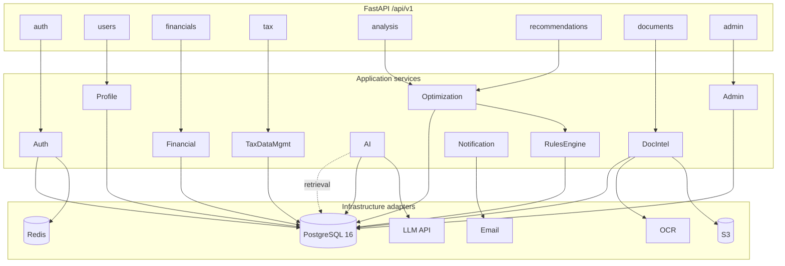
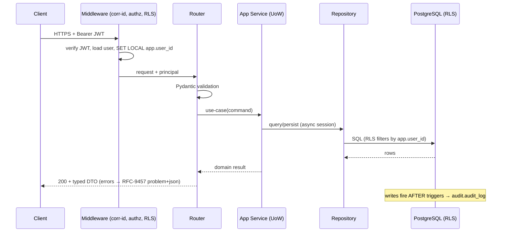
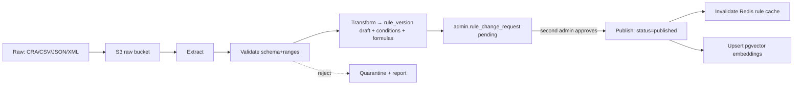
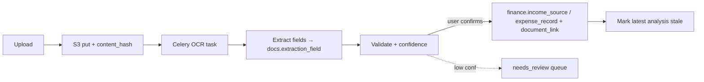

# Onyx Ledger — Backend Architecture Specification

**Status:** Architecture design (pre-implementation). Code is generated only after this design is approved.
**Author role:** Principal backend architect / fintech systems engineer / API + cloud architect
**Stack:** Python 3.12 · FastAPI · SQLAlchemy 2.x (async) · Alembic · PostgreSQL 16 · Redis · Celery · S3 · pgvector · Docker
**Builds on:** [`database-architecture.md`](./database-architecture.md) — the validated 14-schema DB is the persistence foundation this backend maps onto.

---

## 0. Reading guide

Delivers, in order: (1) architecture overview, (2) service architecture, (3) data-flow diagrams, (4) API architecture, (5) folder structure, (6) technology decisions, (7) security architecture, (8) scalability strategy — followed by deep dives on the tax engine, optimization, AI, ingestion, documents, background jobs, error handling, testing, and deployment (the 13 final deliverables), then the sign-off gate.

---

## 1. Backend architecture overview

Onyx Ledger's backend is a **modular monolith built on Clean Architecture + DDD**, deployed as horizontally-scalable stateless API pods plus a fleet of Celery workers, over the existing PostgreSQL system of record. A monolith (not microservices) is the right call *now*: the domains share one transactional database and one deploy pipeline, so we get correctness and velocity without distributed-transaction pain — while the **schema-per-domain DB boundaries and the port/adapter seams below let any service graduate to its own process later** without a rewrite.

### The dependency rule (Clean Architecture)

Dependencies point **inward**; the domain never imports the framework.

```
        ┌──────────────────────────────────────────────────────┐
        │  Interface  (api/)  — FastAPI routers, deps, DTOs     │  ← HTTP, OpenAPI
        ├──────────────────────────────────────────────────────┤
        │  Application (services/*/…) — use cases, orchestration │  ← transactions, ports
        ├──────────────────────────────────────────────────────┤
        │  Domain (domain/, services/tax_engine/core) — PURE     │  ← no I/O, no framework
        ├──────────────────────────────────────────────────────┤
        │  Infrastructure (database/, integrations/) — adapters  │  ← SQLAlchemy, S3, LLM, SMTP
        └──────────────────────────────────────────────────────┘
```

- **Domain** — framework-free entities, value objects, and the **deterministic tax engine**. No SQLAlchemy, no FastAPI, no network. 100% unit-testable in memory.
- **Application (services)** — one package per bounded context; orchestrates domain + repositories inside a unit of work (DB transaction). Depends on **ports** (abstract interfaces), never concrete adapters.
- **Infrastructure** — SQLAlchemy repositories (one per DB schema), the S3/LLM/OCR/SMTP adapters, Redis client. Implements the ports.
- **Interface** — thin FastAPI routers that validate input (Pydantic v2), resolve the current user + set the RLS GUC, call an application service, and shape the response. No business logic.

### Mapping onto the database

Every architectural element has a home in the validated DB:

| Backend concern | DB anchor |
|---|---|
| Per-request tenant isolation | `SET LOCAL app.user_id` → RLS policies |
| Every write audited | `AFTER` triggers → `audit.audit_log` (append-only) |
| Deterministic engine reads law as data | `rules.fact_definition / rule_condition_group / rule_condition / calc_formula`, `tax_kb.tax_bracket*` |
| Reproducible results | `analysis.analysis_run` (+ frozen `analysis_input_snapshot`, line items, checks) |
| Explainability | `analysis_line_item.tax_rule_version_id`, `reco.recommendation.tax_rule_version_id`, `ai.ai_message_citation` |
| AI retrieval | `ai.knowledge_embedding` (pgvector HNSW) |
| KB governance | `admin.rule_change_request` (four-eyes) → `rule_publication` |

---

## 2. Service architecture

Ten application services, each a package with a clear responsibility, a public façade, and **no direct imports of another service's internals** (they collaborate through ports/events, not reach-ins).

| # | Service | Responsibility | Sync/Async | Key collaborators |
|---|---------|----------------|-----------|-------------------|
| 1 | **Auth** | registration, login, JWT access/refresh, password reset, email verification, MFA readiness | sync | Redis (sessions/blocklist), Email (worker) |
| 2 | **User Profile** | tax profile, dependents/spouse, preferences, privacy/consent | sync | Audit (triggers) |
| 3 | **Financial Data** | income, expenses, assets/valuations, liabilities/balances — all tax-year scoped | sync | Documents (provenance) |
| 4 | **Tax Data Management** | ingest government data, version legislation, admin authoring | async pipeline | Ingestion workers, Admin, AI (embeddings) |
| 5 | **Tax Rules Engine** | deterministic eligibility + formula + threshold/credit/deduction math | sync, **pure** | reads `tax_kb`/`rules`; **no AI** |
| 6 | **Optimization Engine** | discover, score, rank opportunities; scenarios | sync | Tax Engine, Financial Data |
| 7 | **AI Explanation** | explain verified results, answer questions via RAG, cite rules | async-capable | LLM adapter, pgvector, Tax Engine outputs |
| 8 | **Document Intelligence** | upload, OCR, extraction, validation, profile update | async pipeline | S3, OCR adapter, Financial Data |
| 9 | **Notification** | email, reminders, alerts | async (workers) | Email/SMS adapters, Redis |
| 10 | **Administration** | manage/approve/publish tax rules, RBAC, system controls | sync | Tax Data Mgmt, Audit |



**Service boundaries are enforced** by an import-linter contract in CI: `api → services → domain/infrastructure`, and no `services.X → services.Y._internal`.

---

## 3. Data-flow diagrams

### 3.1 Request lifecycle (every authenticated call)



### 3.2 Tax analysis flow (the core use case)

```mermaid
sequenceDiagram
    participant API as POST /analysis
    participant AN as AnalysisService
    participant FP as FinancialProfile (facts)
    participant TE as TaxEngine (pure)
    participant RE as RulesEngine
    participant OPT as Optimization
    participant PG as analysis.* (persist)
    API->>AN: run(user, tax_year)
    AN->>FP: assemble fact snapshot (income/expense/profile)
    AN->>PG: freeze analysis_input_snapshot (immutable + hash)
    AN->>TE: compute(snapshot, bracket_sets)  %% deterministic
    TE-->>AN: taxable income, tax, line items, reconciliation checks
    AN->>RE: evaluate(published rule versions for year, facts)
    RE-->>AN: matched outcomes (+ impact via calc_formula)
    AN->>OPT: rank(outcomes, profile)
    OPT-->>AN: ordered recommendations (score, confidence, priority)
    AN->>PG: persist analysis_run + line_items + checks + recommendations
    AN-->>API: analysis id + results (each citing rule_version_id)
```

### 3.3 Tax-data ingestion pipeline (admin/government)



### 3.4 Document intelligence pipeline



### 3.5 AI explanation (RAG, never calculates)

```mermaid
sequenceDiagram
    participant U as User question
    participant AI as AIService
    participant V as pgvector (year-filtered)
    participant AR as Verified analysis+reco
    participant LLM as LLM adapter
    U->>AI: "why should I contribute to an RRSP?"
    AI->>AR: load user's latest VERIFIED numbers
    AI->>V: retrieve top-k rule/explanation chunks (tax_year)
    AI->>LLM: prompt template(context + numbers + citations)
    LLM-->>AI: draft answer
    AI->>AI: validate (no invented figures; must cite a rule_version)
    AI->>AR: persist ai_message + ai_message_citation
    AI-->>U: grounded explanation + citations
```

---

## 4. API architecture

- **REST + JSON**, versioned under `/api/v1`. OpenAPI 3.1 auto-generated by FastAPI; contract published for clients.
- **Every endpoint**: JWT authentication → authorization (ownership/role) → Pydantic v2 validation → service call → typed response → centralized error mapping → structured log line with correlation id.
- **Conventions**: cursor pagination (`?limit&cursor`) on collections; `?tax_year=` filter mandatory on all financial resources; `ETag`/`If-Match` optimistic concurrency on mutable aggregates (`row_version`); `Idempotency-Key` header on POSTs that create money/analysis; RFC-9457 `application/problem+json` errors; ISO-8601 UTC timestamps; money as decimal strings to avoid float drift on the wire.
- **Rate limiting**: Redis token bucket per IP (auth routes) and per user (analysis/AI). 429 with `Retry-After`.

### Endpoint specification (v1)

| Area | Method + path | Auth | Notes |
|------|---------------|------|-------|
| Auth | `POST /auth/register` | public | email+password (Argon2id) |
| | `POST /auth/login` | public | returns access+refresh |
| | `POST /auth/refresh` | refresh token | rotates refresh, blocklists old |
| | `POST /auth/logout` | bearer | revoke session |
| | `POST /auth/password/forgot` · `/reset` | public | hashed one-time token |
| | `POST /auth/email/verify` | public | hashed token |
| | `GET/POST/DELETE /auth/mfa` | bearer | TOTP/WebAuthn readiness |
| Users | `GET/PUT /users/me` | bearer | account + profile |
| | `GET/PUT /users/me/tax-profile` | bearer | province, marital, flags |
| | `GET/PUT /users/me/preferences` · `/privacy` | bearer | consent logged |
| | `GET/POST/PUT/DELETE /users/me/dependents` | bearer | |
| Financials | `GET/POST/PUT/DELETE /financials/income` | bearer | `?tax_year` required |
| | `GET/POST/PUT/DELETE /financials/expenses` | bearer | `?tax_year` |
| | `GET/POST/PUT/DELETE /financials/assets` (+`/valuations`) | bearer | |
| | `GET/POST/PUT/DELETE /financials/liabilities` (+`/balances`) | bearer | |
| Tax KB | `GET /tax/rules` · `/tax/rules/{code}` | bearer | published versions, `?tax_year` |
| | `GET /tax/brackets` · `/tax/benefits` | bearer | |
| Analysis | `POST /analysis` | bearer | run analysis for a tax year |
| | `GET /analysis` · `/analysis/{id}` | bearer | history; immutable |
| | `POST /analysis/{id}/simulate` | bearer | what-if overrides (no persist) |
| Recommendations | `GET /recommendations` | bearer | from latest analysis |
| | `POST /recommendations/{id}/status` | bearer | lifecycle event |
| | `POST /recommendations/{id}/feedback` | bearer | rating |
| AI | `POST /ai/conversations` · `GET …/{id}` | bearer | |
| | `POST /ai/conversations/{id}/messages` | bearer | RAG answer + citations |
| Documents | `POST /documents` (presigned) · `GET /documents` | bearer | S3 ref, no bytes through API |
| | `GET /documents/{id}` · `/extraction` | bearer | |
| Admin | `GET/POST/PUT /admin/rules` (+versions) | admin+perm | authoring |
| | `POST /admin/rules/{id}/change-request` · `/approve` · `/publish` | admin | four-eyes |
| | `POST /admin/ingestion/jobs` | admin | upload gov datasets |
| | `GET /admin/audit` | admin | audit log query |
| Platform | `GET /healthz` · `/readyz` · `/metrics` | infra | liveness/readiness/Prometheus |

---

## 5. Folder structure

```
backend/
├── app/
│   ├── main.py                      # FastAPI factory, lifespan, router mount
│   ├── api/
│   │   ├── deps.py                  # get_current_user, require_perm, db session, UoW
│   │   └── v1/
│   │       ├── router.py            # aggregates sub-routers
│   │       ├── auth/                # routes.py, schemas.py
│   │       ├── users/
│   │       ├── financials/
│   │       ├── tax/
│   │       ├── analysis/
│   │       ├── recommendations/
│   │       ├── documents/
│   │       └── admin/
│   ├── core/
│   │   ├── config.py                # pydantic-settings, 12-factor env
│   │   ├── security/                # jwt.py, password.py, rls.py, rate_limit.py
│   │   ├── logging.py               # structlog JSON + correlation id
│   │   ├── exceptions.py            # domain error hierarchy → problem+json
│   │   └── middleware.py            # corr-id, auth context, RLS GUC, timing
│   ├── domain/                      # PURE — no framework, no I/O
│   │   ├── models/                  # entities + value objects (Money, TaxYear…)
│   │   ├── ports/                   # repository + adapter interfaces (ABCs)
│   │   └── events.py
│   ├── services/                    # application/use-case layer
│   │   ├── auth/  users/  financial/
│   │   ├── tax_engine/
│   │   │   ├── core/                # PURE deterministic engine
│   │   │   │   ├── brackets.py  credits.py  cpp_ei.py  reconcile.py
│   │   │   │   ├── fact_resolver.py condition_eval.py formula_sandbox.py
│   │   │   │   └── engine.py        # orchestrates a computeReturn()
│   │   │   └── service.py           # loads rules from DB, calls core
│   │   ├── optimization/            # scoring.py, ranking.py, service.py
│   │   ├── ai/                      # rag.py, prompts/, validation.py, service.py
│   │   ├── document_processing/     # ocr.py (port impl), extract.py, pipeline.py
│   │   ├── data_ingestion/          # extract/ validate/ transform/ load/
│   │   ├── notification/
│   │   └── admin/
│   ├── database/
│   │   ├── session.py               # async engine, sessionmaker, UoW
│   │   ├── models/                  # SQLAlchemy models, one module per schema
│   │   ├── repositories/            # implement domain.ports (per aggregate)
│   │   └── migrations/              # Alembic (mirrors backend/db/sql)
│   ├── integrations/                # s3.py, llm.py, email.py, ocr_provider.py
│   └── schemas/                     # shared Pydantic DTOs / mappers
├── workers/
│   ├── celery_app.py                # broker=Redis, beat schedule
│   └── tasks/                       # analysis.py, ingestion.py, documents.py, notify.py
├── tests/
│   ├── unit/                        # tax engine golden cases, scoring, condition eval
│   ├── integration/                 # API + DB (testcontainers-postgres)
│   ├── security/                    # authz, RLS isolation, rate limiting
│   └── conftest.py
├── deploy/
│   ├── Dockerfile                   # multi-stage
│   ├── docker-compose.yml           # api + worker + postgres + redis + minio
│   └── ci/                          # GitHub Actions pipelines
├── alembic.ini
├── pyproject.toml
└── README.md
```

Rationale: the given `api/core/database/services/workers` skeleton is kept, plus **`domain/` (pure) and `integrations/` (adapters)** to make the Clean-Architecture dependency rule physically enforceable, and the **pure tax engine under `services/tax_engine/core/`** so it is unit-testable with zero I/O.

---

## 6. Technology decisions

| Concern | Choice | Why | Considered |
|---|---|---|---|
| Web framework | **FastAPI** | async, Pydantic validation, first-class OpenAPI | Django REST (heavier), Flask (manual) |
| Async runtime | **uvicorn + asyncio** | high-concurrency I/O-bound API | gunicorn sync workers |
| ORM | **SQLAlchemy 2.x async** | schema-aware, mature, works with our DDL | SQLModel (thin), raw asyncpg |
| Migrations | **Alembic** | pairs with SQLAlchemy; hand-written for partitions/RLS/triggers | — |
| Validation/DTO | **Pydantic v2** | fast, strict, serialization | marshmallow |
| AuthN | **JWT (access+refresh)**, Argon2id, OAuth2-ready | stateless scale + rotation | server sessions only |
| Cache/broker | **Redis** | sessions, hot KB cache, rate limit, Celery broker | Memcached (no broker) |
| Tasks | **Celery + Redis** (beat) | mature scheduling + retries | RQ (simpler), Arq (async-native) — *see §18* |
| Object store | **S3-compatible** (MinIO in dev) | presigned uploads, cheap durable | DB blobs (rejected) |
| Vector | **pgvector (HNSW)** | one datastore, year-filterable retrieval | Pinecone/Weaviate (extra infra) |
| LLM | **provider-agnostic adapter** | swap models; latest Claude default | hard-coding one SDK |
| Config | **pydantic-settings** | 12-factor env, typed | os.environ scatter |
| Logging | **structlog → JSON** | correlation ids, machine-parseable | stdlib logging only |
| Tracing/metrics | **OpenTelemetry + Prometheus** | traces per request/engine run | vendor lock |
| Containers | **Docker multi-stage** | reproducible, small runtime image | — |

---

## 7. Security architecture

- **AuthN.** Argon2id password hashing; short-lived access JWT (≈15 min) + rotating refresh token whose **hash** is stored in `identity.auth_session`; refresh reuse detection revokes the family. OAuth2 authorization-code ready. MFA (TOTP/WebAuthn) scaffolding via `identity.mfa_method` (secrets as KMS references).
- **AuthZ, two layers.** (1) Application checks (ownership, admin permission) in dependencies; (2) **defense in depth via database RLS** — middleware runs `SET LOCAL app.user_id` (and `app.actor_type`) per transaction, so even a flawed query can't cross users. Admin routes require a `permission` code; KB publish enforces four-eyes at the DB (`reviewed_by <> submitted_by`).
- **Encryption.** TLS everywhere; at-rest volume encryption; **application-layer envelope encryption via KMS** for the most sensitive financial columns (keys never in Postgres). Secrets from a secrets manager, never in images/env files.
- **Input validation.** Pydantic v2 strict models at the edge; money as bounded decimals; server-side tax-year and enum whitelists; file uploads size/MIME/hash-checked and virus-scanned before OCR (`status='quarantined'` gate).
- **Rate limiting & abuse.** Redis token buckets (per IP on auth, per user on analysis/AI); login backoff + lockout recorded in `identity.login_event` and `audit.security_event`.
- **Auditability.** Every material write is captured by the DB's append-only `audit.audit_log` triggers with actor + before/after — the backend only needs to set the actor GUC. Every tax calculation is traceable: `analysis_run.engine_version` + per-line `tax_rule_version_id`.
- **Never stored:** plaintext passwords, SIN, government-portal or bank credentials, raw card numbers (billing keeps provider tokens only). Enforced by design + a CI secret-scanning check.
- **Privacy (PIPEDA).** Consent logged; data export + erasure endpoints drive the DB's soft-delete vs. crypto-shred hard-delete paths.
- **Baseline.** OWASP ASVS L2 target; dependency scanning, SAST, and container scanning in CI; security headers + strict CORS at the edge.

---

## 8. Scalability strategy

- **Stateless API pods** behind a load balancer → scale horizontally on CPU/RTT; no in-process session state (Redis holds it).
- **Caching tiers (Redis):** hot reference/KB data (current-year published rules, bracket sets) with pub/sub invalidation on publish; per-user analysis result cache keyed by input-snapshot hash (recompute only on change); idempotency keys; rate-limit counters.
- **Workers scale independently:** analysis, ingestion, OCR, and notification queues are separate Celery queues with their own concurrency and autoscaling; heavy/slow work never blocks the API event loop.
- **Database:** the DDL already ships partitioning (finance by tax_year, audit by month), UUIDv7 locality, BRIN/GIN/HNSW indexes; add **read replicas** for GET-heavy and reporting traffic, **PgBouncer** transaction pooling in front of the async pool, and CDC → columnar warehouse so analytics never touch OLTP.
- **The tax engine is CPU-bound and pure** → trivially parallel; batch/bulk analysis runs as fan-out worker tasks.
- **Service-extraction seam:** because services talk through ports and the DB is schema-segmented, `ai`, `data_ingestion`, or `document_processing` can move to their own deployables (or a queue-driven service) under load without touching callers.
- **Perf budgets (targets):** p95 API < 200 ms (excl. analysis); a single-user analysis < 500 ms server-side; AI answer < 3 s with streaming.

---

## 9. Tax Rules Engine (deterministic — no AI)

The engine is **pure domain code** (`services/tax_engine/core/`) that turns a fact snapshot into structured, cited tax outcomes. It never calls an LLM and does no I/O; the surrounding `service.py` loads rule data from the DB and feeds it in.

**Pipeline:** `fact_resolver` (materialize `fact_key → value` from the frozen snapshot) → `condition_eval` (walk the `rule_condition_group`/`rule_condition` boolean tree with the operator set) → `formula_sandbox` (evaluate a matched rule's `calc_formula` in a whitelisted RPN/AST evaluator, binding inputs by fact key) → `engine` (brackets/credits/CPP-EI/reconcile) → **structured outcomes**.

**Illustrative port (design, not implementation):**
```
# domain/ports/tax_engine.py
class RulesEngine(Protocol):
    def evaluate(self, facts: FactSet, rules: Sequence[RuleVersion]) -> list[Outcome]: ...
class FormulaEvaluator(Protocol):
    def eval(self, formula: Formula, facts: FactSet) -> Decimal: ...  # sandboxed, deterministic
```

**Worked example (matches the DB seed):**
```
Input : income=75000, province=ON, medical_expenses=3000, tax_year=2025
Engine: MEDICAL_EXPENSE_CREDIT/2025 condition tree → (medical>0 AND net exists) = true
        formula: max(0, 3000 - min(net*0.03, 2834)) * 0.145
Output: { opportunity: "Medical Expense Credit",
          estimated_value: <Decimal>, rule_version_id: <uuid>,
          confidence: 0.9, citation: "Income Tax Act s.118.2" }
```

Guarantees: **deterministic** (same snapshot ⇒ same output), **explainable** (every number carries `rule_version_id` + `calc_formula`), **verifiable** (golden-case unit tests + the DB `reconciliation_check` tie-out), and **versioned** (reads only the *published* version for the analysis's `tax_year`).

---

## 10. Optimization Engine

Consumes the engine's outcomes plus the profile and produces a **ranked** recommendation list. Score is a weighted, explainable function:

```
score = w1·norm(financial_impact)      # dollars saved, normalized
      + w2·eligibility_confidence      # 0..1 from condition strength + data quality
      + w3·user_relevance              # fits province/age/situation
      − w4·complexity                  # effort/steps
      + w5·actionability               # can act before a deadline?
```

Weights are configuration (tunable, A/B-testable), the inputs are persisted on `reco.recommendation` (impact, confidence, priority), and the ordering is reproducible. It also generates **scenarios** (what-if) by re-invoking the pure engine with overridden facts — no persistence, powering the live planner.

---

## 11. AI Explanation Service

**Hard boundary: the AI never computes tax.** It receives already-verified engine outputs and explains them. Flow: load the user's latest **verified** analysis/recommendations → RAG-retrieve top-k chunks from `ai.knowledge_embedding` filtered to the analysis `tax_year`/jurisdiction → render a **prompt template** injecting the verified numbers + candidate citations → call the LLM adapter → **response validation** (reject/repair answers that introduce numbers not present in the verified payload, or that lack a `tax_rule_version` citation) → persist `ai_message` + `ai_message_citation`. Provider-agnostic adapter; streaming responses; per-user rate limits; all prompts/responses logged (with PII minimization) for traceability.

---

## 12. Tax Data Ingestion Architecture

An admin/government pipeline (Celery) implementing **Raw → Extract → Validate → Transform → Load → (approve) → Publish**. Supports CRA documents, CSV, JSON, XML, and manual admin uploads. Each stage is a discrete, retriable task; failures quarantine the batch and emit a report. Loaded rows land as **`draft` `tax_rule_version`s** with their condition trees/formulas; nothing becomes active until a **`rule_change_request`** is approved by a *different* admin and published (the DB's four-eyes control), which then invalidates the Redis rule cache and re-embeds the changed rules into pgvector. Every imported rule records **source, date, version, jurisdiction, approval status** — exactly the columns already modeled.

---

## 13. Document Intelligence Pipeline

Presigned **S3 upload → `docs.document` (ref + content hash) → Celery OCR** (pluggable provider behind an `OcrProvider` port; Textract/Tesseract/structured) → `document_extraction` + per-field `extraction_field` (with confidence + bounding box) → **validation** (map fields to `fact_key`s, range-check) → on user confirmation, create `finance.income_source`/`expense_record` rows + `document_link` provenance and mark the latest analysis stale. Low-confidence extractions route to a `needs_review` queue. Bytes never transit the API or land in Postgres.

---

## 14. Background jobs (Celery + Redis)

| Cadence | Job | Queue |
|---|---|---|
| On demand | run/re-run tax analysis; OCR a document; send email | `analysis`, `documents`, `notify` |
| Daily | check for gov data updates; expire stale sessions/tokens | `maintenance` |
| Monthly | roll analytics; refresh materialized admin views; add next audit partition | `analytics` |
| Yearly | import new tax legislation; open next tax_year partitions; index refresh | `ingestion` |

Idempotent tasks, exponential-backoff retries, dead-letter queue, and Celery Beat for schedules. Long tasks report progress to Redis for the UI.

---

## 15. Error handling & observability

- **Centralized exception hierarchy** (`DomainError`, `NotFound`, `Unauthorized`, `Forbidden`, `Conflict`, `ValidationError`, `ExternalServiceError`, `RateLimited`) mapped by one FastAPI exception handler to **RFC-9457 problem+json** with a stable `type`, `title`, `status`, `detail`, and the request `correlation_id`. External/AI/OCR failures degrade gracefully (retry, fallback, or clear partial result) — never a 500 with a stack trace.
- **Logs**: structured JSON via structlog with correlation id, user id (hashed), route, latency; separate streams for application, security, tax-engine (one line per analysis with `engine_version` + rule versions used), and AI requests.
- **Tracing/metrics**: OpenTelemetry spans across request → service → repository → external calls; Prometheus metrics (RED: rate/errors/duration) + engine/AI counters; every tax calculation is traceable end-to-end via the `analysis_run` id.

---

## 16. Testing strategy

- **Unit (pure, fast):** the tax engine against **golden reference cases** (the same hand-derived federal/provincial/CPP-EI cases the JS prototype validated), condition-tree evaluation, formula sandbox, and the optimization scoring — property tests for monotonicity, marginal ≥ average, no negative tax, determinism.
- **Integration:** API + DB with **testcontainers-postgres** (real Postgres, real RLS, real triggers), Alembic upgrade/downgrade, repository round-trips, ingestion + document pipelines end-to-end against MinIO.
- **Security:** authN/authZ matrices, **RLS isolation** (user A cannot read user B), rate-limit behavior, JWT rotation/reuse detection, four-eyes publish enforcement.
- **Contract:** OpenAPI schema snapshot tests so client breakage is caught in CI. Coverage gate + mutation testing on the tax engine (correctness-critical).

---

## 17. Deployment architecture

- **Docker multi-stage** image (builder → slim runtime, non-root); one image runs API or worker by command.
- **`docker-compose` dev stack:** api + worker + beat + postgres(+pgvector) + redis + minio, with the validated SQL/Alembic applied on boot.
- **Environments:** development, testing (ephemeral, testcontainers), production — all **12-factor** (config strictly from env/secrets manager; no config in code).
- **CI/CD (GitHub Actions):** lint (ruff) → type-check (mypy) → unit → integration (testcontainers) → security scans (SAST, deps, container, secret) → build/push image → migrate → deploy. Blue-green or rolling deploy; migrations run as the `onyx_migrator` role, runtime as `onyx_app_rw`.
- **Runtime topology:** LB → N API pods (HPA) · M worker pods per queue · Postgres primary + read replicas + PgBouncer · Redis · S3 · object-scoped KMS. Health via `/healthz` (liveness), `/readyz` (deps), `/metrics` (Prometheus).

---

## 18. Open decisions requiring sign-off

Proceeding with the **recommended** option unless redirected:

1. **Task queue:** _(Recommended)_ **Celery + Redis** (mature, Beat scheduling) — vs. **Arq** (async-native, lighter, fits our asyncio stack). Pick Celery for ecosystem, Arq for simplicity.
2. **Async vs sync SQLAlchemy:** _(Recommended)_ **fully async** end-to-end. Confirm — it's the highest-throughput choice but every repository is async.
3. **AI provider default:** _(Recommended)_ provider-agnostic adapter with **latest Claude** as default model; confirm any data-residency constraint (Canadian users) that would pin a region/provider.
4. **OCR provider for v1:** _(Recommended)_ structured-input + **pluggable OCR port** (real cloud OCR wired later) so the pipeline is testable now without a paid dependency.
5. **API money on the wire:** _(Recommended)_ **decimal strings** (exactness) over floats.
6. **Repo placement:** _(Recommended)_ implement under **`backend/app/`** in this repo (the DDL already lives in `backend/db/`), retiring the Node prototype to `legacy/` for reference.

---

## 19. Next step — the implementation gate

On approval I will scaffold, in this order:

1. **Project skeleton** — `pyproject.toml`, `app/main.py` factory, config, logging, middleware, exception handlers, health routes.
2. **Database layer** — async engine/session + Unit of Work, SQLAlchemy models (one module per schema, mapping the validated DDL), repositories implementing the domain ports, Alembic env wired to `backend/db/sql`.
3. **Auth service + `/api/v1/auth`** — Argon2id, JWT access/refresh with rotation, RLS GUC middleware, rate limiting — with security tests.
4. **Profile + Financials services & APIs** — tax-year-scoped CRUD with ownership + RLS, optimistic concurrency.
5. **Tax engine (pure) + RulesEngine service** — port the validated deterministic calculation, wire it to read facts/conditions/formulas/brackets from the DB, with the golden-case unit tests.
6. **Optimization + Analysis API** — ranked recommendations, immutable `analysis_run` persistence, what-if simulate.
7. **AI service (RAG) + Documents + Ingestion + Admin + Notification** — behind their ports, with workers.
8. **Deploy** — Dockerfile, compose stack, CI pipeline, and a runnable end-to-end demo (register → add income → run analysis → get cited recommendations → AI explanation).

> **Reply "approved" (or adjust any §18 option) and I'll begin the implementation, committing in reviewable, tested increments.**
