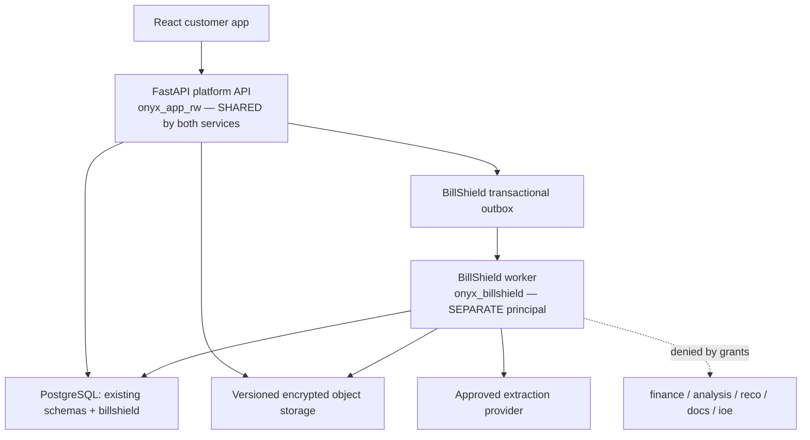
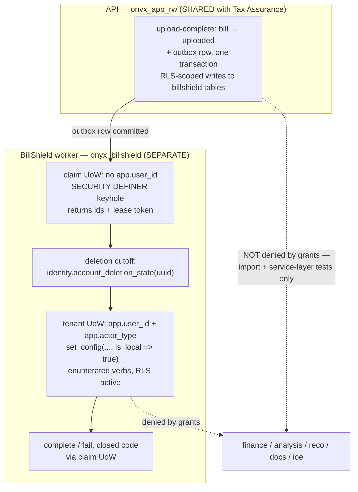
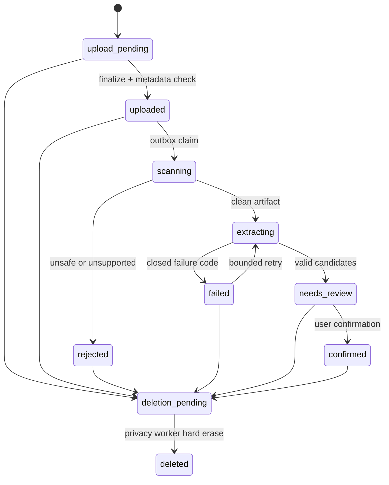

# BillShield + Onyx Ledger Integration Plan

**Status:** Proposed implementation authority; no production code has been changed  
**Repository:** `IPlayInHD/onyx-ledger`  
**Repository baseline reviewed:** `claude/git-status-check-s7ghkv` at `4aa72e29d62c1cbbfb7e0daa032cdbace9ad806b`  
**Prepared:** 2026-08-27  
**Primary objective:** Add BillShield as a second service inside the existing Onyx Ledger SaaS without creating a second platform, weakening tax-system guarantees, or duplicating infrastructure.

> Re-run repository preflight at the start of every implementation slice. The branch, migration head, test counts, and infrastructure state are dynamic and must never be copied from this document as if they were current.

> **Correction note.** This revision replaces an earlier draft that was produced against a different branch. Every repository claim below was re-read at the baseline SHA named above. Where a claim is a measurement, the file and line that supports it is named, so a reviewer can check it rather than trust it. Where a claim could not be executed in the review container, it says so.
>
> **Third correction pass.** Two further errors are fixed. `app.database.session.unit_of_work` does **not** necessarily open an `onyx_app_rw` engine inside `worker-billshield`: `services.tf:248` injects `ONYX_DATABASE_URL` from each worker's own `db_secret`, so that service must declare `db_secret = "billshield"` and the import-boundary rule rests on the no-fallback registry contract instead (§5.4.4, §5.4.10). And `ref.current_app_user()` is a plain `STABLE` function whose default `PUBLIC` execute right is never revoked, so the worker needs schema `USAGE` only — it is not part of the `SECURITY DEFINER` allowlist and is tested behaviourally instead (§5.4.6, §5.4.11 rows 4/4b).
>
> **Second correction pass.** Ten claims in the first corrected revision were wrong or overstated and are fixed here. The consequential ones: the two services **do** share the API database identity (`onyx_app_rw`) — only background processing is separated (§1, §5.4.1); the worker's privilege model is an **operation-level allowlist**, not the self-contradictory "no direct table privilege" (§5.4.6); the cross-service firewall is **asymmetric**, and PostgreSQL enforces only the worker→tax direction (§13.4); `FORCE` RLS constrains the table **owner**, not the ordinary worker (§5.4.8); and `LIFECYCLE.rls=False` is recorded evidence, never an exemption from tenant protection (§4.1, Slice 0A). Six questions the first revision left open are settled here as decisions (§21.1); three genuinely deferred items remain (§21.2).

---

## 1. Executive decision

Build BillShield as a **new bounded domain inside the existing modular monolith**.

The resulting product is one SaaS platform with:

1. **Tax Assurance** — the existing governed Onyx Ledger tax-position and opportunity service.
2. **BillShield** — a new bill and subscription optimization service.

Both services share the platform shell, identity, authentication, legal acceptance, billing entitlements, PostgreSQL cluster, object storage, Celery/Valkey infrastructure, deployment pipeline, operational controls, **and the API's database identity**. They do **not** share business tables, calculation authorities, document-confirmation semantics, domain models, or **background-processing database identity**.

That distinction is exact and is not a detail. The FastAPI process is one process serving both services and it authenticates as `onyx_app_rw`; a BillShield API route therefore runs as the same PostgreSQL principal as a Tax Assurance route. What is separated is **background processing**: the BillShield worker authenticates as a dedicated `onyx_billshield` login in the group role `onyx_billshield_worker`, and that principal has no privilege on any Tax Assurance table. §5.4 defines the boundary and §13.4 states honestly what it does and does not enforce.

The target architecture is:



This explicitly rejects a separate Next.js/Supabase/Vercel application. That greenfield stack appeared in the original BillShield build plan, but the existing repository is now the technical authority.

### The shortest correct version

- Add a `billshield` PostgreSQL schema.
- Add `/api/v1/billshield/*` routes to the existing FastAPI application.
- Add BillShield services and models without importing tax business logic.
- Add a dedicated BillShield task module, queue, **background-processing PostgreSQL login and engine registry entry**, and ECS worker before processing real customer bills. The API keeps `onyx_app_rw`.
- Reuse the existing React app and typed API layer; add a service switcher and BillShield routes.
- Reuse `ObjectStorage`, admission control, legal acceptance, email infrastructure, and `billing.entitlement` through narrow adapters.
- Do **not** reuse `docs.document`, `finance`, `reco`, `ioe`, or the tax engine for BillShield records.
- Keep every AI-produced value unconfirmed until deterministic validation and user review succeed.
- Count only evidence-backed, realized savings as "verified savings."

---

## 2. Authority order

When two sources disagree, use this order:

1. Explicit product decisions approved by the founders.
2. The current repository and its enforced tests.
3. This integration plan.
4. The original BillShield build plan and general vibe-coding playbook.
5. Model suggestions or remembered framework conventions.

The BillShield build plan remains authoritative for product scope, MVP exclusions, the private bill-evaluation corpus, plan-catalogue provenance, savings credibility, and launch metrics. It is not authoritative for the technical stack after the merger decision.

---

## 3. Product definition and scope

### 3.1 Customer promise

BillShield lets a Canadian customer upload a bill or subscription statement, reviews what the system extracted, and then helps the customer identify:

- recurring charges;
- expired or expiring promotions;
- comparable price increases over time;
- services the customer says they no longer use;
- cheaper, materially comparable plans;
- next actions, including negotiation or cancellation scripts; and
- potential, actioned, reported, and verified savings as distinct quantities.

BillShield provides information and tools. It does not negotiate, cancel, switch, dispute, or buy services on the customer's behalf.

### 3.2 Build now

- PDF, JPEG, and PNG bill upload with a strict size and page limit.
- Secure upload completion, type validation, malware scanning, extraction, review, correction, and confirmation.
- One provider vertical slice first; expand only after the evaluation gate passes.
- Telecom, internet, mobile, streaming, and common subscription categories.
- Service tracking based on confirmed bills.
- Comparable price-change and promotion-expiry detection.
- Manually curated Canadian provider and plan catalogue with source URL, region, and observation date.
- Deterministic negotiation and cancellation script templates.
- In-app alerts, followed by privacy-minimized email alerts.
- A savings ledger that separates potential from verified savings.
- Free and paid entitlement enforcement after the value loop is proven.

### 3.3 Build later

- Email forwarding or inbox ingestion.
- Utilities and insurance.
- Household or family sharing.
- Refund and chargeback letter helpers.
- Automated public-plan ingestion after legal and source-quality review.
- Open banking only after product traction, explicit consent design, and a separate security review.

### 3.4 Do not build for launch

- Bank credential login or screen scraping.
- Autonomous cancellation or negotiation.
- Claims that a provider plan is "best" without a defined comparison basis.
- Native mobile applications; keep the existing responsive web/PWA direction.
- United States expansion.
- General personal-finance aggregation.
- Anything requiring Onyx Ledger to act as an accountant, broker, insurer, lawyer, or licensed financial adviser.
- Automatic use of BillShield bills as tax inputs. Cross-service data reuse requires a separate product decision, legal basis, consent flow, and governed provenance design.

---

## 4. Repository baseline and compatibility findings

The plan was grounded against the certified branch and SHA named above. The following are current extension points or constraints, not generic recommendations.

| Area | Repository reality | BillShield decision |
|---|---|---|
| Backend | FastAPI under `backend/app`, with `api → services → domain` layering | Add a BillShield router, schemas, service package, and model module inside the same application |
| Frontend | `frontend/` exists: React/TypeScript/Vite with one authenticated API client (`frontend/src/api/client.ts`), `endpoints.ts`, and generated `schema.ts` | Add BillShield pages to the same app; keep all network traffic through `frontend/src/api/client.ts` |
| Database | PostgreSQL 16, schema-per-domain, SQL files in `backend/db/sql` mirrored 1:1 by Alembic | Add a `billshield` schema using the next discovered SQL and Alembic revisions |
| Tenancy | `app.user_id`, `ENABLE + FORCE ROW LEVEL SECURITY`, policies resolving through `ref.current_app_user()`, and catalogue-driven privacy tests | Every user-owned BillShield table and child relationship must be covered before its migration can pass |
| Privacy | `app/privacy/classification.py` is the table-lifecycle authority; account deletion is a durable phased worker | Classify every new table and storage surface in the same slice that creates it |
| Storage | `ObjectStorage` provides bounded presign, put/get, and version-aware `hard_erase` | Reuse the port, add object metadata/stat only when upload finalization needs it, and use opaque BillShield keys |
| Tax documents | `docs.document` confirmation writes `verification_status="document_backed"` into tax financial rows | Never reuse `docs.document` or `DocumentService.confirm()` for BillShield |
| Async work | `workers/celery_app.py` routes work to queues; `workers/runtime.py::run_task` owns the single `asyncio.run` and disposes every engine | Add BillShield task names and queues; use the same image, broker, deployment modules, and `run_task` |
| API DB identity | One FastAPI process, one principal: `onyx_app_rw` (`app/database/session.py:20–26`) | **Shared.** BillShield API routes run as `onyx_app_rw`, like every other route |
| Worker DB identity | Two privileged runtimes (`privacy`, `freshness`) behind an engine **registry** in `app/database/privacy_session.py`, each with its own login and its own no-fallback DSN setting | Add `billshield` as a third registry entry with its own login — see §5.4 |
| Admission | Central operation policies, dedupe, rate, concurrency, and global capacity | Add or reuse a cost-class policy; do not place limits in BillShield route code |
| Billing | `billing.plan`, `subscription`, `invoice`, `payment_method_ref`, and `entitlement` exist; there is no complete billing runtime | Use a typed entitlement adapter; implement payment-provider flows later as a separate slice |
| Email | A reviewed closed transactional-email port and SES adapter exist; messages may not contain financial data | Extend the closed message set only for a generic "BillShield alert ready" notification |
| Notifications | `app/services/notification/` is effectively empty | Treat in-app alerts as MVP; implement delivery deliberately rather than assuming it exists |
| Infrastructure | `infra/` exists: Terraform with `modules/{network,compute,database,cache,edge,secrets,observability,capacity,cost_guardrails,github_oidc}` and `envs/{staging,production}`; ECS Fargate ARM64, RDS, Valkey, S3/KMS, CloudFront/WAF, Secrets Manager | Extend existing modules; no second cloud estate |
| Skills | `.claude/skills/onyx-entry/` exists with `SKILL.md` and seven reference files (`privacy-security.md`, `test-isolation.md`, `certification.md`, `authority-model.md`, `determinism.md`, `defect-taxonomy.md`, `architecture-invariants.md`) | Use it as the governed entry workflow; do not restate its stable invariants in prompts |
| Certification | `.github/workflows/` holds `backend-quality-gate.yml`, `frontend-quality-gate.yml`, `infra-quality-gate.yml`, `deploy.yml` | Every slice ends with exact-SHA certification before the next one starts |

### 4.1 FORCE-RLS coverage: what is actually hardcoded, and what actually catches a gap

**Measured, not inferred.** Three separate tests bound their coverage with a hardcoded schema list. A `billshield` schema is outside all three:

| Site | The list | What it asserts |
|---|---|---|
| `backend/tests/security/test_privilege_invariants.py:277` (`test_every_user_derived_table_in_every_schema_has_forced_rls`) | `('ioe','finance','wealth','analysis','reco','profile','docs','billing')` | Every `user_id`-bearing table has `ENABLE` **and** `FORCE` RLS |
| `backend/tests/security/test_pd1_privilege_invariants.py:29` (`_TENANT_SCHEMAS`, used by `test_every_tenant_owned_table_has_a_forced_policy`) | `('ai','analysis','billing','docs','finance','ioe','profile','reco','wealth')` | Every `user_id`-bearing table has `ENABLE`, `FORCE`, **and at least one policy**, unless justified in `NON_RLS` |
| `backend/tests/security/test_freshness_outbox_boundary.py:600` (`test_the_worker_role_cannot_read_any_user_financial_table`) | `('finance','wealth','analysis','reco','ioe','identity','profile','docs','billing')` | `onyx_freshness_worker` holds no table privilege in those schemas |

The docstring on the first of these says *"Catalogue-driven across ALL user-data schemas, so a table added to any of them later is covered without editing this test."* That is true for a table added to one of the eight named schemas and false for a table in a schema that is not named. The docstring claims more than the query provides and must be corrected.

The third is **redundant rather than merely narrow**: `test_privilege_invariants.py:56` (`test_the_worker_role_has_no_direct_table_privilege_in_any_schema`) already enumerates every non-system schema from `pg_namespace` and asserts the same property with no list at all. The hardcoded freshness variant is a weaker restatement of a guarantee the repository already holds dynamically. Two contradictory definitions of "coverage" should not both survive.

**What the privacy suite does and does not catch.** `backend/tests/security/test_privacy_inventory.py` is genuinely schema-blind-proof: `_catalogue()` reads every table outside `pg_catalog`/`information_schema`/`pg_toast`, `_user_derived()` seeds on every `user_id` column and walks foreign keys, and three gates follow — lifecycle classification required, non-RLS justification required, and registry-versus-database RLS agreement. A `billshield` table that is simply forgotten therefore already fails CI.

But the specific case Slice 0A exists for slips through. Trace it:

1. `_non_rls_tables()` (line 244) selects `NOT c.relrowsecurity`. A table with `ENABLE` but **not** `FORCE` has `relrowsecurity = true`, so it is **not** in that set — `test_every_non_rls_table_has_an_explicit_justification` never sees it.
2. `test_the_recorded_rls_state_matches_the_database` (line 145) compares `entry.rls` against `bool(rls AND force)`. With `ENABLE` and no `FORCE` that expression is `False`. A registry entry declaring `rls=False` therefore **matches**, and the test passes.
3. `test_the_non_rls_registry_describes_no_table_that_gained_rls` only fires for tables listed in `NON_RLS`. This table is not listed.

So: **a `billshield` user table with `ENABLE` but not `FORCE`, classified in `LIFECYCLE` with `rls=False` and absent from `NON_RLS`, passes the entire existing privacy and security suite.** The table owner reads every tenant while the table looks protected. That is the precise, non-hypothetical hole, and it is what the Slice 0A non-vacuity fixture must reproduce before the guard is written.

**The root cause is that `LIFECYCLE.rls=False` is being read as an exemption.** It is not one. That field is *recorded evidence* — a statement of what the database currently does, which `test_the_recorded_rls_state_matches_the_database` exists to keep honest. It carries no authority to waive tenant protection, and any guard that treats it as a waiver can be defeated by writing `rls=False` in a Python file. The only place a reviewed waiver lives is `NON_RLS`, whose entries carry a closed `NonRlsReason`, an access model, and a note — the things a reviewer actually signs off.

**The protected set must therefore be defined subtractively, from the catalogue:**

```
protected  =  { all catalogue-derived user-derived tables }
              MINUS
              { tables explicitly present in NON_RLS with a coherent,
                reviewed user-derived justification }
```

with "user-derived" computed exactly as `test_privacy_inventory.py::_user_derived()` already computes it — seeded on every `user_id` column plus `identity.user_account`, propagated along foreign keys, unioned with `MANUALLY_DECLARED_USER_DERIVED` — so foreign-key-derived **children** are inside the set without being named. The subtraction **fails closed**: an entry waives protection only when it is explicitly `user_derived=True`, is not a recorded defect, and carries a non-empty note and access model; a table merely *named* in `NON_RLS` with a half-written or contradictory entry stays protected.

The requirement on every protected table, **corrected by Slice 0A measurement**:

- `ENABLE` and `FORCE` — always, no waiver of any kind.
- **Normally at least one policy.**
- A deliberately keyhole-only table may *instead* appear in a closed `SEALED_DEFAULT_DENY` registry with a written reason, **exactly zero policies, and zero non-owner table- or column-level ACL grants** (PUBLIC included, read from `pg_class.relacl`/`pg_attribute.attacl`). Default-deny is stricter than any policy, not weaker; the registry proves that claim from `pg_catalog` on every run and says nothing about superusers, whom no ACL restrains.

`identity.account_subject` is the baseline — and so far only — example: Slice 0A's measurement of the live catalogue found it ENABLE+FORCE with zero policies *by design* (`50_audit_auth_deidentification.sql` revokes ALL and routes every access through SECURITY DEFINER keyholes), a state the plan's original "at least one policy" rule would have flagged as a defect. The sealed registry is **not** a `NON_RLS` exemption, is **not** reachable by writing `LIFECYCLE.rls=False`, and is **not** a shortcut for BillShield operational tables — those carry real tenant policies, without exception.

Nothing else exempts a table: not `LIFECYCLE.rls=False`, not the absence of a `LIFECYCLE` entry, not a schema that no list happens to mention.

Slice 0A should implement that algorithm, correct the misleading docstring, and retire or make dynamic the redundant freshness list. It should **not** claim that the entire privacy suite is schema-blind — it is not, and saying so would misdescribe the repository in the direction that flatters it.

### 4.2 The document task is routed to a queue it is not registered on

**Measured at the baseline SHA, from static reading.** Four facts, each with its location:

1. **The module exists.** `backend/workers/tasks/documents.py` defines `extract_document` with `@celery_app.task(name="workers.tasks.documents.extract_document", ...)` at line 56–59.
2. **The route exists.** `backend/workers/celery_app.py:32` — `"workers.tasks.documents.*": {"queue": "documents"}`.
3. **The module is absent from the clean-start include list.** `backend/workers/celery_app.py:21–28` names exactly five modules: `analysis`, `maintenance`, `privacy`, `tkms`, `ioe`. `documents` is not one of them.
4. **Nothing else imports it.** A repository-wide search for `workers.tasks.documents` returns the route string, the module itself, and one test import — `backend/tests/integration/test_document_extraction_worker.py:49`. No production code path imports the module.

The consequence follows from (3) and (4): in a worker started as `celery -A workers.celery_app worker`, `workers.tasks.documents.extract_document` is **not registered**. `infra/modules/compute/services.tf:12` gives `worker-app` the queue list `analysis,documents,ingestion,...`, so the `documents` queue is consumed by a process that has no task to run for it. A message published to it would be received and rejected as unregistered.

**The existing test cannot detect this.** `test_the_task_is_registered_and_routed_to_the_queue_that_was_already_waiting` (line 373) asserts `extract_document.name in celery_app.tasks` — but the module-level `from workers.tasks.documents import extract_document` at line 49 has already executed the `@celery_app.task` decorator, which registers the task as a side effect. The assertion is satisfied by the test's own import, not by the worker's configuration. It would pass unchanged if `include` were emptied entirely.

**Reserved routes are not defects.** `celery_app.py:33–34` also routes `workers.tasks.ingestion.*` and `workers.tasks.notify.*`. Neither module exists — `backend/workers/tasks/` contains `analysis.py`, `documents.py`, `ioe.py`, `maintenance.py`, `privacy.py`, `tkms.py` and nothing else. These are reserved queue names held for planned work.

This matters for how the Slice 0B guard is written. The obvious inverse invariant — *"every routed pattern's module must appear in `include`"* — would fail on `ingestion` and `notify`, which are not defects. **A route pattern is not evidence that a task exists.** The guard must be keyed on modules that actually declare a task (which is how `backend/tests/unit/test_admission_wiring.py:97–101` already discovers tasks, by scanning for `@celery_app.task(name="...")` in the worker tree), and must treat a route with no declaring module as a reserved name — ideally one recorded in an explicit reserved-route set, so an unclaimed route is a statement someone wrote down rather than an absence nobody noticed.

**The direction that is missing.** `test_admission_wiring.py:80` already proves **task → route**: every declared task has an explicit queue. Nothing proves **module → registration**: that a module declaring a routed task is reachable from a clean Celery start. That missing direction is the whole of Slice 0B.

**Not executed here.** Celery is not installed in the review container (`ModuleNotFoundError: No module named 'celery'`), so the clean-process registration was established by reading configuration and imports, not by booting a worker. Slice 0B must reproduce it by actually starting the app in a subprocess before fixing anything — the guard is worthless if it cannot first fail.

### 4.3 Existing object-erasure boundary concern

The storage port's `hard_erase()` needs S3 version-list and version-delete capabilities. Infrastructure correctly grants those only to the privacy worker, while `DocumentService.delete_document()` calls `hard_erase()` from an API route. Do not copy this mismatch into BillShield. Bill deletion should become `deletion_pending` and be completed by the privacy worker, which is the only runtime allowed to remove every object version.

### 4.4 Baseline evidence and caveat

The prior repository audit reported green backend security/privacy, Ruff, and protected mypy runs at the baseline SHA, while Terraform was unavailable in that audit container. This plan did not re-certify the repository, and this revision executed no tests: backend dependencies are not installed in the review container. Every claim above is from reading files at the baseline SHA. Implementation must run current gates on the exact final SHA.

### 4.5 Constraints discovered in review that bound the design

Four repository facts constrain BillShield's design and are easy to get wrong:

1. **`actor_type` is a closed set enforced by the database.** `backend/db/sql/14_audit.sql:12` — `CHECK (actor_type IN ('user','admin','system'))`. `audit.log_change` reads `current_setting('app.actor_type', true)` and inserts it verbatim (`backend/db/sql/52_audit_log_change_subject.sql:76`, `:172`). A BillShield unit of work setting `app.actor_type = 'billshield_worker'` would violate that constraint on the first audited write. Use `'system'`, as `workers/tasks/documents.py:68` already does, or widen the closed set in its own governed migration with a schema-drift entry.
2. **`unit_of_work` leaves `app.user_id` unset when there is no user** (`app/database/session.py:44–58`). Deny-by-default depends on the GUC's absence, not on an empty string. Any BillShield session factory must preserve that.
3. **The privileged engines are a registry, not globals.** `app/database/privacy_session.py:35–36` keys engines by runtime name so `dispose_worker_engines()` cannot miss one, and `dispose_all_engines()` (line 132) covers the application engine as well. `workers/runtime.py::run_task` calls the latter in its `finally`. A BillShield engine created outside that registry inherits none of it — and the file's own docstring records that this trap has been hit three times.
4. **`get_worker_engine` resolves its DSN through a two-key literal dict** (`privacy_session.py:61–62`). An unregistered runtime name raises `KeyError` before the `if not dsn` check, producing an unhandled error rather than the governed `WorkerRuntimeUnavailable` closed code. Adding a runtime means adding to that mapping, not only adding a setting.

---

## 5. Architectural boundaries

### 5.1 Shared platform versus isolated domains

| Capability | Shared platform | Tax Assurance ownership | BillShield ownership |
|---|---:|---:|---:|
| Account, login, legal gate | Yes | No | No |
| API process and version prefix | Yes | Tax routers | `/api/v1/billshield/*` |
| PostgreSQL cluster | Yes | Existing tax schemas | `billshield` schema |
| Object-storage bucket and KMS | Yes | Existing opaque document prefix | BillShield-specific opaque prefix |
| Celery image and broker | Yes | Existing queues | BillShield queue(s) |
| **API database identity** | **Yes — `onyx_app_rw`** | Tax routes | BillShield routes, same principal |
| **Worker database identity** | No | `onyx_app_rw` (worker-app), `onyx_freshness`, `onyx_privacy` | Restricted `onyx_billshield` login |
| Domain models and tables | No | Existing models | New BillShield models |
| Calculation authority | No | Certified tax engine and IOE | Deterministic BillShield analyzers |
| Uploaded-document semantics | No | Tax slips and evidence links | Bills, subscriptions, and charge observations |
| Catalogue | No | Tax sources/rules | Commercial plan versions |
| Savings ledger | No | Tax opportunity semantics | BillShield savings events |

### 5.2 Dependency rules

BillShield code may depend on:

- `app.core` configuration, exceptions, logging, and security conventions;
- `app.api.deps` authenticated transaction aliases;
- `app.database` base/session primitives — **API routes** use `app.database.session.unit_of_work`; **worker and task modules** use only the restricted BillShield units of work built on the engine registry in `app.database.privacy_session` (§5.4.4);
- `app.domain.ports` and approved integrations;
- `app.services.admission`;
- `workers.runtime.run_task`;
- a new typed adapter over `billing.entitlement`;
- the existing semantic canonicalizer for governed hashes; and
- shared test and deployment helpers.

BillShield code must not import:

- `app.services.tax_engine`;
- tax IOE orchestration, scenarios, ranking, savings, or recommendations;
- `app.services.document_processing`;
- tax `finance`, `analysis`, `reco`, or `docs` models;
- frontend tax-page modules; or
- archived `legacy/` code.

The one deliberate exception is semantic hashing: `app/services/ioe/domain/canonical.py` is the repository's sole canonicalization authority. Register BillShield hash domains there rather than copy it. Raw file SHA-256 remains a byte-integrity hash, not a semantic canonicalization operation. A future relocation of the canonicalizer into a platform package must be its own compatibility entry with re-exports and golden proof.

Add an import-boundary test so these rules are executable rather than comments.

### 5.3 Proposed repository shape

```text
backend/
  app/
    api/v1/billshield/
      __init__.py
      routes.py
    database/models/
      billshield.py
    schemas/
      billshield.py
    services/
      billshield/
        domain/
          models.py
          states.py
          money.py
          savings.py
        extraction/
          ports.py
          schema.py
          service.py
          validators.py
        catalog/
          service.py
        analysis/
          price_change.py
          alternatives.py
        service.py
    integrations/
      bill_extraction.py
  workers/tasks/
    billshield.py
  db/sql/
    <next>_billshield_foundation.sql
  migrations/versions/
    <next>_billshield_foundation.py
  tests/
    unit/billshield/
    integration/billshield/
    security/billshield/
    privacy/billshield/
frontend/
  src/
    pages/billshield/
    features/billshield/
    api/endpoints.ts
docs/
  architecture/billshield-integration-plan.md
  operations/billshield-runbook.md
  privacy/billshield-data-lifecycle.md
```

At the reviewed baseline, the likely next files would be `backend/db/sql/67_...` and an Alembic revision after `0073_legal_acceptance`. Do not hardcode those numbers in a prompt; discover them immediately before the migration is created.

### 5.4 The BillShield database-runtime boundary

This section is the architectural core of the integration and the part most easily got wrong. Everything in it mirrors a pattern the repository already runs in production for the privacy and freshness workers; nothing in it invents a new mechanism.

#### 5.4.1 What is separated, and what is deliberately not

**The API identity is shared. The worker identity is not.** Stating it any other way overclaims the boundary, and an overclaimed boundary is worse than a modest one, because it stops people looking for the gap.

| Runtime | Principal | Shared with Tax Assurance? |
|---|---|---|
| FastAPI process (all routes, both services) | `onyx_app_rw` | **Yes** — one process, one login |
| `worker-app` (analysis, documents, …) | `onyx_app_rw` | Yes |
| `worker-freshness` | `onyx_freshness` | No |
| `worker-privacy` | `onyx_privacy` | No |
| `worker-billshield` | **`onyx_billshield`** in `onyx_billshield_worker` | **No** |

The API is shared because this is a modular monolith. One FastAPI process serves both services and holds one database login (`app/database/session.py:20–26`); giving BillShield routes a different PostgreSQL principal would require a second session architecture — a per-request choice of engine keyed on the route, with two pools, two sets of GUC handling and two error paths. That is not part of this MVP, and §13.4 states the consequence honestly rather than hiding it.

**Why the worker is separated anyway.** `app/database/privacy_session.py` opens with the reason, and it is a defect the repository has already paid for: **PD-16 is a privileged capability being reachable from the application identity.** A `GRANT onyx_freshness_worker TO onyx_app_rw` meant an HTTP request-path session could assume the relay's capability (`infra/modules/database/bootstrap_runtime_logins.sql:8`). The remediation was not a Python class boundary — it was a PostgreSQL `session_user` boundary.

The BillShield worker is the runtime that holds an approved extraction-provider secret and reads customer bill artifacts — the largest new attack surface this integration adds. If it authenticated as `onyx_app_rw`, a compromise of the extraction path would be a compromise of an identity that can read `finance`, `analysis`, `docs` and every other tax table. Separating the *worker* is therefore worth its cost even though the API cannot be separated cheaply: it removes the tax database from the blast radius of the one component processing untrusted third-party file content.

**This is a deliberate divergence from the freshness relay, and the divergence is the point.** The relay does its privileged claim as `onyx_freshness` and then applies events through the *ordinary* application engine under the tenant's own `app.user_id` (`privacy_session.py:102–121`), because the rows it applies to are tax rows and the application identity is the right one to touch them. BillShield's tenant processing writes **BillShield** rows, and the worker must not hold the application identity at all. So both BillShield **worker** units of work authenticate as `onyx_billshield`; what differs between them is the tenant context, not the principal.

#### 5.4.2 Configuration: `billshield_database_url`, with no fallback

Add to `app/core/config.py`, alongside `privacy_database_url` and `freshness_database_url`:

```python
#: The RESTRICTED BillShield worker connection. Same contract and same reason
#: as `privacy_database_url` and `freshness_database_url`: a silent fallback to
#: `database_url` would collapse the boundary back to `onyx_app_rw` on any host
#: where the operator forgot to set it, and would do so invisibly — the worker
#: would run, the bills would process, and the isolation would simply not exist.
#: Absent means the BillShield worker refuses to run.
billshield_database_url: str | None = None
```

Three properties are mandatory and each is load-bearing:

- **`None` default, never `database_url`.** The existing two settings carry this exact contract and say why in their own comments (`config.py:60–70`). A fallback is worse than a missing setting because it fails silently and in the permissive direction.
- **No production validator that accepts absence.** If BillShield is enabled in production, the setting must be present. Prefer extending the existing `_production_*` model validators rather than adding a runtime check, so the failure is at startup and loud — the same argument `_production_storage_is_real` makes at `config.py:311`.
- **The DSN never reaches an error message.** `WorkerRuntimeUnavailable.__init__` carries the runtime *name*, never the DSN, because a connection string holds a host, a database and a role name and the message travels into logs and task failure records (`privacy_session.py:51–55`). BillShield inherits that discipline — but not the class's current problem-document metadata, which is wrong for it. See §5.4.3.

#### 5.4.3 The engine and session factory, fail-closed

Register `billshield` in the existing registry rather than creating a module-level engine:

```python
def get_worker_engine(runtime: str) -> AsyncEngine:
    settings = get_settings()
    dsn = {"privacy":    settings.privacy_database_url,
           "freshness":  settings.freshness_database_url,
           "billshield": settings.billshield_database_url}[runtime]
    if not dsn:
        raise WorkerRuntimeUnavailable(runtime)
    ...
```

Requirements:

- **Absent configuration raises `WorkerRuntimeUnavailable`, not a connection attempt.** The 503 status and the fail-closed behaviour are correct and are reused. **The class's problem-document metadata is not**, and must not be described as though it were.
- **Add the key to the DSN mapping, not only the setting.** Per §4.5(4) an unregistered runtime name raises `KeyError` *before* the `if not dsn` check — an unhandled error instead of the governed closed code. A test should assert that every runtime name the code can pass resolves to a mapping entry.
- **Small pool, for the same reason as the others.** `pool_size=2, max_overflow=2` is the existing shape and the comment explains it: this is one background worker draining a queue, not a request tier. Sizing it like the API would hold restricted connections open for no reason — and would inflate the connection ceiling (§5.4.10).
- **Never construct an `AsyncEngine` outside `get_worker_engine`.** This is the disposal contract (§5.4.9), not a style preference.

**The problem-document metadata must change.** As written today the class is privacy-specific:

```python
class WorkerRuntimeUnavailable(DomainError):
    status_code = 503
    error_type = "https://onyx.ledger/errors/privacy-runtime-unavailable"
    title = "Privacy Runtime Unavailable"

    def __init__(self, runtime: str = "privacy") -> None:
```

The class name was generalized when the registry was introduced; the `error_type`, the `title` and the default argument were not. A BillShield misconfiguration currently surfaces as **"Privacy Runtime Unavailable"** with a `privacy-runtime-unavailable` problem type — a wrong and actively misleading operator signal, pointing an incident at the account-deletion pipeline when the fault is the bill worker. Do not describe that metadata as appropriate for BillShield.

Either of two shapes is acceptable; pick one and record it:

1. **Neutral base.** `error_type = ".../worker-runtime-unavailable"`, `title = "Worker Runtime Unavailable"`, and remove the `runtime="privacy"` default so the caller must name the runtime. Keep `PrivacyRuntimeUnavailable` as the existing alias, and — if any consumer matches on the old URI — retain a documented compatibility mapping rather than silently changing what an existing client sees.
2. **Per-runtime subtype.** A `BillShieldRuntimeUnavailable` subclass with its own `error_type`/`title`, leaving the privacy metadata untouched.

Under either shape the safety rule is unchanged and absolute: **no DSN, host, database name, username, role name, port, or provider exception text may appear** in the type, title, detail, log record, or task failure record. The runtime *name* — a short closed token such as `billshield` — is the whole of what may be disclosed. A generic message is not a diagnostic loss: the operator learns which runtime is unconfigured, which is the actionable fact, and learns nothing that helps an attacker locate the database.

#### 5.4.4 Two units of work, deliberately different

The outbox pattern needs exactly two, and conflating them is how a keyhole becomes a door.

**The claim unit of work — privileged, no tenant context:**

```python
@contextlib.asynccontextmanager
async def billshield_claim_unit_of_work() -> AsyncIterator[AsyncSession]:
    """ONLY for the privileged keyholes — claim, complete, fail.

    Sets no `app.user_id`. Claiming crosses tenants by design, and a worker
    that set the GUC here would be asserting an authorization it does not have
    — the same argument `privacy_unit_of_work` makes for the purge.
    """
    # REGISTRY FIRST. `_factories` is populated as a side effect of building
    # the engine, so reading it without this call raises KeyError on the first
    # use in a process — and, worse, an engine created any other way is outside
    # `_engines` and is therefore disposed by nothing (§5.4.9).
    get_worker_engine("billshield")
    session = _factories["billshield"]()
    try:
        yield session
        await session.commit()
    except Exception:
        await session.rollback()
        raise
    finally:
        await session.close()
```

- Used only to call `billshield.claim_*` / `complete_*` / `fail_*`.
- Those functions are `SECURITY DEFINER`, pin `search_path` including `pg_catalog`, have `EXECUTE` revoked from `PUBLIC`, accept no table name or SQL fragment, and return **identifiers and a lease token only** — never bill content. `test_freshness_outbox_boundary.py:560` already tests the argument-shape property for the existing four functions and is the model to copy.
- `onyx_billshield_worker` holds `EXECUTE` on exactly these functions. It holds **no** privilege on `billshield.job_outbox` itself — the keyholes are the only outbox interface. What table privileges it *does* hold, and on which tables, is enumerated in §5.4.6; it is not "none".
- **Shape copied from `privacy_unit_of_work`/`freshness_unit_of_work` (`privacy_session.py:82–121`), not invented.** `get_worker_engine(...)` first, then the factory, then explicit `commit` on success, `rollback` on any exception, and `close()` in `finally` so the connection returns to the pool on every path.

**The tenant-processing unit of work — one tenant, GUCs set transaction-locally:**

```python
@contextlib.asynccontextmanager
async def billshield_unit_of_work(user_id: uuid.UUID) -> AsyncIterator[AsyncSession]:
    """One tenant's BillShield work, as the BillShield principal.

    `user_id` is REQUIRED, unlike `unit_of_work`: there is no anonymous
    BillShield processing, and an optional parameter here would make
    "no tenant context" reachable by omission rather than by decision.
    """
    get_worker_engine("billshield")            # registry first — see above
    async with _factories["billshield"]() as session:
        async with session.begin():            # commit on exit, rollback on raise
            await session.execute(
                text("SELECT set_config('app.actor_type', :atype, true),"
                     "       set_config('app.user_id', :uid, true)"),
                {"atype": "system", "uid": str(user_id)},
            )
            yield session
```

- **Initialize the registry entry before reading `_factories`.** Both paths must call `get_worker_engine("billshield")` first. This is not defensive style: `_factories` is only populated inside `get_worker_engine`, so a direct read is a `KeyError` on first use in a fresh process — precisely the condition a Celery worker starts in on every boot.
- **`is_local => true` on both GUCs.** Connections are pooled; a context that outlived its transaction would be served to the next user of that connection. `test_pd1_privilege_invariants.py:270` asserts this property on a physical connection rather than trusting the flag, and BillShield needs its own equivalent.
- **Both GUCs in one statement.** Not cosmetic — `session.py:39–45` records that two statements meant two round trips on every transaction.
- **`session.begin()` owns commit and rollback**, and `async with` on the session guarantees closure. A partially applied tenant transaction must never be left open holding a restricted connection.
- **`actor_type` is `'system'`.** Per §4.5(1) the database enforces `CHECK (actor_type IN ('user','admin','system'))`. A BillShield-specific actor type requires widening that closed set in its own migration with a schema-drift entry; it is not a free choice at the session layer.
- **`user_id` is required, not optional.** `unit_of_work` accepts `None` because anonymous authentication genuinely needs it. BillShield has no such caller, and an optional parameter would make the unprotected case reachable by forgetting rather than by deciding.

RLS then does the confinement: policies on BillShield tables resolve through `ref.current_app_user()`, exactly as `backend/db/sql/43_pd1_tenant_rls.sql` does for the sixteen PD-1 tables. `ref.current_app_user()` is a plain `STABLE` SQL function, **not** `SECURITY DEFINER` (`db/sql/16_rls_grants.sql:37–40`), so what the worker needs is `USAGE` on schema `ref` for name resolution — a grant `00_extensions_roles.sql:113` currently gives to `onyx_app_rw` and `onyx_app_ro` only. Add `onyx_billshield_worker`, and nothing else in `ref`.

**A worker module must not reach for the API unit of work — and the reason is not the one an earlier draft gave.** That draft said `app.database.session.unit_of_work` "opens the `onyx_app_rw` engine", which is **false inside a correctly configured `worker-billshield`**. `services.tf:248` injects `ONYX_DATABASE_URL` from *each worker entry's own* `db_secret`, so with `db_secret = "billshield"` (required — §5.4.10) that variable carries the restricted BillShield credential and `app.database.session.engine` in that container authenticates as `onyx_billshield`, not as `onyx_app_rw`.

The prohibition stands anyway, on three accurate grounds:

- **It bypasses the named, no-fallback contract.** `billshield_database_url` is the setting that fails closed when unset (§5.4.2). `ONYX_DATABASE_URL` has a compiled-in default (`config.py:58`) and no such guarantee. Code reaching through the generic session gets its identity from whichever DSN the deployment happened to inject — correct today by configuration, silently wrong the moment a container is misconfigured, reused, or run locally.
- **It makes the registry contract non-load-bearing.** If worker code can obtain a working session without `get_worker_engine("billshield")`, then every property built on the registry — fail-closed configuration, single disposal path (§5.4.9), one place where the runtime's identity is decided — becomes advisory. A contract that code can route around is documentation, not architecture.
- **It can activate a second connection pool.** `app.database.session.engine` and the BillShield registry engine are distinct `AsyncEngine` objects with distinct pools even when both DSNs name the same principal. Using both in one worker process opens both, which is exactly the accounting question §5.4.10 turns on.

What it does **not** necessarily do is run as `onyx_app_rw` — do not say that it does. **The separate and correct claim is about placement:** BillShield work placed on `worker-app` *would* run as `onyx_app_rw`, because that service holds `db_secret = "api"` (`services.tf:13`). That is why decision 21.1(1) requires a dedicated service, and it is a different failure from this one.

Add an import-boundary test:

- **Forbidden:** any module under `workers/tasks/billshield*` or `app/services/billshield/**` importing or calling `app.database.session.unit_of_work`.
- **Permitted:** BillShield **API routes** under `app/api/v1/billshield/` use the ordinary `AuthedSession`/`unit_of_work` path, because the API is `onyx_app_rw` by design (§5.4.1) and a BillShield route is an ordinary request.

The rule is therefore *background processing uses the restricted unit of work; request handling uses the shared one*, and the test must encode that split rather than banning the import repository-wide.

#### 5.4.5 The units of work, drawn



The dashed lines are the honest picture, and the two are not the same strength. The worker's denial is a PostgreSQL grant. The API's is not, because the API is one shared principal. §13.4 says so in words.

#### 5.4.6 The operation-level capability matrix

**There is no empty allowlist here, and claiming one would be self-contradictory.** The BillShield worker's tenant unit of work exists precisely to read and write BillShield rows; a role with no table privilege could not do that. The freshness relay genuinely holds `frozenset()` because its whole job is calling four functions — BillShield's job is not, so it needs a different and more careful model: **enumerated verbs on enumerated tables**, not an empty set and not blanket CRUD.

| Principal | May do | May **not** do |
|---|---|---|
| `onyx_app_rw` (API, shared) | `SELECT`/`INSERT`/`UPDATE` on the BillShield customer tables the API actually serves, confined by RLS — with `UPDATE` on `billshield.bill` **column-scoped** to its mutable columns, never tenant ownership, the storage key, or finalized artifact facts (§7.1); **column-scoped enqueue `INSERT`** on `billshield.job_outbox` (intent columns only; server defaults own claim and terminal state — §9.1) in the same transaction as the bill write; `DELETE` only where a customer-facing delete exists and is not a tombstone; `EXECUTE identity.account_deletion_state(uuid)` (already granted, `41_account_lifecycle.sql:594`) | Any BillShield claim/complete/fail authority — including by supplying claim or terminal columns on insert; any catalogue **publish** or write authority; membership of `onyx_billshield_worker` |
| `onyx_billshield_worker` (background) | Exactly the `SELECT`/`INSERT`/`UPDATE` verbs each operational table's use case proves it needs — enumerated per table, never a blanket grant; `SELECT` only on approved global BillShield catalogue tables; `EXECUTE` on exactly the BillShield claim/complete/fail keyholes; `EXECUTE` on `identity.account_deletion_state(uuid)`; `USAGE` on schemas `billshield`, `ref`, `identity` — which is what makes `ref.current_app_user()` **callable**, since it is a plain `STABLE` function whose default `PUBLIC` execute right the repository never revokes (`16_rls_grants.sql:37–40`), so no explicit `EXECUTE` grant is needed or should be written for it | Any privilege on `billshield.job_outbox` — the keyholes are the only outbox interface; ordinary `DELETE` on any table unless a specific use case proves it, and then only on that table; `TRUNCATE` or `REFERENCES` anywhere; **any** direct privilege on `identity.*` tables; **any** privilege on any Tax Assurance table or schema; catalogue write or publish; object-version deletion |
| `onyx_privacy_worker` | Governed source-object erasure, including every S3 object **version and delete marker**, and the account-deletion phase that reaches BillShield artifacts (§7.4) | Nothing new is granted to it by BillShield beyond that erasure path |
| `onyx_migrator` | All DDL; owns the `billshield` tables | Serve any runtime traffic; it is `NOLOGIN` (`00_extensions_roles.sql:96`) |

Three notes on why this shape and not a looser one:

- **`DELETE` is withheld by default.** BillShield's deletion model is a tombstone plus privacy-worker erasure (§7.3, §7.4), so the worker has no legitimate reason to remove rows. Granting `DELETE` "in case" would hand the component that processes untrusted files the ability to destroy a tenant's confirmed observations.
- **`TRUNCATE` is never granted.** `test_pd1_privilege_invariants.py:82` already asserts this for `onyx_app_rw` and gives the reason: a policy cannot filter a whole-table wipe, so `TRUNCATE` bypasses RLS entirely.
- **Schema `USAGE` is not table access, and for `ref` it is the whole of what is needed.** `USAGE` is name resolution; without it the worker cannot reach `ref.current_app_user()` at all, and with it the function's existing default `PUBLIC` execute right suffices. Do not add a `REVOKE ... FROM PUBLIC` and a compensating `GRANT` for that function: changing its grant design would alter behaviour for every existing role that relies on it, which is far outside a BillShield slice. `test_privilege_invariants.py:201` makes the same USAGE-is-resolution argument for definer owners. Granting `USAGE ON SCHEMA identity` while granting **no** privilege on any `identity` table is the intended, checkable end state.

**The test shape follows from this.** It cannot be `assert reachable == {}`, and it is **two separate proofs**, not one:

1. **Direct-ACL enumeration.** Read the catalogue's ACL data itself (`pg_class.relacl` and `pg_attribute.attacl`, with `PUBLIC` included as a grantee), per object and per verb, and fail on any unexpected **direct** grantee or verb — discovered dynamically rather than by checking a list of known-bad objects. Do **not** sweep every `pg_roles` entry through effective-privilege functions against a group-role allowlist: test login roles are members of the group roles and inherit their privileges, so an effective-privilege sweep manufactures false findings by construction.
2. **Effective-privilege proof for the governed identities.** Become each governed runtime/group identity and attempt real operations — allowed exactly where the allowlist says allowed, refused by PostgreSQL everywhere else.
3. Compare both against an explicit operation-level allowlist held in the test — table, verb, and a one-line reason; and
4. assert separately and unconditionally that the count of Tax Assurance privileges is **zero**, catalogue-derived across every non-`billshield` schema rather than a hardcoded schema list (§4.1).

An allowlist entry with no reason beside it is the failure mode `test_privilege_invariants.py:106` warns about — *"An allow-list nobody prunes becomes a deny-list with extra steps"* — so the reason column is part of the test, not documentation about it.

#### 5.4.7 The deletion cutoff, and how the worker is allowed to ask

BillShield queued work must recheck account deletion **immediately before producing user data**, for exactly the reason `app/services/privacy/preflight.py:3–14` records: a task queued at T1 is picked up at T3, deletion was requested at T2, and nothing in the queue can express that. Celery `revoke` does not close it — a reserved task is already in a worker's hands, `acks_late` redelivers after a restart, and an offline worker never sees the broadcast.

The repository already has the mechanism and BillShield must reuse it, not invent one:

```
identity.account_deletion_state(p_user_id uuid) RETURNS text
  LANGUAGE sql STABLE SECURITY DEFINER
  SET search_path = identity, pg_catalog
```

(`db/sql/41_account_lifecycle.sql:580–588`.) It returns a closed state code or `NULL`, and nothing else — no email, no timestamp, no claim, no failure code. `refuse_if_deleting(session, user_id, task=...)` (`preflight.py:50`) is the callable, and `workers/tasks/documents.py:77` is the working precedent.

**Why a function and not a table read.** The claim unit of work sets no `app.user_id`, so the RLS policy on `identity.account_lifecycle` correctly hides the row — a direct read would see nothing and let every task through. `preflight.py:37–39` states this explicitly. A worker that "checked deletion" by selecting from the lifecycle table would appear to work and would refuse nothing.

**Exactly what to grant.** Today the function is `REVOKE ALL ... FROM PUBLIC` with a single `GRANT EXECUTE ... TO onyx_app_rw` (`41_account_lifecycle.sql:593–594`). BillShield needs two grants and no more:

```sql
GRANT USAGE ON SCHEMA identity TO onyx_billshield_worker;
GRANT EXECUTE ON FUNCTION identity.account_deletion_state(uuid) TO onyx_billshield_worker;
```

No `SELECT` on `identity.account_lifecycle`, `identity.account_lifecycle_phase`, `identity.user_account`, or any other identity table. The schema grant buys name resolution; the definer function does the reading under its own owner's rights and returns one closed token.

**The test that makes this non-vacuous** must prove both halves in one place, because either alone is misleading:

- as `onyx_billshield`, `SELECT identity.account_deletion_state(:uid)` **succeeds** and returns the expected state for a deleting account and `NULL` for an active one; and
- as the same role, `SELECT ... FROM identity.account_lifecycle` (and `identity.user_account`) is **refused by PostgreSQL** with insufficient privilege — not merely returning zero rows, which is what a policy does rather than what a missing grant does (`test_pd1_privilege_invariants.py:1–13`).

And behaviourally: a BillShield task for an account past its cutoff returns a refusal outcome and writes **no** row — proved by asserting the table is empty afterwards, the shape `test_document_extraction_worker.py:425–463` already uses, including its non-vacuity argument that the same task with the same input succeeds when the lifecycle row is absent.

#### 5.4.8 What FORCE RLS does, and what actually confines the worker

The earlier draft said FORCE is what subjects the BillShield worker to RLS. That is wrong, and getting it wrong would produce a test that proves nothing. The three properties are separate:

- **`ENABLE ROW LEVEL SECURITY`** makes policies apply to ordinary roles. This is what confines `onyx_billshield` and `onyx_app_rw` to one tenant's rows. It is the load-bearing control for BillShield.
- **`FORCE ROW LEVEL SECURITY`** additionally applies policies to the **table owner**, which is otherwise exempt. The owner here is `onyx_migrator` (`00_extensions_roles.sql:96` — *"owns DDL; used only by migrations"*). FORCE is still required, and §7.1 still mandates it, but what it protects against is an owner-privileged session reading every tenant — not the ordinary worker.
- **`onyx_billshield` is not a table owner, is not `SUPERUSER`, and must not hold `BYPASSRLS`.** Those three facts are what make ENABLE sufficient for it, and each is independently assertable from `pg_roles` — the shape `test_freshness_outbox_boundary.py:642` already uses for `onyx_freshness_worker`.

So the acceptance language is: **ENABLE plus a policy with both `USING` and `WITH CHECK` confines the worker; FORCE closes the owner path; and neither is trusted from DDL.** The proof is real cross-tenant traffic — as `onyx_billshield` with tenant A's `app.user_id` set, attempt to read, insert, update, and reassign ownership of tenant B's rows, and be refused every time; then attempt the same with no `app.user_id` set and see nothing at all. A `WITH CHECK`-less policy passes every read test while leaving ownership forgery open, which is why `test_pd1_privilege_invariants.py:216` tests for it separately.

#### 5.4.9 Shared worker-engine disposal coverage

This is the requirement most likely to be quietly skipped, and the file that owns it has already recorded three separate occurrences of the same failure.

`workers/runtime.py::run_task` owns the single `asyncio.run` in the worker tree and calls `dispose_all_engines()` in its `finally`. `dispose_all_engines()` disposes the application engine and then calls `dispose_worker_engines()`, which iterates `_engines.values()` — **the registry, not a hardcoded pair**. Its docstring states the design intent directly: *"A caller that has to remember to dispose two things will eventually remember one. This names the set instead, so the next runtime added to the registry is covered by every existing call site without anyone editing it."*

Therefore:

- **The BillShield engine must be created through `get_worker_engine("billshield")`.** A module-level `create_async_engine` in a BillShield module is outside `_engines`, is disposed by nothing, and reproduces the exact defect: pooled connections outlive their event loop and an unrelated task fails later. The failure is not a clean alternation — `runtime.py` records that it depends on which pooled connection is handed out, "which is worse than a clean alternation, because it looks like flakiness rather than a defect."
- **The BillShield task must call `workers.runtime.run_task`.** `tests/security/test_worker_runtime.py` asserts the structural rule that `asyncio.run` appears exactly once in the worker tree, so a BillShield task opening its own loop fails an existing gate. Do not weaken that test to accommodate a new task.
- **Add a coverage test that is not an enumeration.** `runtime.py` records that the first guard for this defect *was* an enumeration ("every task Entry 11B5 depends on") and that four task modules kept failing for three more entries behind a green test. The BillShield test must assert the property — *every engine the registry holds is disposed* — rather than listing the runtimes it knows about.
- **Tests must dispose inside the loop that opened the connections.** `test_document_extraction_worker.py:356` documents why: disposing from a later loop raises "Event loop is closed" out of asyncpg's teardown, and a test that seeds twice hits it while a test that seeds once does not.

#### 5.4.10 Infrastructure and database-connection capacity

Adding a worker is not free, and the repository already refuses to let it be added invisibly.

**Terraform changes required** (none of these is optional, and `backend/tests/security/test_capacity_profiles.py` reads several of them):

1. `infra/modules/compute/services.tf` — a `worker-billshield` entry in `local.workers` (queues, `db_secret`, cpu, memory, count, concurrency), following the `worker-app` / `worker-freshness` / `worker-privacy` shape at lines 10–34. **`db_secret` must be `"billshield"`, not `"api"`.** This is not a detail: `services.tf:248` injects `ONYX_DATABASE_URL` from `var.db_secret_arns[each.value.db_secret]`, so this one field decides what the container's *generic* database engine authenticates as. With `"billshield"`, both `ONYX_DATABASE_URL` and `ONYX_BILLSHIELD_DATABASE_URL` in that container resolve to the restricted BillShield credential, and **the API database secret is never injected into `worker-billshield` at all**. With `"api"` — the value `worker-app` uses — the restricted engine would sit beside a fully privileged one in the same process, and the boundary would depend entirely on which import a developer reached for.
2. The same file's secrets block (lines 247–253) — a conditional injecting `ONYX_BILLSHIELD_DATABASE_URL` for `worker-billshield` only. The existing comment at line 65 states the rule: *"a task that is not the privacy or freshness worker is not given them."* BillShield's DSN goes to the BillShield worker and nowhere else.
3. `infra/modules/compute/iam.tf` — a task role in `task_roles`. `test_capacity_profiles.py:191–196` asserts each privileged worker has a role of its own.
4. `infra/modules/secrets/` — a `billshield` database secret, added to `db_secret_arns` and to `all_secret_arns`.
5. `infra/modules/database/bootstrap_runtime_logins.sql` — `CREATE ROLE onyx_billshield LOGIN ... IN ROLE onyx_billshield_worker`, following the privacy/freshness pattern at lines 16–17. The group role must **not** be granted to `onyx_app_rw`; that grant is PD-16.
6. `infra/modules/capacity/main.tf` — `worker_billshield_{cpu,memory,count,concurrency}` in **both** profiles. The `high_availability` profile is preserved deliberately and `test_capacity_profiles.py` asserts it still exists; adding the keys to `lean` only would break it.
7. `infra/modules/capacity/outputs.tf` and `infra/envs/{staging,production}/main.tf` — plumb the new values through.
8. S3: read restricted to the BillShield object prefix; **no** `DeleteObjectVersion` or `ListBucketVersions` (§7.4).

**The connection ceiling must be extended, not just re-read.** `infra/modules/capacity/main.tf:182–195` computes the arithmetic maximum:

```
api_conn     = (api_pool_size + api_pool_overflow) * api_uvicorn_workers * api_max_count
worker_conn  = (worker_pool_size + worker_pool_overflow)
app_conn     = worker_conn * (worker_app_concurrency + 1)       * worker_app_count
fresh_conn   = worker_conn * (worker_freshness_concurrency + 1) * worker_freshness_count
privacy_conn = worker_conn * (worker_privacy_concurrency + 1)   * worker_privacy_count
connection_ceiling = api_conn + app_conn + fresh_conn + privacy_conn
                   + beat_conn(4) + migrate_conn + reserved_conn(3)
```

guarded by a `terraform_data` precondition that refuses to plan when `connection_ceiling > floor(db_max_connections * db_connection_headroom)`.

A `billshield_conn` term must be added to that sum. **Count the reachable connection paths, not the engine objects that could exist.**

The earlier draft asserted two pools per BillShield worker process — the ordinary `worker_pool_env` engine plus the restricted BillShield engine — and treated that as settled. It is not settled; it is a question about what the worker code can actually reach:

- The `worker-billshield` container receives `ONYX_DATABASE_URL` like every ECS task — carrying the **BillShield** credential, per the `db_secret = "billshield"` requirement above — so an `app.database.session.engine` **exists** in the process the moment anything imports that module. Existing ≠ connecting: a pool opens no backend until something requests a session from it. Note that both engines then authenticate as the same principal; they remain **two distinct pools**, and it is pools, not principals, that the ceiling counts.
- If the import-boundary test of §5.4.4 holds — BillShield worker modules cannot use `app.database.session.unit_of_work` — then no BillShield code path requests a session from that engine, and its pool stays at zero connections in that process.
- But **reachable is not the same as used by BillShield code.** If any shared helper the task calls opens an ordinary unit of work, or if the container also consumes another queue, that pool is live and must be counted.

So the rule is: **enumerate the connection paths the worker process can actually reach, count every one of them, and fail safe when the answer is unclear.** Concretely —

1. The import-boundary test is what makes "the API pool is unused in this process" a *structural* claim rather than an assumption. Without it, count both pools.
2. Any pool that remains reachable — including one held open by a shared helper — is counted at its full `(pool_size + max_overflow)`.
3. Measure before finalizing: observe `pg_stat_activity` grouped by `usename` and `application_name` under a representative BillShield load, and reconcile the measured maximum against the arithmetic term. The repository already sets this precedent — `services.tf` records the API measured at 23 backends across two uvicorn workers under 4 000 requests at 534 rps.
4. Where measurement and arithmetic disagree, **the larger number goes in the ceiling.** The guard exists to be conservative; a ceiling tuned down to a measured average is a ceiling that fails during the burst it was meant to bound.

The guard is not advisory — it refuses to plan. On the lean profile (`db.t4g.small`, 225 backends, 0.85 headroom ⇒ 191 room) a new worker may not fit, and that is the mechanism working: it forces the sizing decision at plan time rather than surfacing as connection refusals under load. **The BillShield service cannot be enabled until `terraform plan` succeeds with the BillShield term included** — that is a hard gate on Slice 3, not a recommendation. **This is the deliberate blast-radius cost of the boundary, not an accidental microservice.** Update `docs/operations/cost-model.md` in the same slice.

#### 5.4.11 Tests the boundary owes

Privilege claims are proved by **becoming the role and being refused** — never by reading DDL, and never by observing a zero-row result, which is what a *policy* does rather than what a missing *privilege* does (`test_pd1_privilege_invariants.py:1–13`).

| # | Test | Asserts | Model to copy |
|---|---|---|---|
| 1 | Worker's actual privileges, enumerated per object and verb from `pg_catalog`, equal the operation-level allowlist of §5.4.6 | **Not** an empty set. Dynamic rejection of anything outside the allowlist, with a stated reason per entry | `test_privilege_invariants.py:56` (enumeration shape only) |
| 2 | Worker holds **zero** privileges on every table outside schema `billshield` | Denial of Tax Assurance — catalogue-derived across all non-system schemas, **no hardcoded schema list** (§4.1) | `test_freshness_outbox_boundary.py:587`, made dynamic |
| 3 | Worker holds **no** privilege at all on `billshield.job_outbox` | The keyholes are the only outbox interface | §5.4.6 |
| 4 | Over `pg_proc` filtered on `p.prosecdef`, the worker's executable set equals **exactly** {BillShield claim, complete, fail} ∪ {`identity.account_deletion_state(uuid)`} — set equality, not subset | No unexpected **privileged** function is reachable. `ref.current_app_user()` is **not** in this set and must not be added: it is not `SECURITY DEFINER`, so a `prosecdef` query correctly never returns it | `test_freshness_outbox_boundary.py:616` |
| 4b | `ref.current_app_user()` is callable by the worker and resolves correctly: inside a transaction that set `app.user_id`, it returns that id; after the transaction, it returns `NULL` | Behavioural, and a different question from row 4. **Do not** assert it via a privileged-function allowlist, and **do not** widen row 4's query to every executable function — that would enumerate every `PUBLIC`-executable function in the database against a privileged allowlist and fail for reasons unrelated to BillShield | `test_pd1_privilege_invariants.py:270` |
| 5 | Worker holds no `DELETE`, `TRUNCATE` or `REFERENCES` on any BillShield table absent a proved use case | Withheld by default | `test_pd1_privilege_invariants.py:82` |
| 6 | `onyx_billshield_worker` cannot log in; `onyx_billshield` is not `SUPERUSER` and does not hold `BYPASSRLS` | These, not FORCE, are why ENABLE confines it (§5.4.8) | `test_freshness_outbox_boundary.py:642` |
| 7 | `onyx_app_rw` is **not** a member of `onyx_billshield_worker` | PD-16 does not recur | `bootstrap_runtime_logins.sql:32` |
| 8 | As `onyx_billshield` with tenant A's context: read, insert, update and ownership-reassignment against tenant B's rows are all refused; with no `app.user_id`, nothing is visible | Real cross-tenant traffic, not a DDL reading | `test_pd1_tenant_isolation.py` |
| 9 | Every BillShield table has `ENABLE`, `FORCE`, and a policy carrying both `USING` and `WITH CHECK` | FORCE closes the **owner** path; `WITH CHECK` closes ownership forgery | `test_pd1_privilege_invariants.py:177`, `:216` |
| 10 | `identity.account_deletion_state(uuid)` succeeds for the worker **and** direct reads of `identity.account_lifecycle` / `identity.user_account` are refused | Both halves, or the test is misleading | §5.4.7 |
| 11 | A BillShield task for an account past its cutoff refuses and writes no row, where the identical task with no lifecycle row succeeds | Non-vacuous by construction | `test_document_extraction_worker.py:425–463` |
| 12 | Absent `billshield_database_url` raises the runtime-unavailable error; its type, title, detail and log record carry no DSN, host, database, username or provider text | Fail closed, quietly (§5.4.3) | `privacy_session.py:39–55` |
| 13 | Every runtime name resolvable in code has a DSN mapping entry | No `KeyError` path | §4.5(4) |
| 14 | Disposal covers every registry engine, asserted as a property over `_engines` | Not an enumeration | `runtime.py` docstring |
| 15 | No `workers/tasks/billshield*` or `app/services/billshield/**` module imports `app.database.session.unit_of_work`; BillShield API routes may | Background vs. request split (§5.4.4) | `test_external_surface_closure.py:117` source-scan shape |
| 16 | No tax engine, IOE, finance, reco or tax-document module imports or queries `billshield` | **Import and service-layer test, not a grant** — see §13.4 | new |

Row 16 is deliberately a different *kind* of evidence from rows 1–5, and the plan does not pretend otherwise. Rows 1–5 are PostgreSQL refusing a principal. Row 16 is a static and service-layer check, because the principal executing tax code is `onyx_app_rw`, which must be able to reach BillShield tables to serve BillShield routes. §13.4 states that asymmetry plainly.

---

## 6. Domain correctness contracts

### 6.1 AI authority boundary

AI may:

- extract candidate text and fields;
- classify a candidate service category;
- propose a human-readable explanation from governed facts; and
- suggest a draft script that is subsequently constrained and reviewed.

AI may not:

- confirm that a charge belongs to the customer;
- create a confirmed charge observation without user review;
- decide whether two plans are materially comparable;
- calculate or persist verified savings;
- silently infer a promotion expiry date;
- select a tax treatment;
- send, negotiate, cancel, or purchase anything; or
- write directly to the catalogue or savings ledger.

Provider output is untrusted input. It must pass a strict versioned schema, numeric/date bounds, closed enums, deterministic normalization, and evidence-location checks before it is displayed. A user must confirm or correct material fields before analysis uses them.

### 6.2 Money and time

- Use PostgreSQL `NUMERIC`, Python `Decimal`, and the existing money-domain conventions.
- Never use floating point for a stored or calculated financial value.
- Store currency explicitly; support CAD only in MVP and reject unsupported currency for savings math.
- Store billing cadence explicitly.
- Support monthly recurring comparisons first. A non-monthly charge may be tracked, but it is excluded from savings claims until cadence normalization is separately certified.
- Store observation time, service period, plan observation date, and catalogue effective period separately.
- Never use current catalogue data to rewrite an old opportunity's evidence.

### 6.3 Comparable price change

Label a result "price creep" only when all of the following are true:

1. At least two confirmed observations belong to the same tracked service.
2. Currency and billing cadence match.
3. The compared amount is the fixed recurring component, not the gross bill total.
4. Usage charges, one-time fees, taxes, credits, device financing, and prorations are separately identified or the result is withheld.
5. The latest fixed recurring amount is greater than the comparable prior amount.
6. The basis observations and analyzer version are retained.

If those conditions are not available, the UI may say "your bill total changed," but not "your provider raised the recurring price."

### 6.4 Forgotten or unused subscription

Without bank or usage access, the system cannot know a service is forgotten. BillShield may ask, "Do you still use this?" A user answer can create an unused-service opportunity. The system must not manufacture an unused verdict from inactivity it cannot observe.

### 6.5 Cheaper alternative

An alternative is eligible only when:

- provider/category, Canadian region, currency, cadence, material features, contract term, and mandatory fees are known;
- the catalogue version has a source URL and observation date;
- the plan is still inside its freshness window; and
- the comparison lists material exclusions and assumptions.

An alternative produces **potential savings**, never guaranteed or verified savings.

### 6.6 Savings credibility

The customer-facing states are intentionally separate:

| State | Meaning | Included in verified total? |
|---|---|---:|
| Potential | A governed comparison found a possible reduction | No |
| Actioned | The customer says they contacted, canceled, or switched | No |
| Reported | The customer reports a new price but has not supplied confirming evidence | No |
| Verified | A later bill or equally strong evidence confirms the new comparable recurring amount | Yes |

Rules:

- Never label annualized potential as money already saved.
- Never add one-time credits to recurring savings.
- Never multiply a monthly reduction beyond the periods for which it is actually observed when showing realized savings.
- Store savings transitions as append-only events; do not overwrite history.
- A verified event references the baseline observation, new observation, calculation version, and opportunity.
- If new evidence invalidates an earlier claim, append a correction event. Do not rewrite the old event.

---

## 7. Data architecture

### 7.1 General schema rules

- One PostgreSQL schema: `billshield`.
- Global catalogue tables and user-owned operational tables may coexist in that schema, with table-level grants and explicit non-RLS justification for global tables.
- Use UUID v7, `created_at`, `updated_at`, and optimistic `row_version` where the customer can edit.
- Use `CHECK` constraints or reference tables for status codes; do not add PostgreSQL enums.
- Every user root has `user_id NOT NULL REFERENCES identity.user_account(id) ON DELETE CASCADE`.
- Every user root has `ENABLE` **and** `FORCE ROW LEVEL SECURITY` with matching `USING` and `WITH CHECK`, resolving through `ref.current_app_user()`.
- Every child table has a parent-derived RLS policy or a defensible direct `user_id`; never rely only on service query filters.
- Prevent cross-tenant edges with composite ownership constraints or parent-derived policy checks.
- Identity and provenance are immutable in the database: primary keys, tenant ownership, storage keys, and finalized artifact facts (file digest, byte size, media format, page count) cannot be changed by any runtime — enforced with column-scoped grants or transition triggers, never by service discipline alone.
- Add every table to the privacy classification and non-RLS registries as appropriate. Per §4.1, `rls=True` in `LIFECYCLE` is a claim the database is checked against — it must mean `ENABLE` **and** `FORCE`.
- Published catalogue versions and savings events are append-only.
- Store closed failure codes, never provider exception text. A closed code means a committed closed Python authority mirrored by an equal SQL constraint — an exact value list, never only a bounded character-class regex, which is bounded text rather than a closed vocabulary. Where a code's authority does not exist yet, defer the column or constraint to the slice that creates the authority; never ship an open-ended text field as a placeholder.
- Do not store a customer filename in PostgreSQL or object keys.

### 7.2 Create tables in stages

Do not create the entire end-state schema in one migration. Each migration should introduce only the tables exercised by that slice.

#### Foundation and extraction

Seven tables. Two are global catalogue tables (no user data; coherent `NON_RLS` entries; runtime read-only); five are tenant or tenant-derived, and only those five enter the lifecycle classification and account-delete cascade registries.

| Table | Purpose | Critical invariants |
|---|---|---|
| `billshield.provider` | Global provider identity | No user data; code/name/country; **no category column** — a Canadian provider spans mobile, internet, television, home phone, and bundles; explicit non-RLS justification; runtime read-only; never resolved automatically from extracted issuer text |
| `billshield.provider_category` | Governed provider service-category capabilities | References `provider`; exactly one closed `ServiceCategory` per row; unique `(provider_id, category)`; global; explicit non-RLS justification; runtime read-only |
| `billshield.bill` | One uploaded customer bill and its lifecycle | User RLS; opaque storage key equal by database constraint to `user_id || '/billshield/v1/' || id` (§7.4); closed status set; truthful deletion timestamps — `deleted_at` logical, `erased_at` physical (§7.3); immutable identity and finalized artifact facts (§7.1); failure codes only with their committed closed authorities; no filename |
| `billshield.extraction_run` | Immutable extraction attempt | Parent-derived RLS; adapter/model/prompt and extraction-schema-version provenance; input hash bound to the bill's finalized artifact by a composite constraint (§7.4); response hash; closed outcome codes mirrored exactly from the committed authorities (§9.1); bill-level candidates with per-field confidence and evidence; no raw provider response |
| `billshield.charge_candidate` | Unconfirmed structured charge candidate | Parent-derived RLS; Decimal money; document order preserved; per-field evidence page/location; **immutable extracted facts** — user corrections become structurally distinct confirmed-observation records in a later slice, never edits to the candidate |
| `billshield.promotion_candidate` | Unconfirmed promotion-expiry candidate | Parent-derived RLS; explicitly printed expiry only; occurrence order preserved; evidence-backed; charge association constrained to the same extraction run by composite reference |
| `billshield.job_outbox` | Transactional job intent | Identifiers and closed task codes only; composite `(bill_id, user_id)` ownership edge to `bill (id, user_id)` (§9.1); opaque fixed-shape dedupe key; lease/attempt bounds; column-scoped enqueue authority (§9.1); no bill content |

#### Confirmed tracking and analysis

| Table | Purpose | Critical invariants |
|---|---|---|
| `billshield.service` | Customer's tracked recurring service | User RLS; provider/category/cadence; masked account suffix only; active/canceled state |
| `billshield.charge_observation` | User-confirmed bill facts | User RLS; source bill/candidate; recurring/one-time/tax separated; immutable after confirmation or versioned correction |
| `billshield.opportunity` | Governed optimization output | User RLS; basis hash; analyzer version; potential savings only; expiry/freshness |
| `billshield.opportunity_event` | Append-only lifecycle | User RLS via opportunity; no overwrite; closed transition vocabulary |

#### Catalogue, alerts, and savings

| Table | Purpose | Critical invariants |
|---|---|---|
| `billshield.plan_version` | Versioned Canadian commercial-plan observation | Global; append-only after publish; price/region/source URL/date; reviewer; freshness |
| `billshield.script_template_version` | Approved action scripts | Global; versioned; provider/category/action/locale; no user values in template source |
| `billshield.alert` | In-app alert and delivery state | User RLS; due time; dedupe key; no arbitrary email body |
| `billshield.savings_event` | Append-only potential/action/reported/verified history | User RLS; evidence references; exact money; immutable trigger |
| `billshield.artifact_deletion_request` | Individual source-file erasure work | User RLS on request; privacy-worker claim keyhole; terminal outcome code |

### 7.3 Bill lifecycle



State transitions live in one domain service. Routes and workers call it; they do not assign status strings independently.

`rejected` and `failed` reach `deletion_pending` deliberately: §7.5 requires failed or rejected source bills to be hard-erased on a bounded schedule, and a terminal state with no path to erasure would make that retention promise unexecutable.

Deletion timestamps are truthful and separate. `deleted_at` is the **logical** deletion time: it is set the moment the customer's deletion request is accepted, the bill enters `deletion_pending`, and the API stops serving the artifact immediately. `erased_at` is the **physical** erasure time: it is set only after the privacy worker has proven source-object erasure succeeded. `deletion_pending` means `deleted_at` set and `erased_at` absent; `deleted` means both set. A constraint tying `deleted_at` to the `deleted` status alone would be wrong — it would contradict the requirement to stop serving the artifact at `deletion_pending`. This keeps four facts distinguishable: user-visible logical deletion, privacy-worker physical erasure, the account-root database cascade, and any retained tombstone/provenance.

### 7.4 Object keys and storage

Use the existing encrypted, private, versioned customer-document bucket with a distinct opaque prefix such as:

```text
{user_id}/billshield/v1/{bill_id}
```

Every component is server-generated. Do not include filename, provider, account suffix, category, date, or MIME extension.

Shape is not ownership: a key that merely *looks like* `{uuid}/billshield/v1/{uuid}` proves nothing about whose row carries it. The bill row must enforce the binding itself — a database constraint equivalent to `storage_key = user_id::text || '/billshield/v1/' || id::text` — and `id`, `user_id`, and `storage_key` are immutable (§7.1). Once finalized, the file digest, byte size, media format, and page count cannot silently change, and `extraction_run.input_sha256` is bound to the same finalized bill artifact through a composite constraint (for example a unique `(id, file digest)` pair on the bill referenced compositely by the run) or an equally strong database-enforced mechanism. Two tests are owed: one plants a syntactically valid key carrying **another tenant's** UUID and proves the database rejects it; one attempts to repoint a finalized bill or extraction run to a different artifact and proves the database refuses it.

Extend `ObjectStorage` with a minimal `stat()`/metadata operation because upload completion is a real caller that must distinguish a missing object from an empty object and verify length/content type. Implement it in both local and S3 adapters and test their behavioral parity.

Individual deletion and retention expiry must be executed by the privacy worker. The API marks work pending and immediately stops serving the artifact; it does not receive `DeleteObjectVersion` or `ListBucketVersions` authority. Neither does the BillShield worker (§5.4.6).

For account deletion, extend the existing `DOCUMENTS` privacy phase to count and hard-erase BillShield source artifacts before terminal account removal. Preserve the existing tax-document ordering and prove both domains converge independently.

### 7.5 Recommended retention defaults requiring legal sign-off

| Data | Recommended default |
|---|---|
| Incomplete upload | Hard erase after 24 hours |
| Failed or rejected source bill | Hard erase after 7 days unless the customer retries |
| Confirmed source bill | Hard erase 30 days after confirmation; keep confirmed structured observations |
| Unconfirmed extraction candidates | Delete with source bill or after 30 days |
| Raw provider response | Do not store |
| Confirmed observations | Retain until service/customer deletion |
| Catalogue versions | Retain for evidence and historical comparison |
| Savings events | Retain until account deletion, subject to the approved privacy policy |

The binary-retention recommendation minimizes exposure while preserving price history through confirmed observations. Legal/privacy owners must approve the actual periods before production.

---

## 8. API design

All routes use `AuthedSession` and `current_user_id`, return RFC 9457-compatible errors through existing handlers, and rely on database RLS. A foreign or missing ID returns the same 404.

The API runs as `onyx_app_rw` and **never** as the BillShield worker identity. The API's job at the boundary is to commit a bill row and an outbox row in one transaction; everything downstream belongs to the worker (§5.4).

### 8.1 Customer endpoints

| Method | Path | Purpose |
|---|---|---|
| `POST` | `/api/v1/billshield/bills` | Create bill row and bounded upload authorization |
| `POST` | `/api/v1/billshield/bills/{bill_id}/upload-complete` | Verify object metadata and atomically create outbox work |
| `GET` | `/api/v1/billshield/bills` | Paginated bill list with safe metadata/status |
| `GET` | `/api/v1/billshield/bills/{bill_id}` | Bill status and review summary |
| `GET` | `/api/v1/billshield/bills/{bill_id}/extraction` | Latest candidate fields and evidence locations |
| `POST` | `/api/v1/billshield/bills/{bill_id}/confirm` | Confirm/correct one extraction using expected row/extraction version |
| `POST` | `/api/v1/billshield/bills/{bill_id}/retry` | Request a bounded retry for a retryable failure |
| `DELETE` | `/api/v1/billshield/bills/{bill_id}` | Mark deletion pending and enqueue privacy-worker erasure; return `202` |
| `GET` | `/api/v1/billshield/services` | Tracked recurring services |
| `GET` | `/api/v1/billshield/services/{service_id}` | Observation history and active alerts |
| `PATCH` | `/api/v1/billshield/services/{service_id}` | User-owned metadata such as "still use this" |
| `GET` | `/api/v1/billshield/opportunities` | Active/dismissed/actioned opportunities |
| `POST` | `/api/v1/billshield/opportunities/{id}/events` | Append viewed/dismissed/actioned/reported transition |
| `POST` | `/api/v1/billshield/opportunities/{id}/verify` | Verify with a confirmed post-action observation |
| `GET` | `/api/v1/billshield/savings` | Separate potential, reported, and verified totals |
| `GET` | `/api/v1/billshield/alerts` | In-app alert list |
| `PATCH` | `/api/v1/billshield/alerts/{id}` | Mark read/dismissed |

### 8.2 Catalogue administration

Use `/api/v1/admin/billshield/*` for provider, plan-version, and script-template administration. Published versions are immutable. A correction creates a superseding version.

Required plan fields:

- provider and plan name;
- Canadian region;
- currency and cadence;
- recurring price and mandatory fees;
- material feature vector;
- contract/promotion conditions;
- source URL;
- observed date;
- reviewer and publication state; and
- superseded version, when applicable.

Begin with manual weekly curation. Do not ship scraping or auto-publication in MVP.

### 8.3 Idempotency and concurrency

- Upload completion is idempotent on `(user_id, bill_id, file_hash)`.
- One live extraction per bill, enforced by a partial unique index.
- Confirmation requires the expected extraction ID and row version.
- Opportunity generation uses a unique governed basis hash.
- Alert creation uses a deterministic dedupe key.
- Outbox claims use lease tokens and bounded oldest-first batches, ordered by a unique tiebreak so two workers cannot disagree about which row is next (`test_freshness_outbox_boundary.py:312`).
- The outbox dedupe key is an opaque fixed-shape identifier — a UUID or fixed-length lowercase digest derived deterministically from `(task_code, bill_id)`, with a database shape constraint — never arbitrary free text. Its uniqueness scope is the whole outbox table: one intent row per `(task_code, bill)`, whose state machine carries retries rather than new rows.
- Never send a Celery task before the transaction that created its data commits.

### 8.4 Response minimization

Never return:

- bucket or object key;
- raw provider request/response;
- internal prompts;
- another customer's existence;
- unbounded exception text;
- account number beyond an approved suffix; or
- provider confidence as if it were truth.

---

## 9. Asynchronous processing and external integrations

### 9.1 Transactional outbox

Use a BillShield outbox patterned after the repository's freshness relay, not a direct `send_task()` in a request transaction.

Flow:

1. Upload completion validates ownership and object metadata.
2. The same transaction moves the bill to `uploaded` and inserts an outbox intent — through the API's **column-scoped enqueue authority**, never a whole-row privilege.
3. A restricted claim function returns identifiers and a lease token only, called through the **claim unit of work** (§5.4.4).
4. **The deletion cutoff is rechecked** via `identity.account_deletion_state(uuid)` before any user data is produced — the task was queued before the account asked to be erased, and the queue cannot express that (§5.4.7).
5. The BillShield worker opens the **tenant-processing unit of work**, which sets `app.user_id` and `app.actor_type` transaction-locally and activates RLS.
6. Completion/failure is recorded with a closed code, through the claim unit of work.
7. A stale lease is recoverable and bounded, and the recovery is audited so a legitimate re-claim is distinguishable from a double claim (`test_freshness_outbox_boundary.py:206`).

This removes the database/queue dual-write race and ensures workers never need broad cross-tenant table reads.

Three properties the outbox table must enforce in the database, not in service code:

- **The cross-tenant edge is closed structurally.** A policy that checks only `job_outbox.user_id` accepts a mixed edge — `user_id` naming tenant A beside `bill_id` naming tenant B's bill. The ordinary `bill_id` foreign key plus direct-user RLS is **not** sufficient to prevent this. Require `UNIQUE (id, user_id)` on `billshield.bill` and a composite foreign key `(bill_id, user_id)` from the outbox to `bill (id, user_id)`, so the pair must name a single real row. The non-vacuity test is mandatory: create bills for tenants A and B; acting as tenant A, attempt the mixed insert (`user_id` = A, `bill_id` = B's bill) and prove **PostgreSQL** refuses it; then prove the equivalent A/A insert succeeds.
- **Enqueue authority is not claim authority.** A table-level `INSERT` grant would let the API explicitly insert `claim_state = 'claimed'`, name an arbitrary `claimed_by`, mint a claim token, land directly in a terminal state, or set attempts and error fields — contradicting the claim that the API can enqueue but cannot claim, complete, or fail work. The API's grant is therefore **column-scoped**: `INSERT` on exactly the minimum safe intent columns (`user_id`, `bill_id`, `task_code`, `dedupe_key`), with server defaults owning every operational column (`claim_state` pending, zero attempts, claim and terminal fields absent). Column-level `INSERT` does not cover `RETURNING`, and ORM inserts commonly ask for server-generated ids back — so the enqueue write either runs as an insert **without** `RETURNING` (the dedupe key, not the row id, is the idempotency handle) or carries an explicitly granted narrow `SELECT` on exactly the returned columns; the implementation must state which it uses. The API holds no `UPDATE` or `DELETE` on the outbox; the worker role holds no direct outbox-table privilege at all; the Slice 3 keyholes remain the only claim/complete/fail interface. Tests prove each half: the API can create a valid pending `EXTRACT_BILL` intent; supplying or mutating any claim/terminal field is refused; an initially claimed/completed/failed row is refused; API `UPDATE`/`DELETE` are refused.
- **Codes are closed and identifiers are opaque.** The initial `task_code` vocabulary is exactly `EXTRACT_BILL`, enforced by a SQL constraint equal to its committed authority. A character-class regex is bounded text, not a closed vocabulary: tests must prove an **unknown uppercase token** is refused, not merely that prose containing spaces is refused. Refusal codes persisted anywhere mirror the committed `RefusalCode` set exactly; parser rejection codes, wherever persisted, mirror the committed `ExtractionParseCode` set exactly; every other failure or terminal code is backed by a committed closed Python authority and an equal SQL constraint, or the column is deferred to the slice that creates the authority. Worker identity fields (such as `claimed_by`) are bounded opaque identifiers with a database shape constraint, not content-capable prose. Slice 3 may add operational columns or constraints whose closed domain authorities do not exist at foundation time — the foundation does not carry speculative open fields merely so a later slice can avoid altering the table.

### 9.2 Worker topology

Before real bills are accepted, add:

- task namespace `workers.tasks.billshield.*`;
- **module `workers.tasks.billshield` in `celery_app.include`** — not the route alone (§4.2);
- queue `billshield` initially;
- ECS service `worker-billshield` using the existing image;
- login `onyx_billshield` joining the `onyx_billshield_worker` group role — the group role itself already exists, created `NOLOGIN` with zero privileges in the database-foundation slice;
- setting `billshield_database_url` and registry entry `"billshield"` (§5.4.2, §5.4.3);
- the operation-level grants of §5.4.6, plus `USAGE` on schemas `billshield`/`ref`/`identity` and `EXECUTE` on `identity.account_deletion_state(uuid)` (§5.4.7);
- database secret accessible only to that ECS role;
- S3 read permission restricted to the BillShield object prefix, with no version-delete or version-list authority;
- the approved extraction-provider secret accessible only to that worker; and
- no access to `finance`, `analysis`, `reco`, `docs`, `ioe`, tax KB, or tax source objects — proved by §5.4.11, not asserted.

Start with one worker service and low concurrency. Split `billshield_extract`, `billshield_alert`, or `billshield_catalog` queues only when measured queue age or incompatible permissions require it.

Update the capacity module's connection-ceiling arithmetic and cost model before enabling the service (§5.4.10). A dedicated worker raises the standing Fargate and database-connection floor; that is a deliberate blast-radius cost, not an accidental microservice.

### 9.3 Task registration invariant

Add structural tests proving:

- the task module is in Celery's clean-process include/import configuration;
- a clean subprocess sees the expected task names **without the test importing the task module first** — the defect §4.2 describes;
- every BillShield route points to a consumed queue;
- infrastructure consumes every BillShield queue;
- a route pattern with no declaring module is a recorded reserved name, not a silent gap; and
- result payloads are ignored and contain no customer values.

### 9.4 Extraction port

Create a BillShield-specific provider interface. Do not reuse the tax explanation `LlmClient` or OCR regex service.

Suggested contract:

```python
class BillExtractionProvider(Protocol):
    provider_code: str
    model_version: str

    async def extract(self, artifact: ValidatedBillArtifact) -> BillExtractionV1: ...
```

Adapters:

1. A deterministic fixture adapter for unit/integration tests.
2. A local born-digital PDF/text adapter where reliable.
3. An approved OCR/multimodal provider adapter behind production settings.

The production adapter must fail closed if its provider, model, region, retention policy, or secret is not explicitly configured — the same contract `billshield_database_url` carries in §5.4.2.

### 9.5 Secure file pipeline

Before extraction:

1. Verify upload exists and actual size is within the signed limit.
2. Verify MIME declaration against magic bytes.
3. Reject archives, executable content, encrypted/password PDFs, extreme page counts, decompression bombs, and malformed files.
4. Scan for malware using an approved scanner.
5. Produce a bounded normalized rendition or text layer.
6. Send only the minimum required content to an external provider.
7. Validate provider output against the versioned schema.
8. Persist only normalized candidates, evidence locations, versions, usage counters, and a response hash—not raw provider output.

Do not accept real-user uploads until malware scanning and external-provider legal review are complete.

A media type BillShield cannot read must be recorded as a closed failure, never as a successful extraction with no fields. `workers/tasks/documents.py:13–19` states why for tax slips and the argument transfers unchanged: empty text runs through the parsers happily and yields nothing, which reads to a customer as "we read your bill and it was blank."

### 9.6 Provider privacy gate

Before a real bill leaves Onyx-controlled infrastructure, record approval for:

- data-processing agreement;
- processing region and subprocessors;
- zero-retention/training controls;
- deletion and incident terms;
- transport and at-rest encryption;
- request logging controls;
- model/version pinning behavior;
- cost and rate-limit behavior; and
- the user consent text describing the transfer.

If these are unresolved, use synthetic or securely redacted bills only.

---

## 10. Extraction evaluation suite

The evaluation suite is a launch dependency and should be built before optimizing production prompts.

### 10.1 Corpus

- 30–50 consented, carefully redacted real Canadian bills.
- Include native PDFs, scanned PDFs, photographs, multi-page bills, bilingual layouts, promotions, one-time fees, device financing, taxes, and missing fields.
- Cover the first provider deeply before adding breadth.
- Hand-label material fields and evidence locations.
- Version every label correction.

The repository is public. Do **not** commit this corpus or customer-derived images, even when redacted. Keep it in encrypted private storage. Commit only:

- the evaluation schema;
- synthetic fixtures;
- a content-addressed manifest with opaque sample IDs;
- aggregate evaluation reports; and
- tooling that accepts the private corpus as an external mount/input.

Never upload real customer bills or secrets into Claude Code, ChatGPT, GitHub issues, CI artifacts, or application logs.

### 10.2 Metrics

Track at least:

- field-level precision, recall, and exact-match rate;
- critical money-field exact match;
- provider/category accuracy;
- billing-period accuracy;
- recurring-versus-one-time classification;
- promotion-expiry accuracy;
- false positive rate for price-creep eligibility;
- percentage requiring user correction;
- unreadable/unsupported rate;
- p50/p95 latency; and
- cost per successful confirmed bill.

The private-beta extraction gate is at least 90% accuracy on agreed critical fields, with no known systematic money-sign, decimal, or recurring/one-time confusion. "Overall 90%" is not enough if the remaining errors overstate savings.

---

## 11. Plan catalogue and scripts

### 11.1 Catalogue governance

- One founder curates plans weekly; another approved administrator reviews publication.
- Every published version has a source URL, region, date observed, and feature vector.
- Published versions are immutable.
- Stale plans automatically become ineligible for "cheaper alternative" calculations.
- Provider marketing text is not copied wholesale; store the structured facts needed for comparison.
- Catalogue administration never receives access to customer bills.
- Public-plan claims in the UI always show "observed on" and link to the source.

The catalogue is the deliberate moat. It is not a cache of live provider pages and must never be recalculated silently from whatever a URL says today.

### 11.2 Script templates

Start with deterministic, versioned templates for:

- ask for promotion renewal;
- ask for a loyalty/retention offer;
- cancel a service;
- switch to a named comparable plan; and
- dispute an unexplained recurring price increase without asserting wrongdoing.

Templates receive only user-confirmed and catalogue-backed values. Optional AI rewriting is a later presentation feature and may not introduce new claims, prices, deadlines, or legal assertions.

---

## 12. Frontend integration

`frontend/` exists and is the only customer web application. There is no second frontend to build.

### 12.1 Preserve existing tax routes

Do not rename or relocate current `/app/position`, `/app/opportunities`, `/app/twin`, or other tax routes during BillShield development. URL migration is unrelated risk.

Add:

```text
/app/billshield
/app/billshield/upload
/app/billshield/bills/:billId
/app/billshield/services
/app/billshield/services/:serviceId
/app/billshield/opportunities
/app/billshield/savings
/app/billshield/alerts
```

### 12.2 Make the shell service-aware

`frontend/src/components/Shell.tsx` currently has tax-only navigation and always presents the tax-year context. Refactor it minimally:

- add a Tax Assurance/BillShield service switcher;
- derive the active service from the route;
- keep the existing tax navigation unchanged;
- render BillShield navigation on BillShield routes;
- show the tax-year selector only in Tax Assurance;
- do not create a second shell, auth provider, design system, or API client.

The platform overview at `/app` can show one card per service behind the BillShield feature flag.

### 12.3 BillShield customer journey

1. Upload a supported bill.
2. Show upload and processing status without exposing internal queue detail.
3. Present extracted fields next to source evidence/page references.
4. Clearly distinguish extracted, corrected, and confirmed values.
5. Require confirmation of material money/cadence/provider fields.
6. Show tracked service and observation history.
7. Show opportunities with basis, assumptions, plan observation date, and confidence language.
8. Let the user mark an action and later verify it with another bill.

### 12.4 Frontend engineering rules

- Add endpoints to `frontend/src/api/endpoints.ts`.
- Regenerate `backend/openapi.json` and `frontend/src/api/schema.ts` using the existing workflow.
- Use TanStack Query and the shared error states.
- No raw `fetch` in components.
- No financial calculation in the browser.
- No inline styling; use existing tokens and CSS conventions.
- Meet keyboard, screen-reader, contrast, mobile, and reduced-motion requirements.
- Add Playwright coverage against the real backend for the complete first-bill journey.

---

## 13. Security, privacy, and legal requirements

### 13.1 Database and identity

- No new authentication system.
- RLS is the tenant boundary; service ownership checks are defense in depth.
- **The API principal is shared between the two services** and is `onyx_app_rw`. The BillShield **worker**, privacy worker, freshness relay, and migrator are distinct PostgreSQL identities — see §5.4.1 for what that does and does not buy.
- `onyx_app_rw` must never inherit privacy-worker, freshness-worker, or BillShield claim authority. That inheritance is PD-16 by name. Sharing the API principal is not PD-16: PD-16 is the *worker's privileged capability* being assumable from a request path, and the capability model of §5.4.6 withholds exactly that from `onyx_app_rw`.
- BillShield claim functions are `SECURITY DEFINER`, pin `search_path` including `pg_catalog`, revoke `PUBLIC`, accept no table name or SQL fragment, and return identifiers only.
- The API can enqueue BillShield work but can never claim, complete, or fail it — enforced **in the database** by the column-scoped enqueue grant with server-owned operational state (§9.1), not by the absence of a keyhole call in service code. A whole-row outbox `INSERT` grant would contradict this and is forbidden.
- **The BillShield worker role holds enumerated verbs on enumerated tables** — never blanket CRUD, never `DELETE`/`TRUNCATE` without a proved use case, and never an "empty allowlist", which would contradict the work it exists to do. §5.4.6 is the matrix; §5.4.11 rows 1–5 are the tests.
- The worker reaches the deletion cutoff through `identity.account_deletion_state(uuid)` with schema `USAGE` only, and holds no privilege on any identity table (§5.4.7).
- Catalogue admin privileges do not grant customer-table reads.

### 13.2 Files and object storage

- Private bucket, public-access block, KMS encryption, TLS, versioning, and access logs stay mandatory.
- Presigned authorization enforces actual byte size.
- Browser never receives a download URL without a fresh ownership check; add a read path only when a real UI need exists.
- File type is established from bytes, not filename or request header.
- Source bills and extracted content never appear in logs, metrics labels, exception strings, task results, or analytics payloads.
- Privacy worker proves every object version and delete marker is gone before marking erasure complete.

### 13.3 Consent and legal copy

Before real-user beta, update and version:

- Terms of Service for BillShield scope and limitations;
- Privacy Policy for bill content, retention, processors, and deletion;
- AI transparency statement for candidate extraction;
- security/trust-centre content;
- marketing claims and savings definitions; and
- alert/email consent and unsubscribe semantics where applicable.

Use the existing durable legal-acceptance framework. Never backfill acceptance for users who did not accept the new version.

### 13.4 Cross-service data firewall

BillShield data is not tax data merely because a bill might contain a deductible expense. The firewall runs in both directions — but **the two directions are enforced by different mechanisms of different strength, and the plan will not pretend otherwise.**

| Direction | Enforced by | Strength |
|---|---|---|
| BillShield **worker** → Tax Assurance tables | **PostgreSQL grants.** `onyx_billshield` holds zero privilege outside schema `billshield` | Hard. The database refuses it. Proved by becoming the role (§5.4.11 rows 1–2) |
| Tax code (engine, IOE, finance, reco, tax documents) → BillShield tables | **Import-boundary and service-layer tests only** | Softer. The database permits it |

**Why the second direction cannot be a grant.** Tax code and BillShield API code execute in the same FastAPI process as the same principal, `onyx_app_rw`, and that principal must be able to read and write BillShield tables in order to serve BillShield routes at all (§5.4.6). A grant cannot distinguish "this statement came from the tax engine" from "this statement came from a BillShield route" — they are the same session, the same login, the same connection pool. Revoking BillShield access from `onyx_app_rw` would break the product; leaving it granted is what makes the reverse boundary a code-level control.

Therefore, precisely:

- PostgreSQL enforces that the BillShield **worker** cannot access Tax Assurance tables. This is a real, testable, becoming-the-role guarantee.
- **Import-boundary and service-layer tests** enforce that tax engine, IOE, finance, reco and tax-document code do not import or query BillShield. This is a real control, and it is a *static* one: it catches the code that exists, not a statement constructed at runtime.
- `onyx_app_rw` is necessarily a shared platform API principal, and its reach across both domains is a deliberate accepted property of the modular monolith, not an oversight.
- A **symmetric** PostgreSQL boundary would require a separate BillShield API identity and session architecture — per-route engine selection, two pools, two GUC paths. **That is not part of this MVP.** If the asymmetry ever becomes unacceptable, that architecture is the price, and it should be costed as its own entry rather than assumed.

Do not claim, in a report, a test name, or a trust-centre page, that both directions are enforced by the database. They are not.

Any future "send this bill to Tax Assurance" feature requires:

- a user-initiated action;
- an explicit purpose and consent;
- a new governed projection rather than a shared row;
- provenance that distinguishes extracted, corrected, and confirmed values; and
- separate certification.

---

## 14. Entitlements and billing

### 14.1 Typed entitlement adapter

Do not read arbitrary JSON keys throughout the product. Add one service that maps `billing.entitlement.features` into a typed contract such as:

```text
billshield.enabled
billshield.bill_limit
billshield.optimization_enabled
billshield.alerts_enabled
billshield.catalog_alternatives_enabled
```

Unknown or malformed keys fail closed. Domain services consume typed entitlements, not Stripe price IDs.

### 14.2 Product packaging

Recommended launch shape:

- **Free:** up to three confirmed bills, core tracking, and basic in-app alerts.
- **Plus:** proposed business-plan price of CAD $12.99/month, unlimited bills subject to fair-use admission, catalogue alternatives, scripts, and full alerts.
- **Annual:** price stored as plan data, not source-code arithmetic; the business plan suggests roughly two months free.

The exact bundle with Tax Assurance remains a commercial decision. Keep service entitlements independent of SKU structure so pricing can change without rewriting BillShield.

### 14.3 Payment implementation order

Do not block the first value-loop prototype on Stripe. After private-beta value is demonstrated:

- implement provider customer/subscription creation;
- implement a signature-verified, idempotent webhook inbox;
- tolerate duplicate and out-of-order webhooks;
- derive entitlements transactionally;
- test past-due, cancellation, renewal, and replay behavior; and
- keep payment tokens only, never card data.

---

## 15. Observability, cost, and operations

### 15.1 Safe metrics

Use bounded labels only. Track:

- upload registrations and completions;
- queue oldest age and depth;
- extraction accepted/succeeded/failed by closed reason code;
- provider latency and rate-limit events;
- extraction accuracy and correction rate from the private eval suite;
- confirmation completion rate;
- opportunity type and lifecycle counts;
- catalogue freshness;
- potential versus verified savings aggregates;
- privacy-erasure backlog and age;
- BillShield database connections in use against the profile's share of the ceiling; and
- estimated provider cost per confirmed bill.

Never label metrics with user ID, bill ID, provider account number, merchant name, amount, filename, or object key.

### 15.2 Structured logging

Log operation, outcome, closed reason, task type, and safe opaque record ID only when necessary. Never log extracted text, raw fields, prompts, provider responses, money, object locations, or customer free text.

A driver or connection error is a special case with its own rule: log the exception **class name** and a closed code, never `str(exception)` and never `exc_info`. A connection error's text carries the host, database, and role name from the DSN (`workers/runtime.py`, `privacy_session.py:39–55`).

### 15.3 Cost model update

Before production activation, add to `docs/operations/cost-model.md`:

- `worker-billshield` Fargate floor;
- added database connection ceiling, showing both the worker pool term and the restricted BillShield engine term, per the reachable-path rule (§5.4.10);
- extraction/OCR cost per page and per confirmed bill;
- S3/KMS requests and retained bytes;
- CloudWatch log/metric volume;
- Secrets Manager additions;
- malware-scanning cost; and
- expected monthly cost at 10, 100, and 1,000 active users.

Use measured workload sizes. Do not copy worker sizing from tax tasks without running BillShield documents through it.

### 15.4 Operational runbooks

Create runbooks for:

- provider outage or model regression;
- extraction backlog;
- malware detection;
- catalogue stale-data incident;
- incorrect savings claim;
- privacy erasure stuck on object versions;
- provider credential rotation;
- BillShield database credential rotation, including what the worker does while the secret is mid-rotation;
- cost-spike kill switch; and
- disabling BillShield without affecting Tax Assurance.

---

## 16. Test and certification strategy

### 16.1 Architecture and import tests

- BillShield cannot import tax engines, tax IOE, finance, reco, docs, or legacy.
- Tax services cannot import or query BillShield. **This is the enforcement for that direction** — there is no grant behind it (§13.4).
- Frontend BillShield code cannot compute savings.
- Every task route is registered and consumed, proved from a clean process (§9.3).
- Every API route uses the approved function-scoped session alias.
- No BillShield module constructs an `AsyncEngine` outside `get_worker_engine` (§5.4.9).
- No BillShield **worker or task** module imports `app.database.session.unit_of_work`; BillShield **API routes** may (§5.4.4).

### 16.2 Database and RLS tests

- Cross-tenant read, insert, update, delete, and ownership-reassignment attempts fail for every BillShield tenant table, run as **every granted runtime principal that exists at that slice** — `onyx_app_rw` from the database foundation onward, and additionally `onyx_billshield` once Slice 3 creates the login. Worker behavioral tests never run as a login that has not been created yet; until then the empty `onyx_billshield_worker` group role is proven to hold nothing, by direct-ACL enumeration and by refused real traffic.
- Sessions with no `app.user_id` see no customer rows.
- `ENABLE` plus a policy is what confines the ordinary roles; `FORCE` is separately asserted and is what stops the **table owner** bypassing them; `onyx_billshield` is separately proved to be neither owner, superuser, nor `BYPASSRLS` (§5.4.8).
- Child policies include both `USING` and `WITH CHECK`.
- The outbox mixed-edge non-vacuity test of §9.1 passes: as tenant A, an insert naming `user_id` = A with `bill_id` = tenant B's bill is refused by the composite ownership constraint, and the equivalent A/A insert succeeds.
- The enqueue-authority tests of §9.1 pass: a valid pending intent inserts through the column-scoped grant; supplying any claim or terminal field is refused; an initially claimed/completed/failed row is refused; API `UPDATE`/`DELETE` on the outbox are refused; the worker role holds no direct outbox-table privilege.
- A planted, syntactically valid storage key carrying another tenant's UUID is rejected by the ownership-binding constraint, and repointing a finalized bill or extraction run to a different artifact is refused (§7.4).
- Closed-code constraints refuse an unknown **uppercase** token — not merely prose containing spaces — and each persisted vocabulary equals its committed Python authority exactly (§7.1, §9.1).
- Privilege proofs follow the two-proof split of §5.4.6: direct-ACL enumeration with `PUBLIC` included, plus become-the-role effective tests for the governed identities; never an effective-privilege sweep of all `pg_roles` against a group allowlist.
- Catalogue tables are read-only to the runtime and explicitly justified as non-RLS.
- Privacy classification has no stale or missing entry.
- Account deletion walks every BillShield FK and source artifact.
- A non-vacuity fixture proves a new schema with ENABLE-but-not-FORCE RLS is rejected — including the `rls=False`, absent-from-`NON_RLS` variant that passes today (§4.1). `LIFECYCLE.rls=False` never exempts; only a reviewed `NON_RLS` entry does.
- The temporary-schema fixture uses a unique name, is rolled back or dropped in a `finally`, and is asserted absent from `pg_namespace` afterwards.
- The tenant GUC does not survive its transaction on a pooled connection.

### 16.3 Domain tests

- Bill state transitions accept only the declared graph.
- Money calculations reject floats.
- Price-creep detection refuses usage, tax, credit, proration, and one-time-fee false positives.
- Alternative comparison refuses stale, regional, cadence, currency, and feature mismatches.
- Potential, reported, and verified savings never collapse into one total.
- Semantic hashes are stable across ordering and `PYTHONHASHSEED` changes.
- Published catalogue and savings events cannot be updated or deleted by ordinary roles.

### 16.4 Async and reliability tests

- Upload completion and outbox event commit atomically.
- Duplicate events produce one active extraction.
- Worker crash/redelivery converges.
- Stale leases recover oldest-first within bounds, and recovery is audited so a re-claim is not mistaken for a double claim.
- A worker cannot complete or fail an event it does not hold.
- Account deletion cutoff refuses queued BillShield work.
- No task result is persisted.
- Provider timeout, malformed JSON, schema drift, 429, and permanent refusal map to closed codes.
- No exception text reaches the database or API.
- The task runs correctly **five times in one process** — the measured shape of the event-loop/pool defect (`workers/runtime.py`).

### 16.5 File-security tests

- Oversized actual upload is refused.
- MIME/magic mismatch is refused.
- Missing and empty objects are distinguishable.
- Executable, archive, encrypted PDF, malformed PDF, extreme page count, and decompression-bomb cases fail safely.
- Infected test artifact is quarantined/rejected and never reaches extraction.
- Object keys contain no filename or user-entered text.
- Privacy erasure removes current versions, historical versions, and delete markers for the exact key only.
- A refusal never carries the document contents, asserted on the rendered exception (`test_document_extraction_worker.py:231`).

### 16.6 Frontend and end-to-end tests

- Tax navigation and tax-year behavior remain unchanged on existing routes.
- Tax-year selector is absent on BillShield routes.
- Upload, status, review, correction, confirmation, opportunity, action, and verification journey works against a real backend.
- Another user's IDs disclose nothing.
- Accessibility checks pass for every new screen and state.
- OpenAPI and generated TypeScript remain in sync.

### 16.7 Certification

For every implementation slice:

1. Targeted unit/integration/security/privacy tests.
2. Ruff.
3. Protected mypy.
4. Related suites together and reordered where state leakage is plausible.
5. Frontend lint, typecheck, tests, and build when frontend changes.
6. Schema drift and migration smoke when persistence changes.
7. Terraform validate/plan when infrastructure changes.
8. Full backend suite.
9. Full release gate on the exact final tree.
10. Exact-SHA CI success.

Do not start the next slice while the current tree is uncertified.

---

## 17. Governed implementation sequence

Each slice should be one coherent, reviewable entry. Do not ask Claude Code to build the entire plan in one prompt.

Slice 0 is **split into three separately governed slices**. They were one slice in the earlier draft and should not have been: they touch different subsystems, carry different risk, and only one of them is a pure test change. Bundling them would mean a single certification run covering a security guard, a production configuration fix, and a repository instruction file — and if any one of the three needed to be reverted, the other two would go with it.

**Ordering is decided, not open:**

| Order | Slice | Nature |
|---|---|---|
| 1 | **0A** | Security tests only |
| 2 | **0B** | **Platform hardening — its own entry, immediately after 0A and before Slice 1.** It fixes a live defect in the tax product and must not wait behind BillShield work |
| — | **0C** | Optional, unscheduled. May run at any point or not at all; nothing depends on it |
| 3 | **Slice 1** | First BillShield-specific work |

0B is placed before Slice 1 deliberately. §4.2 establishes that the `documents` queue currently drains nothing in a clean worker process — that is a defect in shipped tax functionality, discovered by this planning work and not caused by it. Deferring it behind BillShield's own slices would mean knowingly leaving a broken production path open for the length of a multi-slice integration.

### Slice 0A — Future-schema FORCE-RLS security guards

**Goal:** Make the repository refuse a new-schema tenant table that lacks a real tenant boundary, before any such schema exists.

**Scope: security tests only.** No production code, no migration, no Celery configuration, no `CLAUDE.md`.

Work:

- Implement the protected-set algorithm of §4.1 exactly:
  `protected = {catalogue-derived user-derived tables} − {tables whose NON_RLS entry is a coherent reviewed waiver}`, with user-derivation computed as `test_privacy_inventory.py::_user_derived()` does it, so foreign-key-derived children are covered without being named. The subtraction fails closed: `user_derived=True`, not a defect, non-empty note and access model — or the table stays protected.
- Require `ENABLE` and `FORCE` for every table in `protected`, and **normally at least one policy**. The one alternative to the policy requirement is the closed `SEALED_DEFAULT_DENY` registry of §4.1 — written reason, exactly zero policies, zero non-owner table/column ACL grants, proven from `pg_catalog` — a condition discovered by Slice 0A's own measurement (`identity.account_subject`). Membership waives only the policy count, never `ENABLE`, `FORCE`, catalogue existence, or privilege closure, and it is not available to ordinary BillShield tenant tables.
- **`LIFECYCLE.rls=False` is not an exemption** and must not be consulted as one. It is recorded evidence; a coherent `NON_RLS` entry is the only reviewed waiver.
- Replace the hardcoded schema list in `test_every_user_derived_table_in_every_schema_has_forced_rls` (`test_privilege_invariants.py:277`) with that invariant, covering **any** non-system schema.
- Correct its docstring, which currently claims coverage of "ALL user-data schemas" that the query does not provide.
- Make `test_every_tenant_owned_table_has_a_forced_policy` (`test_pd1_privilege_invariants.py:177`) **dynamic**, replacing its `_TENANT_SCHEMAS` bound with the same protected set.
- `test_default_privileges_are_known_and_bounded` (`:139`) **may remain separately scoped**, because it asks a genuinely narrower question — what `pg_default_acl` grants in the schemas that have default ACLs — which is not the same question as which tables need a tenant boundary. If it stays scoped, its docstring must say accurately what its schema membership is and where that membership comes from, so a reader cannot mistake it for coverage.
- Consolidate or make dynamic the redundant hardcoded freshness test (`test_freshness_outbox_boundary.py:600`), which restates a guarantee `test_privilege_invariants.py:56` already holds catalogue-wide. Do not leave two contradictory definitions of coverage.
- Preserve legitimate, explicitly reviewed non-RLS tables. The `NON_RLS` registry stays authoritative.

**Non-vacuity fixture, with hygiene requirements.** Create a temporary schema holding a user-derived table with `ENABLE` and not `FORCE`, classified `rls=False` in `LIFECYCLE` and absent from `NON_RLS`, and prove the guard detects it. The fixture manipulates the live catalogue that every other test in this repository reads, so:

- **Unique schema name per run** (a UUID suffix), never a fixed name that a concurrent or re-run suite could collide with.
- **Rolled back transactionally, or dropped in a `finally`** — both if the DDL path allows it. A failed assertion must not leave the schema behind.
- **No catalogue state survives the test.** This repository's security gate reruns the suite roughly twenty-three times against one database, and `test_freshness_outbox_boundary.py:82–158` records in detail what leftover state does to later runs. A stray schema would be seen by every catalogue-derived test written in this very slice — including the new guard itself, which would then fail in a later reordered run for a reason that has nothing to do with the code under test.
- Assert the cleanup: after the fixture, the schema is absent from `pg_namespace`.

Acceptance:

- The non-vacuity fixture fails against the current guard and passes against the new one. **Demonstrated in that order**, and reported.
- A table exempted only by `LIFECYCLE.rls=False` still fails. Prove this specific case, since it is the loophole.
- No temporary schema survives any test, asserted rather than assumed.
- No production migration, no application code, no BillShield code.
- The full existing security and privacy suites stay green, run together and reordered.

Stop conditions:

- The privacy registry and the live catalogue cannot be reconciled.
- A test would need to be weakened rather than corrected.
- Application or migration code appears necessary.

### Slice 0B — Clean-process Celery registration guard

**Goal:** Prove that a module declaring a routed task is reachable from a clean Celery start, and fix the one case where it is not.

**This is a platform-hardening entry in its own right, and it runs immediately after Slice 0A and before Slice 1.** §4.2 establishes that `workers.tasks.documents` is routed and not included, so a non-vacuous guard will fail on existing production configuration. The fix is a one-line change to `celery_app.include` — small, but it is a production behaviour change to the *tax* product, so it deserves its own review and its own certification run rather than riding along inside a security-test entry. It is also not BillShield's to defer: the defect is live now.

Ground the work in the measured baseline (§4.2), and **re-measure before changing anything**:

- `backend/workers/tasks/documents.py` exists and declares `workers.tasks.documents.extract_document`.
- Its route exists at `celery_app.py:32`.
- Its module is absent from the `include` list at `celery_app.py:21–28`.
- The only importer in the repository is `test_document_extraction_worker.py:49`, and that import is what satisfies the existing registration assertion at line 378.
- `workers.tasks.ingestion.*` and `workers.tasks.notify.*` are routed with **no module at all**. They are reserved names, not defects.

Work:

- Reproduce the gap first: start the Celery app in a clean subprocess, list registered task names, and record that `workers.tasks.documents.extract_document` is absent. A guard that has not been seen to fail proves nothing.
- Add a structural or subprocess test proving every module that **declares** a routed task is registered from a clean Celery app startup, without the test importing that module first.
- Discover declaring modules the way `test_admission_wiring.py:97–101` does — by scanning for `@celery_app.task(name="...")` — not by inverting the route table.
- Treat a route pattern with no declaring module as a **reserved name**. Record the reserved set explicitly so an unclaimed route is a statement someone wrote down rather than an absence nobody noticed. `ingestion` and `notify` must not fail the guard, and must not be silently invisible either.
- Strengthen the existing assertion at `test_document_extraction_worker.py:373` so it cannot be satisfied by the test's own import.
- Make the minimal registration fix the new non-vacuous test exposes — adding `"workers.tasks.documents"` to `include` — and report it explicitly as a production configuration change.
- Do not repair unrelated task behaviour.

Acceptance:

- The new test fails against the current `include` list and passes after the minimal fix. Demonstrated in that order.
- Reserved routes do not fail the guard and are enumerated.
- The document extraction suite stays green.
- No BillShield code, no migration, no infrastructure change.

Stop conditions:

- The fix turns out to require more than adding the module to `include`.
- Adding the module to `include` changes behaviour elsewhere — for example by importing something at worker startup that was previously imported lazily. Report rather than absorb.

### Slice 0C — Optional root `CLAUDE.md` guidance

**Goal:** Give a future session a short, stable pointer to the governed workflow and the domain boundaries.

**Separately governed, optional, and lowest priority.** There is currently no root `CLAUDE.md` (verified at the baseline SHA). This is documentation, has no gate to pass beyond not contradicting anything, and must not be bundled with a security change.

Work:

- Add a concise root `CLAUDE.md` **only if** no current repository instruction file already supersedes the need.
- It should point to `.claude/skills/onyx-entry/`, to this plan, and to the stable domain import boundaries.
- It must forbid hardcoding dynamic state — the same rule `SKILL.md` states: *"A number you hardcode today is a lie you tell yourself in three weeks."*
- It must not duplicate the plan, restate the skill's stable invariants, or auto-invoke `/onyx-entry`.

Acceptance:

- No code, test, migration, or infrastructure change.
- Nothing in it contradicts `.claude/skills/onyx-entry/SKILL.md`.
- It contains no branch, SHA, migration head, or test count.

### Slice 1 — Extraction contracts and private evaluation harness

**Goal:** Define what "read a bill correctly" means before persisting real bills.

Work:

- Versioned `BillExtractionV1` contract.
- Candidate/evidence domain types with Decimal-only money.
- Deterministic fixture adapter.
- Private-corpus manifest and evaluation runner.
- Synthetic fixtures for CI.
- Metrics report with per-critical-field results.

Acceptance:

- Evaluation can run without network or repository-stored private bills.
- Malformed, ambiguous, and unsupported outputs fail closed.
- No persistence, API, or production provider yet.

### Slice 2 — BillShield database foundation

**Goal:** Add the minimum domain persistence with full privacy controls.

Work:

- `billshield` schema and the seven foundation tables of §7.2 — `provider` and `provider_category` (global, non-RLS, runtime read-only), `bill`, `extraction_run`, `charge_candidate`, `promotion_candidate`, and `job_outbox` (tenant or tenant-derived) — with the ownership bindings of §7.4 and §9.1 (storage-key equality; `UNIQUE (id, user_id)` on `bill`; composite outbox ownership edge; input-hash binding on `extraction_run`), the immutability controls of §7.1, the truthful deletion timestamps of §7.3, and closed-code constraints equal to their committed authorities — codes with no committed authority yet are deferred, never free-texted (§9.1).
- SQL/Alembic mirror at the next discovered numbers, with the new schema registered wherever the migration machinery enumerates schemas for teardown.
- SQLAlchemy models and privacy classification: lifecycle entries for the five tenant-derived tables; coherent `NON_RLS` entries for both global tables.
- Account-delete-registry and cascade-universe growth for the five tenant-derived tables. The implementation discovers the registries' measured counts at its starting SHA and updates them there; this plan records the obligation, not the numbers.
- Exact **API** grants only, revoke-then-grant: `bill` read/insert plus column-scoped update; extraction children and catalogue tables read-only; `job_outbox` column-scoped enqueue insert (§5.4.6, §9.1). No default privileges for the schema; no read-only-role grant; no catalogue-admin grant — no administrative writer exists until the catalogue slice.
- The `onyx_billshield_worker` group role, created `NOLOGIN` with **zero privileges**, so its posture is assertable from the first migration. Every worker grant, the login, and the keyholes remain Slice 3.
- RLS and child policies resolving through `ref.current_app_user()`: `ENABLE` and `FORCE` on every tenant-derived table; `FOR ALL` policies with matching `USING` and `WITH CHECK`; parent-derived chains resolved explicitly; no denormalized child ownership column.
- Schema-drift policy regenerated and reviewed.
- Deletion/retention design document (`docs/privacy/billshield-data-lifecycle.md`), using retention policy names only, recording the §7.3 timestamp semantics and the decision that extraction candidates are immutable extracted facts whose user corrections become structurally distinct confirmed-observation records in a later slice.
- Database, RLS, grant, migration, privacy, and contract-parity tests — including the §9.1 and §16.2 non-vacuity tests, each shown to fail before its control exists.

Acceptance:

- Schema drift clean, with the regenerated policy entries reviewed.
- Cross-tenant matrix passes for every tenant-derived table as `onyx_app_rw`; catalogue-level policy shape (`FOR ALL`, both `USING` and `WITH CHECK`) proven for every tenant-derived table; `onyx_billshield_worker` exists, cannot log in, and holds zero privileges — proven by direct-ACL enumeration and by refused real traffic. The as-`onyx_billshield` matrix is Slice 3 acceptance.
- The outbox mixed-edge, enqueue-authority, storage-key-ownership, immutability, and closed-vocabulary tests of §9.1/§16.2 pass, each demonstrated to fail first against the missing control.
- The five tenant-derived tables appear in privacy inventory and cascade analysis — shown to fail before their entries exist, then pass — and both global tables carry coherent `NON_RLS` entries.
- Contract parity: every committed extraction-contract enum round-trips the schema's closed constraints, and a persisted golden extraction recomputes its response hash exactly.
- The Slice 0A guard covers the new schema **without being edited**. If it needs editing, Slice 0A was not general.
- No source-file upload yet — and no worker login, worker table grant, runtime DSN/engine/unit of work, claim/complete/fail keyhole, Celery task/queue/registration, API route, upload or object-storage adapter, Terraform/ECS/IAM/secret/capacity change, malware scanning, production extraction provider, or customer enablement.

### Slice 3 — BillShield runtime identity, secure upload, outbox, and erasure

**Goal:** Store a bill safely, process it as a restricted principal, and remove it truthfully.

Work:

- `billshield_database_url`, registry entry, fail-closed engine and both units of work — each calling `get_worker_engine("billshield")` before `_factories` (§5.4.2–§5.4.4).
- Neutral or BillShield-specific runtime-unavailable problem type and title; the privacy metadata is not reused (§5.4.3).
- `onyx_billshield` login joining the `onyx_billshield_worker` group role created empty in Slice 2; the operation-level grants of §5.4.6 and the keyhole functions; any operational outbox columns or constraints whose closed domain authorities arrive only now (§9.1).
- `GRANT USAGE ON SCHEMA identity` and `GRANT EXECUTE ON FUNCTION identity.account_deletion_state(uuid)` to the worker role, and no identity-table privilege (§5.4.7).
- `GRANT USAGE ON SCHEMA ref` to the worker role — name resolution only, which is sufficient for `ref.current_app_user()`. No `EXECUTE` grant and no `PUBLIC` revocation for that function.
- `worker-billshield` declared with `db_secret = "billshield"`, so the API database secret is never injected into that task (§5.4.10).
- Import-boundary test splitting worker modules from `app.database.session.unit_of_work`, with BillShield API routes explicitly permitted.
- Bounded presigned upload and opaque key.
- `ObjectStorage.stat()` parity.
- upload-completion endpoint.
- transactional outbox claim/lease functions.
- BillShield queue, task module **in `include`**, clean-process registration test, ECS service, secret, IAM role.
- capacity profile entries in both profiles and the extended connection-ceiling arithmetic.
- safe file validation and malware scanner port/adapter.
- privacy-worker individual erasure and account-deletion integration.

Acceptance:

- All sixteen tests of §5.4.11 pass, with the privilege ones asserted by becoming the role.
- The worker's enumerated privileges equal the §5.4.6 allowlist exactly, and Tax Assurance privilege count is zero, catalogue-derived.
- The worker can call `identity.account_deletion_state(uuid)` **and** is refused direct reads of `identity.account_lifecycle` and `identity.user_account`.
- A queued BillShield task for a deleting account refuses and writes no row, non-vacuously.
- Absent `billshield_database_url` refuses to run; the error's type, title, detail and log record leak no DSN, host, database, username or provider text, and do not say "Privacy".
- No BillShield worker module can reach `app.database.session.unit_of_work`; BillShield API routes still can. Asserted as a structural import boundary, justified by the registry contract rather than by a claim about which principal the generic engine would use.
- `worker-billshield` carries `db_secret = "billshield"`; the API database secret appears in no BillShield task definition.
- Disposal covers the BillShield engine, proved as a property and by a five-call-in-one-process test.
- **`terraform plan` succeeds with every reachable BillShield connection path counted.** This is a hard gate: the service is not enabled until it passes, and if the lean profile cannot hold it, decision 21.1(2) applies — `count = 0` and BillShield stays disabled.
- Measured `pg_stat_activity` under representative load is reconciled against the arithmetic term, and the larger number is what the ceiling carries.
- Real S3 contract test proves size bound and version-aware erasure.
- No parser sees an unscanned artifact.
- API cannot delete object versions; neither can the BillShield worker.
- Queue and database connection cost model updated.
- Feature remains disabled for customers.

### Slice 4 — First-provider upload-to-confirm vertical slice

**Goal:** One supported provider works end to end behind a private flag.

Work:

- Provider selection based on corpus coverage.
- born-digital PDF path and approved OCR fallback.
- strict output validation and candidate persistence.
- review/correction/confirmation API.
- BillShield shell, upload page, status page, and review UI.
- OpenAPI generation and Playwright journey.

Acceptance:

- Critical-field extraction gate passes for the chosen provider.
- Extracted versus corrected values remain visible and auditable.
- Confirmation is required before observations or opportunities.
- Synthetic and redacted private tests only unless provider/privacy gates are approved.

### Slice 5 — Service tracking and comparable price change

**Goal:** Confirmed bills become useful longitudinally.

Work:

- service and charge-observation tables.
- deterministic service matching with explicit user resolution for ambiguity.
- recurring/one-time/tax/usage separation.
- price-change and promotion-expiry analyzers.
- observation history UI.

Acceptance:

- False-positive fixtures are refused.
- At least two confirmed comparable observations are required for price creep.
- Analyzer output is reproducible and versioned.

### Slice 6 — Plan catalogue and alternatives

**Goal:** Produce source-backed alternatives without live-web dependency.

Work:

- plan-version and catalogue governance tables.
- admin draft/review/publish flow.
- manual source provenance.
- comparability engine and catalogue freshness.
- alternative-opportunity UI with assumptions and source date.

Acceptance:

- Published plan versions are immutable.
- Stale or incomparable plans produce no savings number.
- Customer worker/API cannot write catalogue data.

### Slice 7 — Scripts, alerts, and savings ledger

**Goal:** Complete the action and retention loop.

Work:

- deterministic script templates.
- in-app alerts and scheduled detection.
- savings and opportunity event tables.
- post-action bill verification.
- generic privacy-minimized email notification only after in-app behavior is stable.

Acceptance:

- No email contains bill, provider, or amount details.
- Potential/actioned/reported/verified totals stay separate.
- Verified savings require post-action evidence.
- Append-only and correction behavior is proven.

### Slice 8 — Entitlements, billing, and public-beta hardening

**Goal:** Meter and sell the service without coupling business logic to provider SKUs.

Work:

- typed entitlement adapter and free quota.
- Plus and annual plan data.
- Stripe/customer/subscription/webhook flow if approved.
- legal document versions and acceptance.
- provider DPA/consent completion.
- operational alerts, runbooks, cost kill switch, and support tools.

Acceptance:

- Duplicate/out-of-order webhooks are harmless.
- Entitlement changes are transactional and fail closed.
- Privacy, security, legal, extraction, savings, and cost launch gates all pass.

### Slice 9 — Provider expansion

**Goal:** Reach the launch provider/category scope without lowering quality.

For each provider/category:

- add corpus coverage first;
- measure current extractor;
- add provider-specific normalization only when evidence demands it;
- pass the same critical-field and savings false-positive gates; and
- publish catalogue data with current sources.

Never expand by changing a global prompt and assuming every layout improved.

---

## 18. Launch gates

### 18.1 Internal demo

- One provider, synthetic fixtures, upload-to-confirm journey.
- Feature flag off by default.
- No real customer data leaves controlled infrastructure.
- RLS, privacy classification, task registration, storage bounds, **worker role separation, and the operation-level privilege allowlist** proven.

### 18.2 Private beta

- 30–50 bill private evaluation corpus.
- Critical extraction accuracy at or above the agreed 90% gate.
- Malware scanning active.
- Provider DPA, retention, region, and consent approved.
- Individual and account erasure proven against versioned S3.
- Price-change false-positive suite green.
- Catalogue source dates/freshness visible.
- Savings UI separates potential and verified.
- Cost per confirmed bill measured and inside budget.
- Connection ceiling holds with the BillShield worker at its beta concurrency.

### 18.3 Public paid beta

- Supported-provider list and unsupported-file behavior are honest.
- Legal documents versioned and accepted.
- Support and incident runbooks exercised.
- In-app alerts reliable; email contains no financial detail.
- Entitlements and billing replay tests green.
- Full exact-SHA release gate and CI success.
- A rollback disables BillShield without changing Tax Assurance.

---

## 19. Business and product metrics

Treat these as product hypotheses, not correctness tests:

- first bill completed in under 10 minutes;
- at least 60% of new users see at least CAD $10/month in credible potential savings during week one;
- free-to-paid conversion of 3–5%;
- monthly churn below 6% by month six;
- verified savings per active paid user per month at least four times the subscription price; and
- fewer than 10% of confirmed critical fields require correction after provider-specific stabilization.

Original kill/pivot guidance remains useful:

- fewer than 50 paying users by month six; or
- churn above 10% for three months despite fixing identified causes.

Never improve these metrics by weakening evidence, relabeling potential as verified, or hiding unsupported bills.

---

## 20. Risk register

| Risk | Why it matters | Required mitigation / gate |
|---|---|---|
| Schema guard misses new domain | ENABLE-without-FORCE could weaken tenant protection, and the §4.1 trace shows the current suite would not catch it | Slice 0A catalogue-derived FORCE-RLS test with the non-vacuity fixture that reproduces the exact hole |
| BillShield worker inherits the application identity | A compromised extraction path would read every tax table; this is PD-16's shape | Dedicated `onyx_billshield` login, no-fallback DSN, role-separation tests asserted by becoming the role (§5.4) |
| Worker granted blanket CRUD "so it works" | The component handling untrusted files could delete a tenant's confirmed observations | Operation-level allowlist (§5.4.6): enumerated verbs on enumerated tables, no `DELETE`/`TRUNCATE` without a proved case, dynamic rejection of anything outside it |
| Worker given direct identity-table access for the deletion cutoff | Widens the worker to account data it has no reason to read | Schema `USAGE` plus `EXECUTE identity.account_deletion_state(uuid)` only; direct lifecycle reads proved refused (§5.4.7) |
| Reverse firewall overclaimed as a grant | A trust-centre or report statement that the database blocks tax→BillShield would be false, and would stop anyone maintaining the code-level control that actually does it | §13.4 states the asymmetry explicitly; the reverse direction is an import/service-layer test and is labelled as one |
| FORCE RLS credited with confining the worker | A test written on that belief proves nothing about `onyx_billshield` | ENABLE + policy confines ordinary roles; FORCE closes the owner path; no `BYPASSRLS`/superuser asserted separately (§5.4.8) |
| `worker-billshield` given `db_secret = "api"` | The container's generic engine authenticates as `onyx_app_rw`, so a fully privileged connection sits beside the restricted one and the boundary depends on which import a developer reaches for | `db_secret = "billshield"` required and asserted; the API secret is never injected into that task (§5.4.10) |
| Worker task uses the API unit of work | It routes around the no-fallback `billshield_database_url` contract, makes the registry non-load-bearing, and can open a second pool. **Not** necessarily an `onyx_app_rw` session — that is a different, placement-level failure | Import-boundary test splitting background processing from request handling (§5.4.4, §5.4.11 row 15) |
| Silent DSN fallback to `database_url` | The boundary would collapse invisibly on any host where the setting was forgotten | `billshield_database_url` defaults to `None`; absent means refuse to run; production validator |
| Forgotten engine disposal | Pooled connections outlive their loop; the repository has hit this three times | Engine created only via `get_worker_engine`; disposal asserted as a property, not an enumeration; five-calls-in-one-process test |
| Connection ceiling exceeded | The database refuses connections under load and it reads as an application outage | `capacity` precondition extended with every **reachable** BillShield connection path, larger of measured and arithmetic; service cannot be enabled until `terraform plan` passes (§5.4.10) |
| Cross-domain coupling | A BillShield change could alter certified tax behavior | Separate schema/models/routes; import-boundary tests both ways; grants enforcing the worker→tax direction only (§13.4); no tax data reuse |
| Malicious file | Parser/scanner/provider attack surface | Byte/type/page/decompression bounds, malware scan, restricted worker role |
| Extraction hallucination | Wrong charges or expiry dates | Strict schema, evidence locations, deterministic validation, user confirmation, private eval |
| Provider privacy | Bills contain identity and account data | DPA, region/retention controls, consent, minimum-data transfer, no real beta until approved |
| Stale plan catalogue | False cheaper-plan claims | Versioned manual catalogue, source/date, freshness expiry, no live-page calculation |
| Savings overstatement | Destroys the product's credibility | Separate states, evidence-backed verification, append-only corrections |
| Queue dual write | Lost or premature extraction | Transactional outbox and leased claims |
| Outbox mixed tenant edge | A row naming tenant A's `user_id` beside tenant B's `bill_id` passes a policy that checks only `user_id` | Composite `(bill_id, user_id)` foreign key to `bill (id, user_id)`; the mixed-edge insert proved refused by PostgreSQL, the A/A insert proved to succeed (§9.1) |
| API enqueue grant carries claim authority | A whole-row outbox `INSERT` lets the request path mint claimed or terminal rows — the keyhole boundary bypassed through the data instead of the role | Column-scoped enqueue insert; server defaults own operational state; supplying claim/terminal fields proved refused (§9.1) |
| Regex mistaken for a closed vocabulary | A bounded character class accepts any unknown token, so "closed codes" silently become open text | SQL constraints equal to committed Python authorities; unknown-uppercase-token refusal tests; authority-less codes deferred, never free-texted (§7.1, §9.1) |
| Task routed but not registered | The queue silently never drains — already true for `documents` at this baseline | Slice 0B clean-process registration guard plus the minimal `include` fix |
| Reserved route mistaken for a defect | A naive guard would fail on `ingestion` and `notify` and get weakened to pass | Guard keyed on declaring modules; reserved routes recorded explicitly |
| Object versions survive deletion | Privacy promise becomes false | Privacy-worker-only hard erase and post-delete re-enumeration |
| Notification assumed to exist | Alerts never reach users | In-app first, explicit delivery implementation and tests |
| DSN or driver text in a log | A connection string carries host, database, and role | Exception class name and closed code only; never `str(exception)`, never `exc_info` |
| Vibe-coded broad changes | Large prompts cross certified boundaries | One slice/commit, exact acceptance criteria, engineer-of-record review |
| Public-repo corpus leak | Permanent disclosure of bill content/IP | Private encrypted corpus; synthetic fixtures and aggregate reports only |

---

## 21. Decisions requiring founder sign-off

Recommended defaults are shown first.

| Decision | Recommended default | Must be decided before |
|---|---|---|
| Platform branding | Keep Onyx Ledger as platform; Tax Assurance and BillShield as services | Public design work |
| First provider | Provider with the deepest valid evaluation coverage | Slice 4 |
| Source-bill retention | 30 days after confirmation; structured observations retained | Slice 3 production activation |
| Extraction provider | Provider-neutral port; select only after DPA/region/cost evaluation | Real-user beta |
| Free quota | Three confirmed bills | Entitlement slice |
| Plus pricing | CAD $12.99/month as plan data | Paid beta |
| Email alerts | Generic "alert ready" only; details in authenticated app | Slice 7 |
| Catalogue approval | Curator + second admin review | Slice 6 publish flow |
| Verified savings | Post-action bill or equally strong evidence only | Slice 7 |
| Tax/BillShield data sharing | None in MVP | Any cross-service feature |
| Capacity profile for BillShield | Measure first; move to `high_availability` only if the lean ceiling cannot hold the worker. If neither is approved, decision 21.1(2) applies: `count = 0`, BillShield disabled — **never** folded into `worker-app` | Slice 3 `terraform plan` |

### 21.1 Architecture decisions already made

These were carried as open questions in an earlier draft. They are **decided** — the architecture in §5 and §17 already implies each one, and re-opening them during implementation would be re-litigating settled design, not discovering something.

| # | Decision | Consequence if ignored |
|---|---|---|
| 1 | **A dedicated `worker-billshield` ECS service is required before real bills are processed.** A queue on `worker-app` is not an acceptable substitute: that service holds `db_secret = "api"` (`services.tf:13`), so BillShield work would run as `onyx_app_rw` and the entire boundary of §5.4 would be decorative | The extraction path — the component handling untrusted third-party files — regains read access to every tax table |
| 2 | **If the dedicated service's cost is not approved, it is deployed at `count = 0` and BillShield stays disabled.** The service is not quietly folded into `worker-app` to save the Fargate floor | An unapproved cost becomes an unapproved security regression |
| 3 | **The outbox is `billshield.job_outbox`**, inside the BillShield schema, not a second tenant of `ioe.freshness_outbox` | A shared queue table would need cross-domain grants and would put BillShield rows inside the IOE privacy classification |
| 4 | **`actor_type` is `'system'` for MVP.** The closed set `('user','admin','system')` is not widened for BillShield in this integration (§4.5(1)) | A `CHECK` violation on the first audited BillShield write |
| 5 | **The existing `DOCUMENTS` privacy phase is extended**, not replaced by a BillShield-specific phase — with **independent remaining-count evidence for Tax and for BillShield**, so each domain's convergence is provable on its own | Either duplicated ordering logic, or a single count that cannot say which domain is incomplete |
| 6 | **Slice 0B is its own platform-hardening entry, immediately after Slice 0A and before Slice 1** (§17) | A live defect in shipped tax functionality stays open for the length of the BillShield integration |
| 7 | **The database foundation is seven tables** (§7.2): `provider` and `provider_category` global; `bill`, `extraction_run`, `charge_candidate`, `promotion_candidate`, `job_outbox` tenant-derived. A provider's service categories are rows in `provider_category`, never a single column — Canadian providers span categories | Either a lossy single-category provider record, or promotion candidates with no relational home and an unrecomputable response hash |
| 8 | **Slice 2 creates `onyx_billshield_worker` empty (`NOLOGIN`, zero privileges); Slice 3 creates the `onyx_billshield` login and every worker grant** | Grants targeting a role that does not exist, or worker behavioral tests scheduled before their principal can log in |
| 9 | **The API's outbox authority is column-scoped enqueue only** — server defaults own operational state; the keyholes remain the only claim/complete/fail interface (§9.1) | The request path can mint claimed or terminal work: PD-16's shape reached through the data instead of the role |
| 10 | **`deleted_at` is logical deletion; `erased_at` is proven physical erasure** (§7.3), and `rejected`/`failed` bills also reach `deletion_pending` so §7.5's erasure recommendations are executable | A "deleted" bill whose bytes still exist, or terminal states retention policy cannot erase |
| 11 | **Extraction candidates are immutable extracted facts**; user corrections become structurally distinct confirmed-observation records in a later slice | Corrections overwrite evidence-backed extractions and the response hash stops recomputing |

### 21.2 Deferred — evidence and sign-off still owed

Only three things remain genuinely undetermined, and none is an architecture question. Each is waiting on a measurement or on an authority outside this repository.

1. **Capacity and profile outcome.** The ceiling arithmetic is specified (§5.4.10) and the accounting rule is decided — count the reachable paths, take the larger of measured and arithmetic. What is not known is the **number**: it depends on the chosen concurrency and count, on whether the container's generic `app.database.session` pool — which under `db_secret = "billshield"` authenticates as `onyx_billshield`, not `onyx_app_rw`, but is still a second pool — is actually reached in that process, and on measured engine use. **Resolve in Slice 3 by running `terraform plan` and reading `pg_stat_activity`, never by estimating.** If the lean profile cannot hold it, decision 21.1(2) applies.
2. **Legally approved retention periods.** Every value in §7.5 is a recommendation. `RetentionClass` deliberately names policies rather than durations for exactly this reason, so the engineering can be built now and the numbers set once.
3. **The product and founder choices already listed in §21** — first provider, free quota, pricing, catalogue approval, verified-savings evidence standard, cross-service sharing. Those are commercial decisions and are not re-listed here.

---

## 22. Vibe-coded engineering operating model

The repository can continue to be built with Claude Code, but the workflow must make the model's scope small and the human's authority explicit.

### 22.1 Rules for every engineering prompt

- Name exactly one slice and one starting branch/SHA.
- Tell Claude to run read-only preflight before editing.
- Tell it which architecture and skill references to read.
- State allowed files, forbidden areas, and whether migrations are allowed.
- State security/privacy/determinism obligations.
- Give executable acceptance tests.
- Require that a guard be seen to FAIL before it is trusted.
- Require a stop report before commit/push unless those actions are explicitly authorized.
- Never provide production credentials or real customer bills.
- Never ask the model to "build all of BillShield."
- One founder is engineer of record and reviews every diff.
- Marketing/catalogue work uses separate admin data, not code or customer tables.

### 22.2 Recommended prompt cycle

1. **Audit/reproduce** — read only; confirm the exact gap and current authority.
2. **Design** — produce a narrow change list and stop on new authority or privacy conflicts.
3. **Implement** — one bounded slice.
4. **Targeted tests** — fail cheap first.
5. **Review** — inspect the actual diff for scope and hidden coupling.
6. **Certify** — exact tree, full gates, exact-SHA CI.
7. **Close** — report evidence and stop; do not begin the next slice automatically.

Use `/onyx-entry` only when explicitly starting a governed implementation entry. It commits, pushes, and runs long certification workflows; it should not auto-run during planning or review.

---

## 23. Copy/paste prompt for the first Claude Code task — Slice 0A only

This prompt covers **Slice 0A and nothing else**. Slice 0B changes production Celery configuration and Slice 0C adds a repository instruction file; both are separately governed and have their own prompts, written when they are started. Do not merge them into this one.

```text
You are working in the existing Onyx Ledger repository. This is Slice 0A of the
BillShield integration and is SECURITY-TEST ONLY. Do not add BillShield tables,
routes, workers, migrations, dependencies, or production behavior. Do not touch
Celery configuration. Do not add a root CLAUDE.md. Those are Slices 0B and 0C
and are separately governed.

Before editing:
1. Run the repository read-only preflight and record branch, HEAD, upstream,
   worktree status, Alembic head, and relevant test state.
2. Read:
   - docs/architecture/billshield-integration-plan.md, sections 4.1 and 17
   - .claude/skills/onyx-entry/SKILL.md
   - .claude/skills/onyx-entry/privacy-security.md
   - .claude/skills/onyx-entry/test-isolation.md
   - backend/tests/security/test_privilege_invariants.py
   - backend/tests/security/test_pd1_privilege_invariants.py
   - backend/tests/security/test_privacy_inventory.py
   - backend/tests/security/test_freshness_outbox_boundary.py
   - backend/app/privacy/classification.py

Task A — reproduce the gap before closing it:
- Construct a temporary schema with a user-derived table that has ENABLE ROW
  LEVEL SECURITY and NOT FORCE, classified in LIFECYCLE with rls=False and
  absent from NON_RLS.
- Run the existing security and privacy suites against it and record which
  tests pass that should not. The plan's section 4.1 traces why they pass;
  confirm or refute that trace with measurement.
- If the trace is wrong, STOP and report. The guard's design depends on it.

Task B — the protected set, defined subtractively:
- Implement exactly this algorithm and no looser one:

      protected = { all catalogue-derived user-derived tables }
                  MINUS
                  { tables whose NON_RLS entry is a COHERENT reviewed waiver:
                    user_derived=True, not a defect entry, non-empty note,
                    non-empty access_model }

  The subtraction FAILS CLOSED: mere presence in NON_RLS exempts nothing.
- Compute "user-derived" the way test_privacy_inventory.py::_user_derived()
  already does: seed on every user_id column plus identity.user_account,
  propagate along foreign keys, union MANUALLY_DECLARED_USER_DERIVED. This is
  what puts foreign-key-derived CHILD tables inside the set without naming
  them.
- Require ENABLE and FORCE for every table in `protected`, and normally at
  least one policy. The one alternative to the policy count — discovered by
  Slice 0A's own measurement of identity.account_subject — is a closed
  SEALED_DEFAULT_DENY registry: written reason, exactly zero policies, zero
  non-owner table- or column-level ACL grants (PUBLIC included, read from
  pg_class.relacl and pg_attribute.attacl via aclexplode, never
  information_schema.role_table_grants). Membership waives ONLY the policy
  count — never ENABLE, FORCE, catalogue existence, or privilege closure —
  and is not a shortcut for ordinary tenant tables, BillShield's included.
- LIFECYCLE.entry.rls=False is NOT an exemption and must not be consulted as
  one. It is recorded evidence of what the database does; it carries no
  authority to waive tenant protection, and a guard that honours it can be
  defeated by editing a Python file. A coherent NON_RLS entry is the only
  reviewed waiver.
- A table that is user-derived, ENABLE, not FORCE, LIFECYCLE rls=False and
  absent from NON_RLS MUST FAIL the new invariant. Prove this exact case.
- An INCOHERENT NON_RLS entry (user_derived=False, a defect classification,
  or an empty note/access_model) must exempt nothing. Prove this directly
  against the guard's own verdict.

Task C — apply it to the existing guards:
- Replace the hardcoded schema list in
  test_every_user_derived_table_in_every_schema_has_forced_rls with the
  Task B invariant. Correct its docstring, which claims coverage the query
  does not provide.
- Make test_every_tenant_owned_table_has_a_forced_policy in
  test_pd1_privilege_invariants.py DYNAMIC, replacing its _TENANT_SCHEMAS
  bound with the same protected set.
- test_default_privileges_are_known_and_bounded MAY remain separately scoped:
  it asks a narrower question (what pg_default_acl grants where default ACLs
  exist), which is not the same question as which tables need a tenant
  boundary. If you keep it scoped, restate its docstring so it says accurately
  what its schema membership is and where that membership comes from.

Task D — the redundant freshness list:
- test_freshness_outbox_boundary.py's
  test_the_worker_role_cannot_read_any_user_financial_table names nine schemas.
  test_privilege_invariants.py's
  test_the_worker_role_has_no_direct_table_privilege_in_any_schema already
  asserts the same property across every schema, catalogue-derived.
- Consolidate them or make the narrower one genuinely dynamic. Do not leave two
  contradictory definitions of coverage.

Task E — non-vacuity, and fixture hygiene:
- Keep the Task A fixture as a permanent test. It must FAIL against the old
  guard and PASS against the new one, and you must demonstrate it in that
  order. A guard nobody has seen fail is not evidence.
- The fixture manipulates the live catalogue that every other test reads, so:
  * use a UNIQUE schema name per run (UUID suffix), never a fixed name;
  * roll it back transactionally, and/or drop it in a finally block, so a
    failed assertion cannot leave it behind;
  * assert afterwards that the schema is absent from pg_namespace;
  * leave NO catalogue state behind. The security gate reruns this suite
    around twenty-three times against one database, and a stray schema would
    be seen by every catalogue-derived test in this slice — including the new
    guard, which would then fail in a later reordered run for a reason
    unrelated to the code under test.

Verification:
- Run the smallest targeted tests first, including the non-vacuity case.
- Run Ruff and protected mypy for changed Python scope.
- Run the complete related security and privacy tests in combination, and
  reordered — this repository has a documented history of tests that passed
  alone and failed in company.
- Report every command, result, diff summary, and any pre-existing or newly
  reproduced defect.

Stop conditions:
- Any production, migration, or application-code change becomes necessary.
- Any Celery or infrastructure change becomes necessary.
- The privacy registry and live catalogue cannot be reconciled.
- A test would need to be weakened rather than corrected.
- The section 4.1 trace does not reproduce.

Do not commit, push, merge, open a PR, deploy, or start Slice 0B, 0C or 1. Stop
with the worktree ready for human review.
```

---

## 24. Definition of done for the integration

BillShield is integrated—not merely demoed—when:

- one account and legal gate serve both services;
- current Tax Assurance behavior and certified outputs remain unchanged;
- BillShield owns its schema, routes, services, task namespace, queue, **background-processing PostgreSQL login, and engine-registry entry** — while sharing the API principal `onyx_app_rw` with Tax Assurance, deliberately and on the record;
- the BillShield **worker** cannot reach Tax Assurance tables, proved by becoming the role; and tax engine, IOE, finance, reco and tax-document code cannot reach BillShield, proved by import and service-layer tests — **the two directions carry different mechanisms and the difference is stated wherever the boundary is claimed** (§13.4);
- the worker holds enumerated verbs on enumerated tables matching the §5.4.6 allowlist exactly, with no blanket CRUD, no unproved `DELETE`, no outbox-table privilege, and no identity-table privilege — and the API's outbox authority is column-scoped enqueue only, proved unable to claim, complete, or fail work (§9.1);
- queued BillShield work rechecks the deletion cutoff through `identity.account_deletion_state(uuid)` and produces nothing for a deleting account;
- absent BillShield database configuration refuses to run rather than falling back to the application identity, and says so without naming a host, database, role, or provider;
- `worker-billshield` is declared with `db_secret = "billshield"`, so no API database credential reaches that container, and BillShield worker code cannot reach the shared API unit of work — the contract it would bypass being the named, no-fallback registry, not merely a different principal;
- every engine the process opens is disposed through the shared registry;
- the database connection ceiling accounts for every reachable BillShield connection path and `terraform plan` succeeds with it counted;
- real bills are bounded, scanned, privately processed, reviewable, and truthfully erasable;
- extraction quality is measured against the private Canadian bill corpus;
- every material value is user-confirmed or catalogue-backed before analysis;
- price-change and alternative claims carry reproducible evidence and versioning;
- potential and verified savings cannot be confused by API, database, or UI;
- plan data is sourced, dated, reviewed, versioned, and freshness-gated;
- alerts have a real in-app and approved delivery path;
- entitlements are typed and payment-provider events are idempotent;
- privacy inventory, RLS, least privilege, deletion, determinism, schema drift, frontend, and end-to-end gates pass;
- every BillShield task is registered from a clean worker process, not from a test's import;
- cost is measured and the lean profile remains inside its approved ceiling; and
- the full release gate and blocking CI jobs succeed on the exact final SHA.

Until those conditions hold, market the feature according to the narrowest gate it has actually passed: internal demo, private beta, or public beta. Do not describe planned capability as shipped capability.
