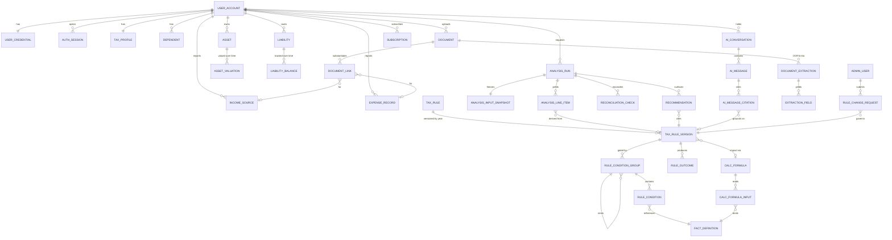

# Onyx Ledger — Database Architecture

**Status:** Architecture design (pre-implementation). SQL/DDL is generated only after this design is approved.
**Author role:** Principal database architect / fintech systems engineer
**Primary store:** PostgreSQL 16 · **Backend:** Python + FastAPI · **ORM:** SQLAlchemy 2.x (async)
**Future:** Redis · pgvector · S3-compatible object storage · CDC → analytics warehouse

---

## 0. Reading guide

This document delivers, in order:

1. Architecture explanation & principles
2. Domain breakdown (13 bounded contexts)
3. ERD description (+ Mermaid diagram)
4. Complete entity list
5. Relationship explanation
6. The rules/condition/formula engine (the hardest sub-system, treated separately)
7. Normalization analysis
8. Scalability considerations
9. Security considerations
10. Open decisions requiring sign-off
11. Next step (the SQL gate)

---

## 1. Architecture explanation & principles

Onyx Ledger is an **advisory** tax platform: it never files or transmits to the CRA. That framing is architecturally load-bearing — the database is a **system of record for the user's financial reality and for versioned Canadian tax knowledge**, plus an **audit trail of every analysis and recommendation** derived from the two. It is *not* a filing system, so there is no e-file state machine, but there **is** a strong obligation of correctness, explainability, and traceability ("which rule version produced this recommendation?").

Ten principles drive every decision below.

1. **Domain-Driven Design, enforced physically.** Each bounded context becomes a PostgreSQL **schema** (namespace) inside one database. This gives real ownership boundaries and per-schema privileges today, and a clean seam to extract a service later — without paying the distributed-transaction tax now.
2. **The user is an aggregate root; the tax knowledge base is a separate aggregate root.** They meet only inside the **analysis** domain. User data never references KB internals except through stable rule identifiers, and the KB never references a user. This keeps "who I am" and "what the law says" independently versionable.
3. **Time is a first-class dimension, twice over.**
   - *Tax knowledge* is **bitemporally versioned** (valid-time via `effective_date`/`expiry_date` + `tax_year`, transaction-time via row `created_at`/status). Rules are **append-only**; nothing is overwritten.
   - *Financial facts* are **tax-year scoped** and, where they represent a changing quantity (asset value, liability balance), kept as **time series**.
4. **Reproducibility over live joins for analyses.** An `analysis_run` captures an **immutable input snapshot** and **persists its derived outputs** (taxable income, per-line breakdown, checks, recommendations). Re-running the current engine against old law must never silently change a historical result.
5. **Every computed number is explainable.** Line items and recommendations carry a foreign key to the exact **`tax_rule_version`** and/or **`calc_formula`** that produced them. This is the backbone of the AI-citation requirement.
6. **Eligibility and math are data, not code.** Conditions are stored as a **boolean expression tree**; formulas as **versioned expressions** over a **fact catalog**. The engine is a generic evaluator. Adding "Medical Expense Credit 2027" is a data operation, not a deploy.
7. **UUID v7 primary keys.** Globally unique (safe for sharding, object-storage keys, and client-side generation) *and* time-ordered, which preserves index/heap locality at the scale of hundreds of millions of rows — avoiding the write amplification of random UUIDv4.
8. **Relational first; JSONB only where the shape is genuinely open or deliberately frozen.** Multi-valued attributes (incomes, expenses, dependents, valuations) are always child tables. JSONB is reserved for: evolving preferences/metadata, immutable input snapshots, OCR bounding boxes, plan feature flags, and audit before/after payloads — each justified in §7.
9. **Money and rates are exact.** Money is `NUMERIC(14,2)`; rates/percentages `NUMERIC(9,6)`. No floats in financial columns, ever.
10. **Privacy and auditability are structural, not bolted on.** Row-Level Security per user, least-privilege roles, append-only audit, token/secret **hashing** (never raw), column encryption for sensitive fields, and a hard-deletion (erasure) path distinct from soft deletion.

### Conventions

- `snake_case`, **singular** table names, `schema.table` addressing.
- Every table: `id UUID PK (v7)`, `created_at timestamptz not null default now()`, `updated_at timestamptz not null default now()` (trigger-maintained).
- User-owned aggregates add `deleted_at timestamptz` (soft delete). Mutable domain aggregates add `row_version int` for optimistic locking.
- Foreign keys: `ON DELETE RESTRICT` to reference/KB data; `CASCADE` to truly owned children; `SET NULL` to optional cross-links.
- Small, **fixed** value sets (boolean logical operator, condition operator) → `CHECK` constraint or tiny enum. **Evolving** value sets (income types, statuses, categories) → **lookup tables** in a shared `ref` schema, never PG `ENUM` (which is painful to alter at scale).
- Lookup/reference data lives in schema `ref`; cross-cutting audit in `audit`.

---

## 2. Domain breakdown (bounded contexts → schemas)

| # | Domain | Schema | Responsibility | Owns |
|---|--------|--------|----------------|------|
| 1 | Identity & User Management | `identity` | Who the user is; how they authenticate | accounts, credentials, sessions, tokens, MFA, login history |
| 2 | User Financial/Tax Profile | `profile` | Non-transactional facts about the user | tax profile, dependents, spouse, housing, preferences, privacy |
| 3 | Income & Expenses | `finance` | Per-year money in / money out | income sources, expense records, categories |
| 4 | Assets & Liabilities | `wealth` | Balance-sheet items + history | assets, valuations, registered accounts, liabilities, balances |
| 5 | Tax Knowledge Base | `tax_kb` | Versioned Canadian tax law as data | rules, rule versions, brackets, credits, benefits, limits |
| 6 | Rules Engine Support | `rules` | Dynamic eligibility + calculation | fact catalog, condition trees, operators, formulas, constants, outcomes |
| 7 | Tax Analysis Results | `analysis` | Immutable computed analyses | runs, input snapshots, line items, reconciliation checks, assumptions |
| 8 | Recommendation Engine | `reco` | Optimization opportunities + lifecycle | recommendations, status events, feedback |
| 9 | AI Knowledge & Conversations | `ai` | Chat + retrieval + explainability | conversations, messages, citations, embeddings, explanations |
| 10 | Documents & OCR | `docs` | Uploaded slips + extraction | documents (object-store refs), extractions, extracted fields, links |
| 11 | Administration | `admin` | Internal staff + governance of the KB | admin users, roles, permissions, change requests, approvals |
| 12 | Subscriptions & Billing | `billing` | Plans, subscriptions, invoices | plans, subscriptions, invoices, payment-method tokens, entitlements |
| 13 | Security & Audit | `audit` | Immutable trail + compliance rights | audit log, consent log, export/erasure requests, security events |
| — | Shared reference | `ref` | Enumerations-as-data | jurisdictions, provinces, tax years, income/expense/asset/doc types, statuses |

**Why schema-per-domain (not one schema, not 13 databases):** one physical database keeps foreign keys, transactions, and backups simple while millions of users still fit comfortably; schemas give per-domain `GRANT`s (the billing service role can't read `finance`), a legible object namespace, and a pre-drawn cut line if a domain is later promoted to its own service via logical replication/CDC.

---

## 3. ERD description

The topology is **two hubs and a bridge**.

- **Hub A — `identity.user_account`** is the aggregate root for everything a user owns. Profile, finance, wealth, documents, analyses, recommendations, AI conversations, subscriptions, and audit rows all fan out from it (1-to-many or 1-to-1). Deleting/erasing a user cascades or crypto-shreds this entire subtree.
- **Hub B — `tax_kb.tax_rule` → `tax_kb.tax_rule_version`** is the aggregate root for the law. Condition trees, formulas, brackets, benefits, admin change-requests, AI citations, analysis line items, and recommendations all point *into* specific rule versions. The KB has **no** FK back to any user.
- **Bridge — `analysis.analysis_run`** is where a user snapshot meets the law. A run belongs to one user and one tax year, freezes an input snapshot, and produces line items, reconciliation checks, and recommendations, each annotated with the `tax_rule_version`/`calc_formula` that generated it.
- **Cross-cutting — `audit.audit_log`** references any entity polymorphically (schema + table + id) and is written by triggers, not application joins.

---

## 4. Complete entity list

### `ref` — reference data
`jurisdiction`, `province`, `tax_year`, `currency`, `residency_status`, `marital_status`, `employment_type`, `housing_status`, `income_type`, `expense_category`, `asset_category`, `liability_category`, `document_type`, `verification_status`, `rule_category`, `condition_operator`, `account_registered_type`.

### 1 · `identity`
`user_account`, `user_credential`, `auth_session`, `login_event`, `password_reset_token`, `email_verification_token`, `mfa_method`.

### 2 · `profile`
`user_profile`, `tax_profile`, `dependent`, `spouse_profile`, `user_preference`, `user_privacy_setting`.

### 3 · `finance`
`income_source`, `expense_record`. *(categories live in `ref`.)*

### 4 · `wealth`
`asset`, `asset_valuation`, `registered_account_detail`, `liability`, `liability_balance`.

### 5 · `tax_kb`
`tax_rule`, `tax_rule_version`, `tax_bracket_set`, `tax_bracket`, `contribution_limit`, `benefit_program`, `benefit_parameter`, `legislation_reference`, `gov_source`.

### 6 · `rules`
`fact_definition`, `rule_condition_group`, `rule_condition`, `condition_value_set`, `condition_value_set_item`, `calc_formula`, `calc_formula_input`, `calc_constant`, `rule_outcome`.

### 7 · `analysis`
`analysis_run`, `analysis_input_snapshot`, `analysis_line_item`, `reconciliation_check`, `analysis_assumption`.

### 8 · `reco`
`recommendation`, `recommendation_status_event`, `recommendation_feedback`.

### 9 · `ai`
`ai_conversation`, `ai_message`, `ai_message_citation`, `ai_prompt_context`, `knowledge_embedding`, `ai_explanation`.

### 10 · `docs`
`document`, `document_extraction`, `extraction_field`, `document_link`.

### 11 · `admin`
`admin_user`, `role`, `permission`, `role_permission`, `admin_user_role`, `rule_change_request`, `rule_publication`.

### 12 · `billing`
`plan`, `subscription`, `invoice`, `payment_method_ref`, `entitlement`.

### 13 · `audit`
`audit_log`, `consent_log`, `data_export_request`, `data_deletion_request`, `security_event`.

**Total: ~70 tables** across 14 schemas (13 domains + `ref`).

---

## 5. Relationship explanation (selected, non-obvious)

- **`user_account` 1—1 `user_credential`.** Credentials are split out so the hot, widely-joined account row never carries the password hash, and so credential reads can be granted to a narrower role.
- **`tax_profile` is current-state, per-user (1—1); point-in-time truth lives in `analysis_input_snapshot`.** Rather than bitemporally versioning the whole profile (expensive, rarely queried historically), we snapshot the exact inputs into each analysis. Dependents and spouse are separate tables because they are multi-valued / independently editable.
- **`income_source` / `expense_record` are (user, tax_year)-scoped children**, never a single "income" column. Type and category are FKs to `ref` lookups so new income types/expense categories are inserts, not migrations. Each row carries `verification_status` and an optional `document_id` for provenance.
- **`asset` 1—many `asset_valuation`; `liability` 1—many `liability_balance`.** Current value is a convenience column on the parent (the latest valuation), with full history in the child time-series. `registered_account_detail` is a **subtype** table (1—1 with `asset`) holding contribution room/limits only for TFSA/RRSP/FHSA/RESP.
- **`tax_rule` 1—many `tax_rule_version`.** The *rule* is the stable identity ("Medical Expense Credit"); each *version* is one `(tax_year, effective_date→expiry_date, status)` incarnation, with `superseded_by_version_id` chaining replacements. Nothing is ever updated in place once `published`.
- **Condition tree:** `tax_rule_version` 1—many `rule_condition_group`; a group self-references its `parent_group_id` and carries a `logical_op ∈ {AND, OR, NOT}`; leaves are `rule_condition` rows bound to a `fact_definition` via an operator. This models arbitrary boolean logic relationally (see §6).
- **`analysis_run` is the join of the two hubs.** It has exactly one `analysis_input_snapshot` (frozen JSONB), and many `analysis_line_item` (income/deduction/credit/tax lines), `reconciliation_check` (the assurance layer: pass/review/flag), and `recommendation` rows. Line items and recommendations FK to the `tax_rule_version` that produced them — closing the explainability loop.
- **`recommendation` 1—many `recommendation_status_event`.** Status (`generated → viewed → accepted/rejected → completed`) is an **event log**, not a mutable column, so the full lifecycle and timing are auditable; the current status is a denormalized convenience column kept in sync by the same transaction.
- **`ai_message` 1—many `ai_message_citation` → `tax_rule_version` / `analysis_run` / `recommendation`.** This is the hard requirement "the AI can always identify which tax rules created a recommendation," expressed as first-class FKs rather than free text.
- **`knowledge_embedding`** carries a `vector` plus a polymorphic `(source_type, source_id)` and a copy of the chunk text and `tax_year`, so retrieval can be filtered to the law in force for the user's year.
- **`document` never stores bytes** — only `storage_provider`, `bucket`, `object_key`, `content_hash`, `mime_type`, `byte_size`, and `status`. `document_link` associates a document with the `income_source`/`expense_record` it substantiates.
- **`rule_change_request` governs `tax_rule_version` status transitions.** A version cannot reach `published` without an approved change request from an `admin_user` holding the right `permission` — the KB's four-eyes control.
- **`audit_log` is polymorphic and append-only.** It stores `(actor_type, actor_id, action, entity_schema, entity_table, entity_id, previous_value JSONB, new_value JSONB)` and is populated by triggers; no application FK points *out* of it, so it can never block a delete.

---

## 6. The rules / condition / formula engine (design crux)

The mandate is: *store eligibility and math as data*, support `= > < between in contains exists` with `AND/OR/NOT`, keep formulas separate from prose, and let the backend engine read it all from the database. Design:

**(a) Fact catalog — `rules.fact_definition`.** A registry of every value the engine can reason about, addressed by a stable dotted key and decoupled from physical columns:
`profile.age`, `profile.province`, `profile.marital_status`, `income.employment.total`, `income.self_employment.net`, `income.total`, `expense.medical.total`, `asset.rrsp.contribution_room`, `derived.net_income`, `derived.marginal_rate`. Each row has a `data_type` (`number|money|percent|integer|boolean|text|enum|date`) and a `unit`. The engine resolves a fact key against the analysis input snapshot; conditions and formulas reference **fact keys**, never table columns — this is what makes eligibility non-hardcoded and refactor-proof.

**(b) Condition tree — relational boolean AST.**
- `rule_condition_group(id, rule_version_id, parent_group_id NULL, logical_op ∈ {AND,OR,NOT}, sort_order)` — nestable; the root group is the rule's gate.
- `rule_condition(id, group_id, fact_key → fact_definition, operator → ref.condition_operator, value_type, value_number, value_number_high, value_text, value_boolean, value_date, value_set_id NULL)` — a leaf comparison. `value_number_high` supports `between`; `value_set_id → condition_value_set` supports `in`/`contains` over a set (e.g., province ∈ {ON, BC}).

This represents `IF income > threshold AND province = 'ON' AND age > 65` as one AND-group with three leaves — and any nesting of `OR`/`NOT` by adding child groups. It is fully queryable ("show every rule that depends on `profile.age`"), diff-able, and auditable. *(A compiled JSONB form of the same tree may be cached on the version for fast evaluation; the relational tree remains the source of truth.)*

**(c) Formulas — `rules.calc_formula`.** Math is stored **separately from descriptions**: `calc_formula(id, code, expression, expression_lang ∈ {rpn, ast, cel}, output_unit, description)` with `calc_formula_input(formula_id, param_name, fact_key → fact_definition)` binding inputs to facts, and `calc_constant(code, tax_year, value)` for named constants (e.g., indexation factor). The engine evaluates the expression in a **sandbox** (no arbitrary code; a whitelisted operator set), pulling inputs by fact key. A `tax_rule_version` may point to a `calc_formula` for its **impact/amount**.

**(d) Tabular vs. formulaic calculations — a deliberate split.** Not everything should be a formula:
- **Tax brackets** are inherently tabular → `tax_bracket_set(jurisdiction, tax_year, kind)` + `tax_bracket(set_id, lower_bound, upper_bound NULL, rate, ordinal)`. Storing brackets as rows (not a formula blob) makes them queryable, seedable, and diffable year over year.
- **Fixed amounts / thresholds / contribution limits** → columns on `tax_rule_version` / `contribution_limit`.
- **Phase-outs, gross-ups, blended-rate math** → `calc_formula` expressions.
This mirrors how the CRA itself publishes the law and keeps 90% of calculations as inspectable data.

**(e) Outcomes — `rules.rule_outcome`.** The `THEN` half: `rule_outcome(rule_version_id, outcome_type ∈ {recommend, apply_credit, apply_deduction, flag_benefit_eligibility}, recommendation_template_id NULL, impact_formula_id NULL, priority)`. When a version's condition tree evaluates true for a user's snapshot, the engine emits the outcome — a recommendation (with where/how/why text) and/or a computed impact.

The net effect: **adding or amending law is INSERT-only data work** (a new `tax_rule_version` + its condition tree + formula + outcome, routed through the admin approval workflow), and every emitted number traces back to the exact version and formula that produced it.

---

## 7. Normalization analysis

- **Baseline: BCNF for all transactional and financial tables.** Every non-key attribute depends on the whole key and nothing but the key. No repeating groups, no multi-valued columns: multiple incomes, expenses, dependents, valuations, balances, citations, and status events are each their own table.
- **Reference/lookup tables** eliminate transitive dependencies and update anomalies for all evolving enumerations (income types, categories, statuses, provinces). Truly fixed micro-sets (`logical_op`, condition operator families) use `CHECK`/enum for speed.
- **Deliberate, documented denormalizations** (each a conscious trade, not an accident):
  1. `analysis_run` **persists derived aggregates** (`taxable_income`, `estimated_tax`, `estimated_savings`, `confidence_score`). These are computed, but stored because an analysis is an **immutable historical fact** that must not drift when the engine changes.
  2. `asset.current_value` / `liability.current_balance` cache the latest child time-series row for cheap reads; the child table is authoritative.
  3. `recommendation.status` caches the latest `recommendation_status_event`.
  4. `knowledge_embedding.content` duplicates source text so vector retrieval needs no join into the KB.
- **JSONB is used in exactly six places, each justified:** evolving `user_preference`/`entitlement`/`plan.features`; the **immutable** `analysis_input_snapshot.snapshot`; OCR `extraction_field.bounding_box`; `ai_prompt_context.context`; and `audit_log.previous_value/new_value`. Everywhere a relation is more appropriate (incomes, conditions, brackets), a relation is used — per the brief.
- **Result:** near-zero update/insert/delete anomalies on the OLTP surface; the few denormalized columns are single-writer, same-transaction maintained, and reconstructable from their source of truth.

---

## 8. Scalability considerations (design for millions of users)

- **Keys:** UUIDv7 → time-ordered inserts preserve B-tree/heap locality and slash write amplification vs. v4; also enables client-side ID generation and safe cross-shard uniqueness.
- **Partitioning:**
  - *Append-only event/time tables* — `audit.audit_log`, `ai.ai_message`, `identity.login_event`, `analysis.analysis_run` — **range-partitioned by `created_at`** (monthly), with **BRIN** indexes on the time column (tiny, perfect for append-only).
  - *Financial fact tables* — `finance.income_source`, `finance.expense_record` — **list-partitioned by `tax_year`**, so a year's analysis touches one partition and old years archive cleanly.
- **Read scaling:** streaming read replicas for analytics/reporting; **Redis** for sessions, hot reference data (current-year brackets/rules), and rate limiting; keep the primary for OLTP writes.
- **AI retrieval:** `pgvector` with an **HNSW** index on `knowledge_embedding.embedding`, pre-filtered by `tax_year`/`jurisdiction` to keep recall relevant and the search space small.
- **Connection management:** PgBouncer (transaction pooling) in front of FastAPI's async pool.
- **Service extraction path:** schema boundaries + logical replication/CDC (Debezium) let `billing`, `ai`, or `tax_kb` graduate to their own database/service without a rewrite.
- **Analytics offload:** CDC → columnar warehouse (BigQuery/Snowflake/DuckDB) so heavy aggregation never touches OLTP; materialized views for admin dashboards, refreshed off-peak.
- **Hot-row avoidance:** no global counters in-row (use Redis or per-shard counter tables); status changes modeled as event inserts, not contended updates.

---

## 9. Security considerations

- **Never stored, by design:** plaintext passwords (Argon2id hash in `identity.user_credential`), SIN, government-portal or bank credentials, raw card numbers. Session/reset/verification **tokens are stored only as hashes**; the raw token exists only in transit.
- **Row-Level Security** on every user-owned table, policy keyed to the authenticated `user_id` (set via `SET LOCAL app.user_id`), so a query bug can't cross tenants. Admin access goes through separate roles/policies.
- **Least-privilege database roles:** `app_rw` (CRUD on user domains, no DDL), `app_ro` (replicas), `kb_admin` (writes `tax_kb`/`rules` only, gated by app-level approval), `audit_writer` (INSERT-only on `audit.*`), `migrator` (DDL, used only by migrations). Billing's role cannot read `finance`; the audit writer cannot read user PII.
- **Encryption:** at-rest volume encryption (infra) plus **column-level encryption** for the most sensitive financial detail via `pgcrypto` **or** application-layer envelope encryption with an external KMS (recommended — keys never in the DB). MFA secrets are stored as **KMS key references**, not raw secrets.
- **Immutable audit:** `REVOKE UPDATE, DELETE ON audit.audit_log`; rows written by `AFTER` triggers on tracked tables capturing actor, action, and before/after JSONB. The log outlives the entities it references (polymorphic, no outbound FK).
- **Compliance rights (PIPEDA):** `consent_log` records versioned consents; `data_export_request` and `data_deletion_request` drive **secure deletion** — a hard-delete/crypto-shred of PII on erasure, while retaining pseudonymized audit entries (actor replaced by a tombstone) for integrity. **Soft delete** (`deleted_at`) serves reversible UX; **hard delete** serves legal erasure — two distinct paths.
- **Defense in depth:** TLS in transit; `security_event` captures anomalous auth/access for monitoring; all secrets via KMS/parameter store, never in tables or code.

---

## 10. Open decisions requiring your sign-off

These are genuine forks where I'll proceed with the **recommended** option unless you say otherwise:

1. **Encryption of sensitive financial columns:** _(Recommended)_ application-layer **envelope encryption via external KMS** (keys never in Postgres) over in-DB `pgcrypto`. Higher assurance, slightly more app complexity.
2. **Admin identity:** _(Recommended)_ a **separate `admin.admin_user`** table (physical least-privilege separation) rather than an elevated flag on `identity.user_account`.
3. **Condition storage:** _(Recommended)_ **relational tree as source of truth**, with an optional cached compiled JSONB for evaluation speed — vs. JSONB-only (simpler, less auditable).
4. **Formula language:** _(Recommended)_ a **restricted expression DSL (RPN/AST evaluated in a sandbox)** over embedding a general expression engine — safer, fully auditable.
5. **Migrations tool:** **Alembic** (matches SQLAlchemy) with a strict domain-ordered migration sequence.
6. **UUID generation:** **UUIDv7** (app- or DB-side via a small function) — confirm you're OK adding the generator, otherwise fall back to `gen_random_uuid()` (v4) with the noted locality cost.

---

## 11. Next step — the SQL gate

Per your process, DDL comes **after** this architecture is validated. On your approval I will generate, in this order:

1. **Extensions & roles** (`pgcrypto`, `vector`, UUIDv7 function; least-privilege roles).
2. **`ref` schema** seed tables (jurisdictions, provinces, tax years, type/status lookups).
3. **`CREATE TABLE`** statements per domain, in dependency order: `ref → identity → profile → finance → wealth → tax_kb → rules → analysis → reco → ai → docs → admin → billing → audit`.
4. **Indexes** (btree on FKs, partial on soft-delete/status, GIN on JSONB/full-text, BRIN on time partitions, HNSW on embeddings).
5. **Foreign keys & constraints** (checks, uniqueness, exclusion where needed).
6. **Partitioning DDL** (range/list) and the **audit trigger** framework.
7. **RLS policies** and role `GRANT`s.
8. **Alembic migration order** and **seed-data examples** (a sample versioned tax rule — e.g., the Medical Expense Credit across 2025/2026 — with its condition tree, formula, and outcome).
9. **Database documentation** (data dictionary per table).

> **Reply "approved" (or tell me which of the §10 options to change) and I'll generate the full PostgreSQL schema + migrations + seed data.**
