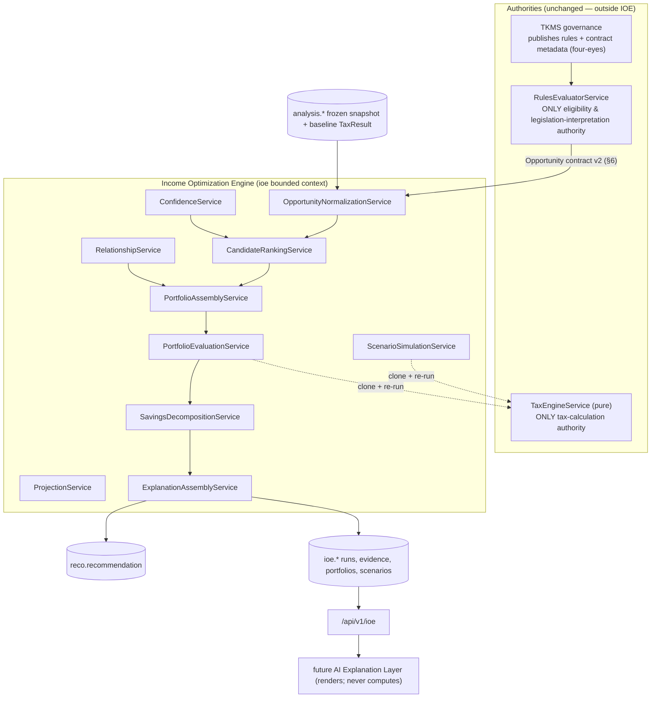
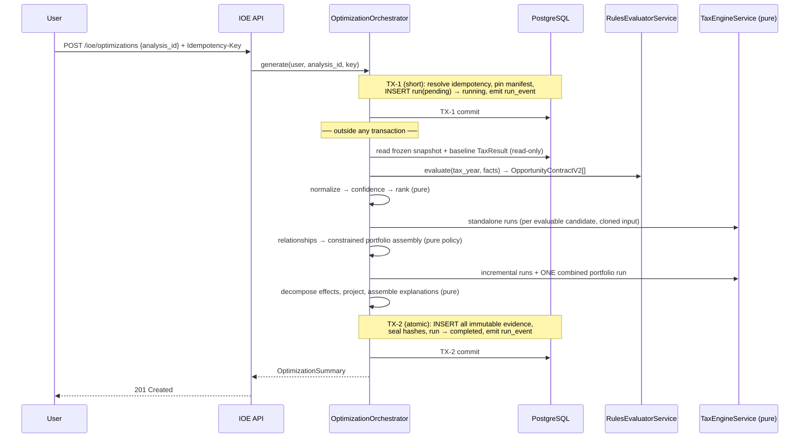

# Onyx Ledger — Income Optimization Engine (IOE) Architecture, Revision 2

**Status:** Pre-implementation architecture (revised). No implementation code until the §33 gate is approved.
**Supersedes:** `ioe-architecture.md` (Revision 1). Revision 1 remains in history; this document is the authority.

> 📎 **Amended by `ioe-architecture-v2.1.md`.** Revision 2.1 replaces six subsections of this document:
> §9.4 + §7 + §24 (rule-snapshot pinning), §12.3 + §12.2 (portfolio objective metrics and interaction-delta
> mathematics), §6.2 + §17 (registry-controlled lever bindings), §12.1–12.3 (greedy limitations), and
> §30 + §31 (migration ordering). Read 2.1 alongside this document; everything else here stands unchanged.
**Author role:** Principal fintech systems architect / senior Canadian tax-platform engineer.

**Preserved, unchanged foundations:** the 14-schema PostgreSQL database (+ `tkms`), the FastAPI modular monolith, the deterministic `TaxEngineService`, the `RulesEvaluatorService`, the Tax Knowledge Management System, published-rules-only reads, the `analysis` / `reco` / `tax_kb` bounded contexts, a dedicated `ioe` bounded context, Clean Architecture layering, PostgreSQL RLS, `Decimal`-based deterministic calculation, immutable historical calculation results, versioned configuration and provenance, what-if scenarios over cloned frozen inputs, and **the tax engine as the only component permitted to calculate tax**.

All schema changes proposed here are **additive** (new `ioe` schema; additive columns/tables on `rules`/`tax_kb`/`reco`). No existing column is dropped or retyped.

---

## 1. Executive summary

The Tax Intelligence Engine answers *"what is this user eligible for based on published rules and supplied data?"* The IOE answers *"what verified actions or scenarios may improve this user's after-tax position?"*

Revision 1 was directionally right but made four claims this revision retracts, because each would have produced a system that is wrong, legally risky, or impossible to operate:

1. **It called the whole IOE "pure" and promised "byte-identical outputs."** The domain math is pure; the application layer is emphatically not (it orchestrates storage, rule evaluation, caching, engine execution, and workflow state). §2 and §9 restate determinism as a layered, hash-verifiable property with canonical serialization rules.
2. **It used "guaranteed savings."** No tax outcome is guaranteed — outcomes depend on data accuracy, documentation, unmodeled facts, CRA review, and future rule changes. §13 replaces this with an orthogonal pair of enums: `calculation_basis` (how the number was produced) and `evidence_status` (how well the inputs are supported).
3. **It let the IOE derive eligibility, required actions, dependencies, and legislative support.** That is legislation interpretation. §6 moves every legally meaningful field into an expanded `Opportunity` contract supplied by the rules layer under TKMS governance — an additive, four-eyes-governed change to `rules`/`tax_kb`, not an IOE inference. The service is renamed **`OpportunityNormalizationService`** accordingly.
4. **It summed recommendation-level impacts into a total.** This double-counts shared contribution room, non-refundable credit ceilings, and interacting strategies. §12 introduces a mandatory **portfolio-evaluation stage**: a compatible strategy portfolio is applied to a cloned baseline and re-run through `TaxEngineService`, and **the only total shown to users is that combined engine result.** This is the blocking correction.

The first release is therefore scoped and named honestly: a **deterministic ranked-opportunity and strategy-portfolio engine** — candidate ranking followed by *constrained, rule-based* portfolio assembly. It is not a mathematical optimizer, and this document does not claim it is.

---

## 2. Corrected design stance

### 2.1 Determinism is layered, not global

> **The IOE domain calculations are pure and deterministic. The application layer orchestrates storage, rule evaluation, caching, engine execution, and workflow state.**

| Layer | Purity | What lives here | Determinism guarantee |
|---|---|---|---|
| **Pure domain** (`ioe/domain/*`) | Pure functions, no I/O, no clock, no UUIDs | scoring, confidence, savings decomposition, relationship detection, portfolio assembly policy, lever application, canonical serialization | Same canonical inputs ⇒ same outputs, always |
| **Stateful application orchestration** (`ioe/*/service.py`) | Impure by design | workflow headers, transaction boundaries, retries, idempotency, caching, invoking the engine and rules evaluator | Deterministic **given** pinned dependency versions and a frozen input snapshot |
| **Infrastructure & persistence** | Impure | PostgreSQL, Redis, Celery, object storage | Not deterministic (IDs, timestamps, ordering) — excluded from hashes |
| **External versioned dependencies** | Outside IOE control | `TaxEngineService`, `RulesEvaluatorService`, published rule versions, reference data, engine config | Pinned per run (§9.4); a version change produces a *new* run, never a mutated one |

### 2.2 The determinism guarantee (replaces "byte-identical outputs")

> **Identical canonical inputs and pinned dependency versions produce semantically identical domain outputs and identical canonical result hashes.**

"Semantically identical" means equal after canonical normalization (§9.1): equal `Decimal` values at the declared scale, equal enum members, equal sets compared under the declared ordering. It explicitly does **not** mean identical database rows, identical UUIDs, identical timestamps, or identical wire bytes.

### 2.3 What the IOE may and may not do

**May:** normalize, group, score, rank, compare, simulate (via the engine), assemble portfolios, detect relationships between recommendations, decompose economic effects, project, and assemble structured explanations.

**May not:** interpret legislation; determine legal eligibility; author or alter tax calculation formulas; compute tax itself; read unpublished rules; infer required actions, documents, dependencies, or deadlines from rule text; present a summed total that has not been verified by a combined engine run.

---

## 3. System boundaries



**Boundary rules.** The IOE reads the engine and rules evaluator through their public interfaces only; it has **no** write path to `finance`, `profile`, `wealth`, `tax_kb`, or `rules`. It never queries `tax_rule_version` directly for eligibility (only for citation display of versions already referenced by an `Opportunity`).

---

## 4. Tax-engine and IOE responsibility matrix

| Concern | `TaxEngineService` | `RulesEvaluatorService` | **IOE** |
|---|---|---|---|
| Compute federal/provincial tax, CPP/EI, dividends, capital gains | **Owns** | — | Never |
| Author/alter calculation formulas | Owns (as data, via TKMS) | Executes stored formulas | Never |
| Determine legal eligibility | — | **Owns** | Never |
| Interpret legislation / rule text | — | **Owns** | Never |
| Required actions, documents, dependencies, deadlines | — | **Owns** (supplies via contract §6) | Consumes verbatim |
| Citations, jurisdiction, expiry information | — | **Owns** | Consumes verbatim |
| Per-opportunity calculated impact | Provides the tax function | **Owns** rule-formula impacts | Consumes; may diff engine runs |
| Normalize opportunities into candidates | — | — | **Owns** |
| Score confidence, rank candidates | — | — | **Owns** |
| Assemble a constrained strategy portfolio | — | — | **Owns** |
| Evaluate the portfolio total | **Executes** the combined run | — | **Owns** the orchestration + diff |
| Detect relationships/conflicts between recommendations | — | supplies `shared_resource_code` etc. | **Owns** graph construction |
| Scenario simulation | **Executes** each run | — | **Owns** lever application + diff |
| Multi-year projection | Executes per-year runs | — | **Owns** methodology + assumptions |
| Explanation assembly (structured) | — | supplies citations/basis codes | **Owns** assembly (deterministic) |
| Natural-language rendering | — | — | Future AI layer (renders only) |

---

## 5. Revised domain model

### 5.1 Core enums (explicit, stable serialization — §9.1)

```text
calculation_basis:            # HOW the number was produced
  engine_determined           # difference of two TaxEngineService runs
  rule_formula_determined     # published rule's stored formula, executed by RulesEvaluatorService
  scenario_estimate           # engine run over user-supplied hypothetical inputs
  projection_estimate         # multi-year extrapolation under structured assumptions

evidence_status:              # HOW WELL the inputs are supported (independent of basis)
  documented_verified         # linked document, extraction verified
  documented_unverified       # document present, not verified
  user_attested               # user-entered, no document
  incomplete                  # required inputs missing

economic_effect_type:         # WHAT KIND of outcome
  immediate_refund_impact
  current_year_tax_reduction
  tax_deferral                # timing shift, NOT a permanent reduction
  refundable_benefit
  recurring_annual_benefit
  multi_year_projected_benefit
  future_option_value

cost_type:
  required_cash_contribution  # e.g. RRSP/FHSA contribution
  required_expenditure        # e.g. donation, eligible expense
  implementation_cost         # fees, professional advice

reversibility:  reversible | partially_reversible | irreversible
benefit_horizon: current_year | next_year | multi_year | indefinite

eligibility_status:           # supplied by RulesEvaluatorService ONLY
  eligible | conditionally_eligible | ineligible | indeterminate

relationship_type:            # §16
  requires | precedes | excludes | substitutes
  shares_limit | enhances | reduces_value | overlaps

portfolio_membership:
  selected | excluded_conflict | excluded_constraint
  excluded_not_evaluable | deferred_timing

freshness_status: current | stale | superseded
workflow_status:  pending | running | completed | failed | cancelled

recommendation_lifecycle:
  new | viewed | saved | planned | completed | dismissed | unable_to_complete | expired

assumption_certainty: user_asserted | platform_default | derived_from_data | statutory_known
assumption_materiality: high | medium | low
assumption_source: user | platform | analysis
```

> **Note on orthogonality.** `calculation_basis` and `evidence_status` are independent axes and must never be collapsed. A `rule_formula_determined` amount over `user_attested` inputs is precisely calculated from unverified data — the user must see both facts.

### 5.2 Pure domain objects

- **`OpportunityContractV2`** — the inbound contract (§6). Consumed verbatim; the IOE never fabricates its fields.
- **`OptimizationCandidate`** — a normalized opportunity plus IOE-derived, non-legal metadata: `candidate_id`, `normalized_category`, `economic_effects[]`, `costs[]`, `portfolio_application` (lever bindings, nullable), `standalone_potential`, `incremental_portfolio_benefit`, `portfolio_membership`, `score_breakdown`, `confidence_breakdown`.
- **`EconomicEffect`** — `{effect_type, amount, tax_year, horizon_years, calculation_basis, reversibility, is_permanent}`. A candidate may carry several (e.g. an RRSP contribution yields `current_year_tax_reduction` **and** `tax_deferral`).
- **`CostComponent`** — `{cost_type, amount, timing}`.
- **`ScoreBreakdown`** / **`ConfidenceBreakdown`** — per-factor `{factor_code, raw, normalized, weight, contribution, reason_code}`; the rendered explanation is derived from these, never free-typed.
- **`StructuredAssumption`** — §15.
- **`Lever`** / **`LeverBinding`** — registry-defined mapping from a named hypothetical to `TaxInput` field deltas, with validation and a `lever_registry_version`.
- **`RecommendationRelationship`** — typed edge (§16).
- **`StrategyPortfolio`** — `{selected_candidates[], resource_ledger, portfolio_total_benefit, interaction_delta, assembly_policy_version, excluded[] with reason codes}`.
- **`ProjectionSeries`** — per-horizon amounts with the assumptions that produced them.

### 5.3 Relationship to `TaxInput` / `TaxResult`

The engine's existing `TaxInput` (province, year, income components, deductions, credits inputs) and `TaxResult` (`total_income`, `taxable_income`, `federal_tax`, `provincial_tax`, `income_tax`, `total_payable`, `refund_or_balance`, `marginal_rate`, `average_rate`, …) are used **as-is**. Lever application produces a modified `TaxInput` clone; economic effects are read from named `TaxResult` field diffs — never recomputed by the IOE.

---

## 6. RulesEvaluator opportunity contract (v2)

### 6.1 Why the contract must expand

Today's `Opportunity` carries `rule_version_id, opportunity_code, title, category, mechanism, where_text, how_text, why_text, estimated_impact, priority, citation` — largely display prose. Revision 1 implicitly expected the IOE to infer eligibility, actions, dependencies, and deadlines from that prose. **That is legislation interpretation and is now prohibited.**

**Contract v2** therefore requires the rules layer to *supply* every legally meaningful field. These fields are authored as **rule data** and published through TKMS four-eyes governance — the same path as any other rule content.

### 6.2 The contract

```text
OpportunityContractV2:
  # identity & provenance
  opportunity_code            str            # stable code
  rule_version_id             uuid           # published version (TKMS-approved)
  jurisdiction                str            # 'FED' | province code
  tax_year                    int
  contract_version            str            # e.g. 'opportunity/2.0.0'

  # legal determinations — RULES LAYER ONLY
  eligibility_status          eligibility_status
  eligibility_basis_codes     list[str]      # coded reasons, not prose
  required_actions            list[ActionSpec]
  required_documents          list[DocumentSpec]
  dependencies                list[DependencySpec]
  applicable_deadlines        list[DeadlineSpec]
  citations                   list[CitationSpec]
  expiry_information          ExpiryInfo | null
  assumptions_required        list[AssumptionRequirement]

  # economics — supplied, not inferred
  calculation_basis           calculation_basis
  calculated_impact           Decimal | null
  economic_effect_type        economic_effect_type
  shared_resource_codes       list[str]      # e.g. 'RRSP_ROOM_2025' — feeds §16 edges
  portfolio_application       LeverBindingSpec | null   # how to apply it in a portfolio run

  # display (unchanged, still prose)
  title, category, mechanism, where_text, how_text, why_text
```

Sub-specs are structured, e.g. `ActionSpec {action_code, description, effort_rating, cost_type, cost_amount, deadline_ref}`, `DeadlineSpec {deadline_code, date, is_hard, jurisdiction}`, `CitationSpec {legislation_reference_id, citation_text, source_url}`.

### 6.3 Required additive changes to the rules layer

These are **rules-layer** changes, governed by TKMS — listed here because the IOE cannot proceed without them (see migration impact and blocking decision **D-2**):

| Additive change | Schema | Purpose |
|---|---|---|
| `rules.rule_action` | new table | `required_actions` (action_code, effort_rating, cost_type, cost_amount, deadline_ref) |
| `rules.rule_required_document` | new table | `required_documents` (document_type_code, necessity) |
| `rules.rule_dependency` | new table | `dependencies` (depends_on_rule_code, dependency_type) |
| `rules.rule_deadline` | new table | `applicable_deadlines` (deadline_code, date//rule, is_hard) |
| `rules.rule_shared_resource` | new table | `shared_resource_codes` (resource_code, pool_scope) |
| `rules.rule_outcome += economic_effect_type, reversibility, portfolio_lever_code` | additive columns | economic classification + portfolio applicability |
| `tax_kb.tax_rule_version += eligibility_basis_codes jsonb` | additive column | coded eligibility reasons |

**Backward compatibility.** `RulesEvaluatorService` emits contract v2 with these fields **nullable/empty when unpopulated**. A candidate whose contract fields are absent is normalized with `eligibility_status = indeterminate`, is **excluded from the portfolio** (`excluded_not_evaluable`), and is surfaced as informational only. The IOE never fills the gap by guessing.

### 6.4 Service rename

`OpportunityDetectionService` → **`OpportunityNormalizationService`**. It normalizes, classifies (non-legally), and enriches with IOE-owned metadata. It detects nothing legal. ("Enrichment" was rejected as it implies adding substance; "normalization" is accurate.)

---

## 7. Persistence model

New `ioe` schema. **W** = mutable workflow record, **I** = immutable evidence record (§8).

| Table | Kind | Key columns |
|---|---|---|
| `ioe.optimization_run` | **W** | id, user_id, analysis_id, tax_year, workflow_status, freshness_status, evaluated_at, stale_at, stale_reason_codes `text[]`, superseded_by_run_id, optimization_spec_hash, optimization_result_hash, weight_config_id, version_manifest `jsonb`, manifest_hash, error_code, idempotency_key, started_at, completed_at |
| `ioe.optimization_run_event` | **append-only** | run_id, from_status, to_status, reason_code, created_at |
| `ioe.run_rule_version` | **I** | run_id, tax_rule_version_id — the exact published rule set used |
| `ioe.optimization_candidate` | **I** | run_id, recommendation_id, opportunity_code, rule_version_id, eligibility_status, calculation_basis, evidence_status, standalone_potential, incremental_portfolio_benefit, portfolio_membership, exclusion_reason_code, candidate_rank, recommendation_score, confidence_score |
| `ioe.candidate_economic_effect` | **I** | candidate_id, effect_type, amount, tax_year, horizon_years, calculation_basis, reversibility, is_permanent |
| `ioe.candidate_cost` | **I** | candidate_id, cost_type, amount, timing |
| `ioe.score_component` | **I** | candidate_id, factor_code, raw_value, normalized_value, weight, contribution |
| `ioe.confidence_component` | **I** | candidate_id, factor_code, value, weight, contribution, reason_code |
| `ioe.recommendation_relationship` | **I** | run_id, source_recommendation_id, target_recommendation_id, relationship_type, shared_resource_code, maximum_shared_amount, explanation_code, resolution_options `jsonb` |
| `ioe.strategy_portfolio` | **I** | run_id, assembly_policy_version, baseline_tax, portfolio_tax, portfolio_total_benefit, sum_of_standalone, interaction_delta, additivity_verified `bool`, portfolio_result_hash |
| `ioe.portfolio_member` | **I** | portfolio_id, candidate_id, apply_order, incremental_benefit, resource_allocations `jsonb` |
| `ioe.resource_ledger_entry` | **I** | portfolio_id, resource_code, capacity, allocated, remaining |
| `ioe.multi_year_projection` | **I** | run_id, horizon_year, projected_amount, effect_type, calculation_basis, assumption_set_id |
| `ioe.assumption_set` / `ioe.assumption` | **I** | structured assumptions (§15): code, value, source, certainty, effective_period, materiality, display_note |
| `ioe.scenario` | **W** | id, user_id, base_analysis_id, label, workflow_status, visibility_status (`active`/`archived`), scenario_spec_hash, scenario_result_hash, lever_registry_version, version_manifest `jsonb`, execution_ms, archived_at, error_code, idempotency_key |
| `ioe.scenario_event` | **append-only** | scenario_id, from_status, to_status, reason_code |
| `ioe.scenario_input_change` | **I** | scenario_id, lever_code, field, old_value, new_value, apply_order |
| `ioe.scenario_result` | **I** | scenario_id, baseline_tax, scenario_tax, tax_delta, effect breakdown, confidence_score, affected_rule_versions `jsonb` |
| `ioe.weight_config` | **W (activation only)** | id, version, weights `jsonb`, schema_version, is_active, activated_at, activated_by, checksum |

**Additive changes to existing schemas:**

| Change | Table | Rationale |
|---|---|---|
| `+ optimization_run_id uuid NULL REFERENCES ioe.optimization_run(id)` | `reco.recommendation` | traceability from a recommendation to the run that produced it |
| `+ calculation_basis text`, `+ evidence_status text` | `reco.recommendation` | replaces implied certainty; drives user-facing labels |
| extend lifecycle CHECK to the 8 states (§5.1) | `reco.recommendation` | additive value extension, existing values preserved (`generated`→`new` mapped forward, old values retained in the CHECK during transition) |
| `reco.recommendation_status_event` reused as the append-only lifecycle log | — | already exists; no change |

---

## 8. Immutability and workflow-state model

### 8.1 The distinction

| Category | Examples | Mutability |
|---|---|---|
| **Mutable workflow headers** | `optimization_run`, `scenario` | Status/freshness transitions **only**, via an allow-list; result columns are write-once when transitioning to `completed` |
| **Immutable calculation evidence** | candidates, economic effects, costs, score/confidence components, relationships, portfolio + members + ledger, projections, assumptions, scenario input changes, scenario results, `run_rule_version` | Insert-only; UPDATE/DELETE rejected |
| **Append-only event logs** | `optimization_run_event`, `scenario_event`, `reco.recommendation_status_event` | Insert-only |
| **Visibility actions** | scenario "delete" | Sets `visibility_status='archived'` + `archived_at`; calculation evidence is retained |
| **Audit** | `audit.audit_log` | Append-only (existing SECURITY DEFINER trigger; rejects UPDATE/DELETE) |

### 8.2 Allowed transitions

```
pending ──► running ──► completed          (terminal, results sealed)
   │           ├──────► failed             (terminal; error_code set, no result children)
   └───────────┴──────► cancelled          (terminal; user/system abort)
completed ──► (freshness only) current ──► stale ──► superseded
```
Freshness is a **separate axis** from `workflow_status`: a `completed` run may become `stale` or `superseded` without ever mutating its calculation evidence (§24).

### 8.3 Enforcement (defence in depth)

1. **Service-layer guard** — a pure `WorkflowStateMachine.assert_transition(from, to)` (mirroring TKMS's `RuleLifecycle`) is the single place transitions are defined; illegal moves raise.
2. **Database CHECK** — enumerated values on `workflow_status`, `freshness_status`, `visibility_status`.
3. **Trigger `ioe.reject_result_mutation()`** — a `BEFORE UPDATE OR DELETE` trigger on every immutable evidence table raises unconditionally (same pattern as `audit.reject_mutation`).
4. **Trigger `ioe.guard_run_transition()`** — a `BEFORE UPDATE` trigger on `optimization_run` / `scenario` that (a) rejects any change to sealed result columns once `workflow_status='completed'`, and (b) validates the `(OLD.status, NEW.status)` pair against the transition table. Terminal states reject further status changes.
5. **SECURITY DEFINER** is used only where the runtime role lacks direct rights (audit writes), with a pinned `search_path`; each such function is reviewed per §25.

> **Decision D-6:** whether the transition allow-list lives in the trigger (strongest, duplicated logic) or only in the service (single definition, weaker). *Recommended:* both — service for expressive errors, trigger as a coarse backstop rejecting sealed-column mutation and terminal-state changes.

---

## 9. Versioning and canonical hashing

### 9.1 Canonical serialization rules (normative)

Applied by `ioe/domain/canonical.py` before any hash is computed:

| Rule | Specification |
|---|---|
| Encoding | UTF-8, no BOM |
| Object keys | Sorted lexicographically by Unicode code point, recursively |
| Arrays | **Explicitly ordered** by a declared sort key per collection (documented per hash input); never relies on DB or set-iteration order |
| Decimals | Serialized as strings at a **fixed scale per semantic type**: money `scale=2`, rates `scale=6`, factors `scale=6`; no exponent notation |
| Rounding | `ROUND_HALF_UP` for money; quantization applied **once**, at serialization, per the pinned `decimal_policy_version` |
| Null vs missing | A field with value null is emitted as `"field": null`; a field that does not apply is **omitted**. The two are distinct and never interchanged |
| Enums | Serialized as their stable lowercase snake_case string member name, never ordinal |
| Dates | ISO-8601 `YYYY-MM-DD`; timestamps excluded from hashes entirely |
| Booleans | `true` / `false` |
| Excluded from all hashes | wall-clock timestamps, generated UUIDs, database primary keys, execution durations, row counts, cache state, worker identity |
| Separators | `,` and `:` with no insignificant whitespace |

Any change to these rules increments `canonical_serialization_version` and is treated as a breaking version bump (§9.4).

### 9.2 The four hashes

```text
optimization_spec_hash = H(canonical{
    baseline_input_snapshot_hash,       # from analysis.analysis_input_snapshot
    tax_year, jurisdiction,
    rule_version_set,                   # sorted list of tax_rule_version ids
    version_manifest,                   # §9.4, includes weight_config_id + all algorithm versions
    user_constraints,                   # cash available, effort ceiling, etc. (structured)
    assumption_set                      # structured assumptions (§15)
})

optimization_result_hash = H(canonical{
    optimization_spec_hash,
    ranked_candidates,                  # ordered: (rank, candidate_key)
    portfolio,                          # members in apply_order, ledger, totals
    economic_effects, costs,
    score_components, confidence_components,
    relationships, projections
})

scenario_spec_hash = H(canonical{
    baseline_input_snapshot_hash,
    canonical_scenario_input,           # normalized lever changes in apply_order
    tax_year, jurisdiction,
    lever_registry_version,
    engine_version, engine_config_version,
    rule_version_set,
    reference_data_versions,
    calculation_policy_version, decimal_policy_version
})

scenario_result_hash = H(canonical{ scenario_spec_hash, canonical_result })
```
`H` = SHA-256, hex-encoded. **Spec hashes never include results; result hashes always include their spec hash.** Hashing only the scenario deltas is explicitly prohibited — the baseline snapshot, versions, and jurisdiction are part of the identity.

### 9.3 What the hashes are used for

- **Idempotency & dedupe** (§23) — spec hash identifies an equivalent computation.
- **Reproducibility verification** — recompute and compare result hashes (regression tests, §29).
- **Staleness detection** — a changed rule set or manifest yields a different spec hash for the same logical request (§24).

They are **not** used as security tokens and are never user-supplied trust anchors.

### 9.4 Version manifest (pinned per run — replaces a single `ioe_version`)

Stored as `version_manifest jsonb` + `manifest_hash`, with the rule set normalized into `ioe.run_rule_version`:

| Manifest key | Pins |
|---|---|
| `tax_engine_version` | `TaxEngineService` (`ENGINE_VERSION`) |
| `engine_config_version` | engine configuration/parameters |
| `tax_calculation_policy_version` | ordering/treatment policy of the calculation |
| `decimal_policy_version` | scales + rounding modes |
| `rules_evaluator_contract_version` | `opportunity/2.x.y` |
| `rule_version_set_hash` | hash over `ioe.run_rule_version` |
| `reference_data_version` | `ref.*` (brackets, limits, indexation) snapshot version |
| `opportunity_normalization_version` | normalization logic |
| `scoring_algorithm_version` | ranking algorithm (separate from weights) |
| `weight_config_id` + `weight_config_version` | active weights, pinned at run start |
| `confidence_algorithm_version` | confidence model |
| `savings_decomposition_version` | economic-effect decomposition |
| `portfolio_assembly_version` | assembler policy |
| `relationship_registry_version` | relationship/conflict rules |
| `lever_registry_version` | lever definitions |
| `projection_methodology_version` | multi-year method |
| `explanation_template_version` | structured explanation shape |
| `canonical_serialization_version` | §9.1 |

---

## 10. Optimization workflow



**Gate before anything else:** the referenced `analysis_run` must be `completed` (and owned by the caller). Otherwise `409 analysis_not_ready`. No optimization is generated from incomplete or unpublished data.

**Failure path:** any exception between TX-1 and TX-2 → a short TX-3 sets `workflow_status='failed'` with a **sanitized `error_code`** (no stack traces, no PII), emits a `run_event`, and writes **no result children**. Partially persisted children are impossible because all children are written inside TX-2 (§22).

---

## 11. Candidate-ranking methodology

Stage 1 of two. Ranking orders *candidates*; it does not select them (§12).

```
RecommendationScore = clamp01( Σ_i  w_i · f_i )  × 100
```

Each factor appears **exactly once**; overlapping concepts were merged (correction §8 of the brief):

| Factor `f_i` | Definition (each concept appears once) | Dir |
|---|---|---|
| `economic_value` | Normalized comparable value from §13.3 — **horizon- and effect-type aware**, never raw dollars | + |
| `confidence` | The single composite confidence from §14. *(Revision 1's separate `eligibility_confidence` and `recommendation_confidence` were the same quantity and are merged here.)* | + |
| `time_sensitivity` | Days to the nearest hard `DeadlineSpec`, normalized | + |
| `implementation_effort` | `effort_rating` from `ActionSpec` (rules-supplied) | − |
| `required_cash_flow` | Σ `required_cash_contribution` + `required_expenditure`, ÷ declared available cash | − |
| `user_relevance` | Structural profile match (holds the account/income type the rule concerns) — **not** behavioural | + |
| `reversibility` | `reversible` > `partially_reversible` > `irreversible` | + |

**Explicitly excluded from the financial score:** rule stability, documentation quality, scenario/projection uncertainty (all inside `confidence`, §14 — including them here would double-weight them), and **historical user behaviour** (§11.2).

**Determinism:** ties break on `(economic_value desc, opportunity_code asc, rule_version_id asc)`. Weights come from the run-pinned `weight_config_id`; the config is never re-resolved mid-run.

### 11.2 Historical behaviour — presentation only

Prior acceptance/rejection **must not** influence eligibility, legal relevance, calculated impact, deadline urgency, or confidence. It is therefore **removed from the financial score entirely** (rather than capped) — a cap still lets behaviour distort a financial figure, and there is no defensible weight for "the user ignored this before" in a tax-impact number.

It is retained as **presentation metadata** on the API response, driving ordering *within* the UI and filtering, never the score:

```text
presentation_flags: previously_dismissed | previously_completed | remind_later
presentation_preferences: prefers_low_cash_flow | prefers_simple_actions
```
A client may re-order or collapse using these; `recommendation_score` and every persisted component remain untouched. `presentation_*` values are excluded from all hashes.

> **Decision D-7:** remove entirely (recommended) vs. cap at ≤5% of score.

---

## 12. Portfolio-assembly methodology *(blocking correction)*

### 12.1 Ranking ≠ optimization

A ranked list is not a strategy. **Stage 1** ranks candidates; **Stage 2** assembles a *feasible, non-double-counted* portfolio and evaluates it through the engine. The first release ships a **deterministic rule-based assembler**, not a solver — and this document does not claim mathematical optimality.

**Release name:** *Deterministic ranked-opportunity and strategy-portfolio engine.*

### 12.2 The three benefit measures

| Measure | Definition | How computed |
|---|---|---|
| `standalone_potential` | Benefit if this candidate alone were applied to the baseline | `baseline_tax − tax(baseline ⊕ candidate)` via one engine run |
| `incremental_portfolio_benefit` | Marginal benefit when added to the already-selected set, in `apply_order` | `tax(portfolio_before) − tax(portfolio_after)` |
| `portfolio_total_benefit` | Benefit of applying the whole portfolio | `baseline_tax − tax(baseline ⊕ all selected)` — **one combined engine run** |

> **The user-facing total is `portfolio_total_benefit` and nothing else.** Summing recommendation cards is prohibited. `sum_of_standalone` is persisted **only** as a diagnostic, alongside `interaction_delta = sum_of_standalone − portfolio_total_benefit` and `additivity_verified` (true only when `|interaction_delta| ≤ $0.01`). The UI may show per-card `incremental_portfolio_benefit` (which *is* additive by construction) but must label the total as the portfolio result.

### 12.3 Assembly algorithm (deterministic, rule-based)

```text
assemble(ranked_candidates, relationships, constraints, baseline_input):
    ledger    = ResourceLedger(capacities from rules-supplied shared_resource pools)
    selected  = []
    portfolio = clone(baseline_input)              # frozen baseline; never the live profile
    prev_tax  = engine.run(portfolio).total_payable

    for c in ranked_candidates:                    # deterministic order from Stage 1
        if c.portfolio_application is None:
            mark(c, excluded_not_evaluable); continue        # cannot enter an engine run
        if violates_relationships(c, selected, relationships):
            mark(c, excluded_conflict); continue             # excludes / substitutes
        if not dependencies_satisfied(c, selected):
            mark(c, deferred_timing); continue               # requires / precedes
        alloc = ledger.try_allocate(c.shared_resource_codes, c.requested_amounts)
        if alloc is None:
            mark(c, excluded_constraint); continue           # shared pool exhausted
        if constraints.cash_remaining < c.required_cash:
            mark(c, excluded_constraint); continue

        trial = apply_levers(portfolio, c.portfolio_application, alloc)
        trial_tax = engine.run(trial).total_payable
        if trial_tax > prev_tax:                             # provably not beneficial here
            ledger.rollback(alloc); mark(c, excluded_constraint); continue

        c.incremental_portfolio_benefit = prev_tax - trial_tax
        portfolio, prev_tax = trial, trial_tax
        ledger.commit(alloc); constraints.spend(c.required_cash)
        selected.append(c)

    final = engine.run(portfolio)                            # THE authoritative combined run
    return StrategyPortfolio(
        selected, ledger,
        portfolio_total_benefit = baseline_tax - final.total_payable,
        sum_of_standalone       = Σ selected.standalone_potential,   # diagnostic only
        interaction_delta       = sum_of_standalone - portfolio_total_benefit,
        additivity_verified     = abs(interaction_delta) <= 0.01)
```

### 12.4 How each double-counting hazard is handled

| Hazard | Mechanism |
|---|---|
| **Shared contribution limits** (RRSP/FHSA/TFSA room) | `ResourceLedger` with capacities from rules-supplied `shared_resource_codes`; a pool can be allocated once. Two candidates on the same pool generate a `shares_limit` edge with `maximum_shared_amount` |
| **Non-refundable credit ceilings** | Resolved **inside the engine**: the combined run applies the ceiling naturally, so the portfolio total can never exceed tax otherwise payable. This is the structural reason the total must come from an engine run |
| **Mutually exclusive strategies** | `excludes` edges → `excluded_conflict`; the higher-ranked one wins, the other is surfaced as an alternative with its own standalone figure |
| **Strategies that alter another's value** | `enhances` / `reduces_value` edges; the effect is *measured* by the incremental engine run, not estimated |
| **Strategies that change benefit eligibility** | The combined engine run recomputes benefit-bearing outputs; additionally the run's `rule_version_set` is re-checked and any candidate whose eligibility inputs changed is flagged `requires_re-evaluation` rather than silently kept |
| **Same deduction/expense used twice** | Expense pools are `shared_resource_codes` (e.g. `MEDICAL_POOL_2025`); the ledger prevents re-allocation |
| **Household allocations** | Each candidate carries `household_member_ref`; pools scoped `individual` vs `household`. **MVP (D-4):** household-shared pools (donations, medical, tuition transfer) are allocated to the primary filer with the alternative surfaced as a `substitutes` edge; full spousal joint optimization is deferred |
| **Alternative timing choices** (claim now vs carry forward) | `substitutes` edges with `resolution_options`; the assembler picks the ranked branch and reports the other as a trade-off with its own figure |

### 12.5 Engine-run budget

Per optimization: `1 baseline + N_evaluable standalone + N_selected incremental + 1 combined`. With the §27 cap of 50 candidates this is ≤ ~102 pure in-process `Decimal` runs against a warm rule cache — the dominant cost is rule loading, which is cached, not the arithmetic.

---

## 13. Savings and economic-effect methodology

### 13.1 No "guaranteed" anything

All uses of *guaranteed savings*, *guaranteed component*, `is_guaranteed`, and `total_guaranteed_savings` are **removed**. They are replaced by the orthogonal `calculation_basis` × `evidence_status` model (§5.1).

**Mandatory disclosure**, rendered with every optimization and scenario result:

> All figures are calculated from the information supplied and the tax rules published in this platform. They are estimates for educational purposes and depend on the accuracy and completeness of that information. Actual outcomes may differ and may be affected by CRA review, documentation requirements, facts not modelled here, and future changes to tax rules or their interpretation. This is not tax advice.

### 13.2 User-facing terminology map

| Internal | User-facing label |
|---|---|
| `engine_determined` + complete evidence | **Calculated potential savings** |
| `rule_formula_determined` | **Calculated potential savings** (rule-based) |
| `scenario_estimate` | **Scenario-based estimate** |
| `projection_estimate` | **Future planning estimate** |
| `tax_deferral` | **Tax deferral** (timing, not a permanent reduction) |
| `current_year_tax_reduction` | **Current-year tax reduction** |
| `immediate_refund_impact` | **Refund impact** |
| any of the above with `evidence_status ∈ {user_attested, incomplete}` | prefixed **Estimated** + an evidence badge |

### 13.3 Comparable value without misleading

Different economic effects are **never silently added**. Each candidate carries its effects separately, and the UI segregates them. For *ranking only*, a single `economic_value` is derived under an explicit, versioned policy:

```
comparable_value = Σ_effects  amount × effect_factor[effect_type] × horizon_discount(horizon_years)
    horizon_discount(h) = 1 / (1 + r)^(h-1)      # r = discount_rate_policy, default conservative
    effect_factor:
        immediate_refund_impact        1.00
        current_year_tax_reduction     1.00
        refundable_benefit             1.00
        recurring_annual_benefit       per-year amount, each year discounted
        multi_year_projected_benefit   per-year amount, each year discounted
        tax_deferral                   deferral_value_policy  (≪ 1.00 — a timing benefit, not a reduction)
        future_option_value            option_value_policy    (lowest weight)
    minus  Σ costs × cost_factor[cost_type]
```

Governed by `savings_decomposition_version` + a `value_normalization_policy_version`. **Guardrails:** a five-year projected estimate can never rank as a peer of an equal-dollar immediate reduction (discounting plus effect factors ensure this); `comparable_value` is an internal ranking quantity that is **never displayed as a dollar amount**; every displayed figure is the raw amount of a single effect type with its basis label and horizon.

> **Decision D-5:** the default `discount_rate_policy` and `deferral_value_policy` values require sign-off (they encode a financial judgement, not a tax rule).

---

## 14. Confidence methodology

`0..100`, deterministic, weighted; **each concept defined once and appearing once** (correction §8):

| Component | Precise definition (non-overlapping) | Applies to |
|---|---|---|
| `eligibility_evidence_strength` | Completeness/quality of the inputs that establish the user **meets the eligibility criteria** (driven by `evidence_status` + presence of rules-supplied `required_documents`) | all |
| `calculation_determinism` | Property of **how the amount was produced** — from `calculation_basis`: `engine_determined`/`rule_formula_determined` high; `scenario_estimate` lower; `projection_estimate` lowest | all |
| `documentation_quality` | Verification state of documents supporting **the amounts** (`docs.document` extraction/verification) — distinct from eligibility evidence | all |
| `scenario_uncertainty` | Function of assumption **materiality, source, and result sensitivity** (§15) — *not* assumption count | scenarios only |
| `projection_uncertainty` | Function of **horizon length** and whether indexation is known vs assumed | projections only |
| `rule_stability` | Rule expiry proximity, amendment recency, and TKMS `validation_report` status of the citing version | all |

```
Confidence = clamp01( Σ_j  c_j · v_j ) × 100
```
Components not applicable to a given item are **omitted and their weight redistributed proportionally** (not scored as zero, which would unfairly penalize non-scenario items).

**Confidence is not reduced by assumption count.** A single high-materiality assumption to which the result is highly sensitive reduces confidence far more than five low-materiality, low-sensitivity ones. Sensitivity is measured, not guessed: for high-materiality assumptions the simulator may run a bounded sensitivity probe (re-running the engine at the assumption's declared range) and derive sensitivity from the spread — an engine-measured quantity, consistent with §2.3.

Rendered explanation is generated from `confidence_component` rows (`reason_code` → template), never free-typed:

```
Confidence 88%
  • Eligibility supported by verified T4 documentation      (eligibility_evidence_strength 1.00)
  • Amount computed by the tax engine                        (calculation_determinism 1.00)
  • One high-materiality assumption: employment income constant through 2027
      → result sensitivity: moderate                         (scenario_uncertainty 0.55)
  • Rule published and validated; no expiry within 24 months  (rule_stability 0.95)
```

---

## 15. Structured assumptions

Free-text assumptions are **never** calculation inputs. Calculations depend on structured fields only; `display_note` is presentation.

```json
{
  "code": "EMPLOYMENT_INCOME_CONSTANT",
  "value": true,
  "source": "user",
  "certainty": "user_asserted",
  "effective_period": "2027",
  "materiality": "high",
  "display_note": "Optional human-readable note"
}
```

- `code` is drawn from a **versioned assumption registry** (`assumption_registry_version`) that declares each assumption's type, permitted values, default, materiality class, and which engine inputs it may influence. Unknown codes are rejected — an assumption can never introduce an unbounded input.
- Assumptions are stored in `ioe.assumption_set` / `ioe.assumption` and participate in `optimization_spec_hash` / `scenario_spec_hash` **by structured fields only**; `display_note` is excluded from hashes so wording changes never alter identity.
- Confidence consumes `materiality`, `source`, `certainty`, measured `sensitivity`, whether the assumption affects **eligibility or only amount** (`affects_eligibility bool` — eligibility-affecting assumptions are weighted far more heavily), and projection horizon.

---

## 16. Recommendation relationships and conflicts

Pairwise free-text conflicts are replaced by a **typed relationship graph**:

```text
recommendation_relationship:
  source_recommendation_id   uuid
  target_recommendation_id   uuid
  relationship_type          requires | precedes | excludes | substitutes
                             | shares_limit | enhances | reduces_value | overlaps
  shared_resource_code       str | null      # e.g. 'RRSP_ROOM_2025', 'MEDICAL_POOL_2025'
  maximum_shared_amount      Decimal | null
  explanation_code           str             # renders human text from a template
  resolution_options         jsonb           # [{option_code, description_code, effect_summary}]
```

Edges originate from three deterministic sources, in priority order: (1) rules-supplied `shared_resource_codes` and `dependencies` (authoritative); (2) the versioned `relationship_registry` (`relationship_registry_version`) encoding known structural patterns; (3) measured interaction — when an incremental engine run shows a candidate's benefit changed materially in the presence of another, an `enhances`/`reduces_value` edge is recorded **with the measured delta**.

Human-readable conflict text is **rendered from `explanation_code` + structured fields**; no prose is stored as the source of truth. The graph is consumed by the assembler (§12.3) and surfaced via the API so trade-offs are explicit rather than hidden by selection.

---

## 17. Scenario-modeling architecture

- **Isolation.** A scenario clones the **frozen baseline `TaxInput`** from `analysis.analysis_input_snapshot`. The live profile is never read-modify-written; the IOE has no write path to `finance`/`profile`/`wealth`.
- **Levers, not free-text.** The versioned lever registry maps each named hypothetical to concrete `TaxInput` field deltas with validation (type, sign, bounds, mutual exclusivity). Composite levers (`retire`, `move_provinces`, `sell_investments`) apply several deltas atomically. Unregistered levers are rejected.
- **Same engine, always.** Scenario tax comes from `TaxEngineService.run(modified_clone)`; the IOE only diffs named `TaxResult` fields.
- **Reproducibility.** Each scenario stores `scenario_spec_hash` and `scenario_result_hash` (§9.2) plus the full version manifest. Replay recomputes and compares hashes.
- **Comparison.** `compare(a, b)` diffs two stored results (or a scenario vs baseline) deterministically, requiring both to share a `baseline_input_snapshot_hash` — otherwise the comparison is refused as non-comparable.
- **Deletion semantics.** `DELETE /ioe/scenarios/{id}` performs a **user-visible archive**: `visibility_status='archived'`, `archived_at` set, hidden from default listings. Calculation evidence and audit records are retained. Physical erasure occurs only through the account-deletion path subject to legal retention (§25).

---

## 18. Multi-year projection architecture

- Horizons: current year, next year, 3-year, 5-year. Each horizon-year amount is stored separately in `ioe.multi_year_projection` with its own `calculation_basis = projection_estimate` and its `assumption_set_id`.
- Indexation uses `ref.tax_year.indexation_factor` where a published value exists (`derived_from_data`); otherwise a structured assumption `INDEXATION_CONSTANT` is recorded explicitly (`platform_default`). The two cases are never conflated.
- Future-year figures are **never** computed by extrapolating a tax formula inside the IOE. Where a future-year engine run is possible (published rules exist for that year) the engine is run; where it is not, the projection is an explicit assumption-based extension of a current-year engine result, labelled as such.
- Projections are **educational, not predictive**, carry `projection_uncertainty` in confidence, and are excluded from any current-year total.

---

## 19. Service boundaries

| Service | Responsibility | Layer |
|---|---|---|
| `OpportunityNormalizationService` | contract v2 → `OptimizationCandidate` (non-legal normalization/classification) | orchestration |
| `ConfidenceService` | composite confidence + components (§14) | orchestration over pure `confidence` |
| `CandidateRankingService` | Stage-1 score + components (§11) | orchestration over pure `scoring` |
| `RelationshipService` | typed relationship graph (§16) | orchestration over pure `relationships` |
| `PortfolioAssemblyService` | Stage-2 constrained assembly (§12.3) | orchestration over pure `portfolio` policy |
| `PortfolioEvaluationService` | standalone/incremental/combined engine runs + additivity check | orchestration (invokes engine) |
| `SavingsDecompositionService` | economic effects, costs, comparable value (§13) | orchestration over pure `savings` |
| `ProjectionService` | multi-year series + assumptions (§18) | orchestration |
| `ExplanationAssemblyService` | structured, deterministic explanation blocks | orchestration over pure templates |
| `ScenarioSimulationService` | lever application, engine re-run, diff (§17) | orchestration |
| `ScenarioService` | scenario lifecycle, listing, compare, archive | orchestration |
| `OptimizationOrchestrator` | the §10 workflow, transactions, idempotency, hashing | orchestration |
| `WeightConfigService` | schema validation, activation workflow (§15 of brief / §21 here) | orchestration |
| `FreshnessService` | staleness evaluation + supersession (§24) | orchestration |

---

## 20. Folder structure

```
backend/app/services/ioe/
├── domain/                       # PURE — no I/O, no clock, no UUID generation
│   ├── models.py                 # candidates, effects, costs, breakdowns, portfolio, relationships
│   ├── enums.py                  # §5.1, stable serialization
│   ├── canonical.py              # §9.1 canonical serialization + hashing primitives
│   ├── scoring.py                # §11 factors + weighted sum + tie-breaking
│   ├── confidence.py             # §14 components + redistribution + reason codes
│   ├── savings.py                # §13 decomposition + comparable value + discounting
│   ├── relationships.py          # §16 edge derivation rules
│   ├── portfolio.py              # §12.3 assembly policy + ResourceLedger
│   ├── levers.py                 # lever registry + validation + application to TaxInput clone
│   ├── assumptions.py            # §15 registry + validation
│   ├── projection.py             # §18 methodology
│   └── workflow.py               # §8.2 state machine
├── normalization/service.py
├── ranking/service.py
├── confidence/service.py
├── relationships/service.py
├── portfolio/{assembly_service.py, evaluation_service.py}
├── savings/service.py
├── projection/service.py
├── explanation/service.py
├── scenario/{simulation_service.py, service.py}
├── freshness/service.py
├── weights/service.py
└── orchestrator.py
backend/app/database/models/ioe.py
backend/app/api/v1/ioe/routes.py
backend/workers/tasks/ioe.py
backend/db/sql/20_ioe.sql · 21_ioe_contract.sql · 96_seed_ioe.sql
backend/migrations/versions/0026_ioe.py · 0027_ioe_contract.py · 0028_seed_ioe.py
backend/tests/{unit,integration,property,performance,security}/ioe/
```

---

## 21. API specification (`/api/v1/ioe`, user-scoped)

All endpoints require a user JWT; every supplied foreign id is ownership-validated in the application layer **in addition to** RLS (§25). POSTs accept `Idempotency-Key`.

| Method + path | Notes |
|---|---|
| `POST /ioe/optimizations` | body `{analysis_id, constraints?, assumptions?, async?}`; header `Idempotency-Key`; → `202` (async) or `201` |
| `GET /ioe/optimizations/{id}` | summary: `workflow_status`, `freshness_status`, `stale_reason_codes`, `portfolio_total_benefit`, effect breakdown, manifest, disclosure text |
| `GET /ioe/optimizations/{id}/candidates` | ranked; each with `standalone_potential`, `incremental_portfolio_benefit`, `portfolio_membership`, `exclusion_reason_code`, `calculation_basis`, `evidence_status`, score/confidence components |
| `GET /ioe/optimizations/{id}/portfolio` | selected members in `apply_order`, resource ledger, `portfolio_total_benefit`, `interaction_delta`, `additivity_verified` |
| `GET /ioe/optimizations/{id}/relationships` | typed edges + rendered explanations + `resolution_options` |
| `GET /ioe/optimizations/{id}/projection` | per-horizon amounts + structured assumptions |
| `POST /ioe/optimizations/{id}/refresh` | recompute when stale; returns the new run and sets `superseded_by_run_id` on the old |
| `POST /ioe/scenarios` | `{base_analysis_id, levers[], assumptions[]}` + `Idempotency-Key` |
| `GET /ioe/scenarios` · `/{id}` | listing excludes `archived` unless `?include_archived=true` |
| `POST /ioe/scenarios/compare` | `{a, b}`; refuses non-comparable baselines |
| `DELETE /ioe/scenarios/{id}` | **archive** (§17), not physical deletion |
| `POST /ioe/recommendations/{id}/lifecycle` | `{state, note?}` over the 8 states; appends a lifecycle event |
| `GET /ioe/recommendations/{id}/trace` | full chain: recommendation → run → analysis → rule versions → TKMS import → manifest → score/confidence components |

Every response carrying figures includes `calculation_basis`, `evidence_status`, effect type, horizon, and the §13.1 disclosure. Errors are RFC-9457 problem+json with correlation ids and sanitized detail.

---

## 22. Transaction boundaries and failure recovery

**The pattern (normative):**

1. **TX-1 (short):** resolve idempotency, pin the version manifest and `weight_config_id`, insert the workflow header `pending`, transition to `running`, emit a status event. Commit. *The header is now visible to the user as in-progress.*
2. **Compute outside any transaction:** read-only snapshot reads, rules evaluation, pure domain math, engine runs. No locks are held during the expensive phase.
3. **TX-2 (atomic):** insert **all** immutable result children, seal `optimization_result_hash`, transition `running → completed`, emit the status event. Commit. *Children and completion become visible together.*
4. **On failure — TX-3 (short):** transition `running → failed`, set a **sanitized `error_code`** (enumerated; no messages, stack traces, or PII), emit the status event. No result children exist.
5. **Never expose partial children:** the read API filters children by `workflow_status='completed'`; because children are written only in TX-2, a partially-written result set is not reachable even under crash-mid-commit.

**Recovery:** a `running` run with no heartbeat past a timeout is swept to `failed(error_code=timeout)` by a maintenance task. Retrying a failed run creates a **new** run (immutable evidence is never resurrected); the retry links `previous_attempt_run_id`. Worker retries are bounded with backoff, terminal failures land in a dead-letter table reusing the TKMS pattern.

---

## 23. Idempotency and concurrency

**Two complementary mechanisms:**

1. **Client `Idempotency-Key`** (opaque, per-user) — stored on the header with `UNIQUE (user_id, idempotency_key)`. A repeat with the same key returns the existing run (`200` with `Idempotency-Replayed: true`) rather than creating a second one.
2. **Database-enforced spec uniqueness** — `UNIQUE (user_id, optimization_spec_hash) WHERE workflow_status IN ('pending','running','completed') AND freshness_status = 'current'`. Equivalent computations cannot produce duplicate concurrent runs even without a client key.

**Simultaneous identical requests:** both attempt the TX-1 insert; exactly one wins the unique index, the loser catches the integrity error and **attaches to the winner's run** (returning its id), rather than computing again.

| Situation | Behaviour |
|---|---|
| Request retry (same key) | Returns the existing run; no recomputation |
| Worker retry | Idempotent by spec hash; a completed run short-circuits |
| Race (two identical concurrent POSTs) | Unique index arbitrates; loser attaches to winner |
| Failed run retry | New run created (`previous_attempt_run_id` set); failed rows excluded from the partial unique index so retry is possible |
| Reusing a completed result | Returned when `freshness_status='current'` |
| Stale result | **Not** silently returned (§24) — response carries `freshness_status='stale'` + reasons, and `POST /refresh` computes a new run |

---

## 24. Freshness and staleness

An existing optimization becomes stale when any of these occur:

```text
stale_reason_codes:
  FINANCIAL_DATA_UPDATED | NEW_ANALYSIS_COMPLETED | RULE_VERSION_REPLACED
  RULE_WITHDRAWN | REFERENCE_DATA_CHANGED | ENGINE_VERSION_CHANGED
  DEADLINE_PASSED | RECOMMENDATION_COMPLETED | DOCUMENTATION_STATUS_CHANGED
  WEIGHT_CONFIG_ACTIVATED | CONTRACT_VERSION_CHANGED
```

Fields on the header: `freshness_status`, `evaluated_at`, `stale_at`, `stale_reason_codes text[]`, `superseded_by_run_id`.

**Evaluation** is lazy-on-read plus event-driven: `FreshnessService.evaluate(run)` recomputes the `optimization_spec_hash` inputs cheaply (snapshot hash, rule-version set, manifest) and compares. TKMS publish events and analysis completion mark affected runs stale proactively. **The API never silently returns an outdated result because an idempotency hash matched** — staleness is always reported, and a stale read is explicitly labelled with its reasons and a refresh affordance.

---

## 25. Security and privacy

> **RLS is the primary tenant-isolation control, reinforced by application authorization, restricted database roles, connection-context safeguards, and automated isolation tests.** No absolute guarantee of non-exposure is claimed.

| Area | Control |
|---|---|
| Application authorization | Every endpoint authorizes the principal in the service layer *in addition to* RLS |
| Ownership validation | **Every** supplied foreign id (`analysis_id`, `scenario_id`, `recommendation_id`, comparison ids) is verified to belong to the caller before use — never trusted from the request |
| Database roles | Runtime connects as a restricted non-superuser (`onyx_app_rw`) with `FORCE ROW LEVEL SECURITY` on user-owned `ioe` tables; no DDL rights |
| Connection-pool hygiene | `app.user_id` / `app.actor_type` set via `set_config(..., is_local=true)` (transaction-scoped) so context cannot leak across pooled checkouts; a pool `reset_on_return` hook clears session GUCs defensively |
| Tenant-context leak tests | Automated tests exercise pooled connections across users and assert no cross-read (§29) |
| SECURITY DEFINER review | Each such function is enumerated, has a pinned `search_path`, minimal body, and is re-reviewed on change |
| Admin/support boundaries | Admin tokens do **not** grant access to user optimization data; support access (if introduced) requires a separate, audited, time-boxed grant — deferred, out of MVP scope |
| Encryption | TLS in transit; encryption at rest via managed volume/backup encryption |
| Field minimization | The `ioe` schema stores derived figures and codes, not raw personal documents; no SIN or document bytes |
| Log redaction | Structured logs carry ids and codes only; amounts and personal fields are redacted; error responses are sanitized `error_code`s |
| Worker payloads | Tasks carry `{run_id}` / `{scenario_id}` only — never financial data; the worker re-reads under a user-scoped UoW |
| Redis isolation | Cache keys are namespaced and **tenant-free where possible** (the published-rule cache is per `tax_year`, containing no user data); any user-scoped cache entry is key-prefixed by user and TTL-bounded |
| Rate limits | Per-user limits on `POST /optimizations` and `POST /scenarios`; scenario **sweep** endpoints have stricter quotas and a concurrent-run cap to prevent compute abuse |
| Audit privacy | Audit rows record actor, action, and entity ids; financial payloads are minimized in audit `jsonb` for IOE tables |
| Retention & deletion | IOE results follow the platform retention policy; account deletion erases user-identifiable IOE rows subject to legal retention — where retention applies, records are **anonymized/tombstoned** rather than kept identifiable. The conflict is resolved explicitly per record class, not implicitly |
| Backup / DR | Covered by platform PITR backups; restore procedures must preserve RLS and role grants (verified by a restore drill) |
| Trace endpoint | `/trace` is authorized like any other user resource and returns **only** the caller's chain; rule/TKMS provenance is limited to published-rule metadata |
| Cross-user inference | Aggregates/benchmarks are out of MVP scope; if introduced they require minimum cohort sizes and review — noted as a future risk, not a current feature |

---

## 26. Background workers

Sync by default; async when §27 thresholds are exceeded or `async=true`.

| Queue | Task | Retry | Terminal failure |
|---|---|---|---|
| `ioe_optimize` | full optimization | 3× backoff | dead-letter + run→`failed(sanitized code)` |
| `ioe_scenario` | single scenario | 3× | dead-letter + scenario→`failed` |
| `ioe_sweep` | multi-scenario sweeps | 2× | dead-letter; partial sweep results are individually complete scenarios |
| `ioe_freshness` | staleness evaluation / supersession marking | 5× | retry-only (eventual) |

Workers reuse the established `asyncio.run` inside a user-scoped UoW bridge, carry minimal payloads (§25), and honour the same idempotency keys — a retried task attaches to the existing run rather than duplicating it.

---

## 27. Performance targets

Stated with dataset size, cache state, hardware class, and percentiles — no unqualified promises.

**Reference environment:** 4 vCPU / 8 GB application container, PostgreSQL 16 co-located region, Redis warm.

| Workload | Conditions | Target |
|---|---|---|
| Optimization | ≤ 50 candidates, warm published-rule cache, ≤ ~102 engine runs (§12.5) | **p50 < 0.8 s, p95 < 2 s, p99 < 4 s** |
| Optimization | cold rule cache | p95 < 4 s (first request per `tax_year` per instance) |
| Single scenario | ≤ 10 lever changes, warm cache | **p50 < 1.5 s, p95 < 5 s, p99 < 8 s** |
| Scenario compare | two stored scenarios | p95 < 500 ms (no engine runs) |
| Trace | single recommendation | p95 < 500 ms |

**Automatic routing to workers** when any holds: candidates > 50; lever changes > 10; scenario sweep > 3 scenarios; projection horizon > 5 years; or a measured cold-cache rule load exceeding 1 s. Sync requests exceeding a hard 10 s budget are aborted and re-dispatched async with `202` + run id, never left hanging.

---

## 28. Scalability

- **Stateless services**; horizontal scaling of API and workers independently.
- **Caching:** published-rule set per `tax_year` (invalidated on TKMS publish, reusing the engine's existing invalidation), baseline `TaxResult` read from the persisted `analysis_run`.
- **Bounded work per request** — the candidate cap and engine-run budget make cost predictable rather than data-dependent.
- **Partitioning readiness:** `optimization_run` and `scenario` are `(user_id, created_at)` indexed and are RANGE-partition candidates on `created_at` at volume (the `audit`/`analysis` pattern).
- **Extensibility without redesign:** new jurisdictions arrive through the engine + TKMS; new optimization types are registry entries (lever, relationship, assumption, effect) — not architectural changes.
- **Service-extraction seam:** the IOE talks to the engine and rules evaluator only through public interfaces and owns its own schema, so it can graduate to a separate service without touching either authority.

---

## 29. Testing strategy

**Property-based:** scoring invariants (monotonic in value, bounded 0–100, permutation-invariant ordering under a fixed tie-break, weight-normalization stability); savings invariants (`portfolio_total ≤ Σ standalone` for substitutive sets; effects never negative-summed into a positive total; discounting monotonic in horizon).

**Portfolio correctness (blocking-requirement coverage):** double-counting prevention (two candidates sharing a pool never allocate more than capacity); combined interaction effects measured vs. asserted; non-refundable ceiling respected because the total comes from the engine; `additivity_verified` false when interactions exist; **the API never returns a summed total**.

**Concurrency & idempotency:** concurrent duplicate POSTs create exactly one run; idempotency races; failed-run retry creates a new run; worker retry attaches rather than duplicates.

**Workflow & persistence:** every legal/illegal state transition; rollback at each persistence stage (crash before TX-2 leaves no children; crash mid-TX-2 commits nothing); sealed-column mutation rejected; immutable-table UPDATE/DELETE rejected.

**Determinism:** canonical hashing stable **across process restarts and interpreter hash-seed changes**; `Decimal` precision/rounding at declared scales; historical replay reproduces `optimization_result_hash`; golden-portfolio regression fixtures.

**Data & rules:** structured-assumption validation (unknown code rejected, out-of-range rejected); malformed weight configurations rejected at activation; stale-rule detection; rule withdrawal mid-life; deadline boundary conditions; timezone handling (dates are date-typed; no local-time drift).

**Security:** tenant-context leakage through pooled connections; authorization for **every** foreign identifier; SECURITY DEFINER function behaviour; trace completeness and trace authorization; scenario-abuse rate limits.

**Other:** explanation consistency (rendered text matches stored components); lever validation; cache invalidation on publish; migration upgrade **and** downgrade; performance tests asserting §27 percentiles.

---

## 30. Database and migration plan

All additive. SQL files remain authoritative; Alembic revisions mirror them (established pattern).

| Revision | SQL file | Contents | Risk |
|---|---|---|---|
| `0026_ioe` | `20_ioe.sql` | `ioe` schema: all tables in §7, CHECK constraints, RLS policies + `FORCE ROW LEVEL SECURITY`, `reject_result_mutation` + `guard_run_transition` triggers, `updated_at`/audit triggers, grants, partial unique indexes for idempotency | Low — new schema only |
| `0027_ioe_contract` | `21_ioe_contract.sql` | Additive rules-layer contract tables/columns (§6.3) + `reco.recommendation` additive columns and widened lifecycle CHECK | **Medium** — touches existing schemas; all additive, nullable, existing values preserved |
| `0028_seed_ioe` | `96_seed_ioe.sql` | Default `weight_config` v1 (validated schema), lever registry seed, relationship registry seed, assumption registry seed | Low — idempotent seeds |

**Downgrade:** each revision drops only what it created (`0027` drops added columns/tables; existing data untouched). Migration tests exercise upgrade→downgrade→upgrade.

**Weight-config safety (brief §15):** `ioe.weight_config` carries `version` (UNIQUE), `schema_version`, a validated `weights jsonb` (expected factor names, per-factor allowed ranges), `checksum`, and an activation workflow (`activated_by`, `activated_at`). A **partial unique index `WHERE is_active`** permits at most one active config. Weights that do not total 1 are **rejected at activation** unless the schema declares `normalization: proportional`, in which case they are normalized deterministically at activation time and the normalized values are stored. `weight_config_id` is pinned at TX-1 and never re-resolved mid-run. `scoring_algorithm_version` is a **separate** manifest key from `weight_config_version`.

---

## 31. Updated implementation phases

| Phase | Contents | Exit criteria |
|---|---|---|
| **P0** | `0027_ioe_contract` + `RulesEvaluatorService` emits contract v2 (fields nullable) | Contract v2 consumed end-to-end; unpopulated fields ⇒ `indeterminate`, excluded from portfolio |
| **P1** | `0026_ioe` schema + models + workflow triggers | Autogenerate-clean; transition/immutability triggers proven by tests |
| **P2** | Pure domain: `canonical`, `enums`, `scoring`, `confidence`, `savings`, `relationships`, `portfolio`, `levers`, `assumptions`, `workflow` | Property + golden tests green; hash stability across restarts |
| **P3** | Normalization → confidence → ranking → relationships; orchestrator TX pattern; idempotency | Optimization runs persist with full provenance; concurrency tests green |
| **P4** | **Portfolio assembly + evaluation** (the blocking requirement) | Portfolio total comes from a combined engine run; double-counting tests green; API exposes no summed total |
| **P5** | Scenario simulation + archive + compare; freshness/staleness | Reproducible hashes; stale never silently returned |
| **P6** | Projections, explanation assembly, API surface, workers, caching | §27 performance targets met; security tests green |

---

## 32. Open decisions requiring sign-off

| # | Decision | Recommended | Alternative |
|---|---|---|---|
| **D-1** | Release scope/name | "Deterministic ranked-opportunity and strategy-portfolio engine" — rule-based assembler, no solver claim | Defer portfolio assembly to v2 (⚠️ would leave the double-counting defect unfixed — not advised) |
| **D-2** | Contract v2 additive rules-layer changes (§6.3) | Approve; IOE cannot supply legally meaningful fields without them | Ship IOE with `indeterminate` eligibility and no portfolio (severely degraded) |
| **D-3** | Recommendation generation ownership | Move into the IOE orchestrator; `AnalysisService` delegates (single source of truth), `reco.recommendation` shape preserved | Leave the inline loop and run IOE as a parallel writer (two truths) |
| **D-4** | Household/spousal optimization in MVP | Primary filer allocation + `substitutes` edge surfacing the alternative; full joint optimization deferred | Full household optimization now (large scope increase) |
| **D-5** | `discount_rate_policy` / `deferral_value_policy` defaults | Conservative defaults, versioned, displayed as policy — **requires financial sign-off** | Treat deferral at par (misleading; not advised) |
| **D-6** | Transition enforcement location | Service state machine **plus** DB trigger backstop | Service only |
| **D-7** | Historical behaviour in ranking | Remove from the financial score entirely; presentation metadata only | Cap at ≤5% of score |
| **D-8** | Scenario deletion semantics | Archive (visibility) with evidence retained | Physical deletion (loses audit evidence) |
| **D-9** | Sync vs async default | Sync with §27 auto-routing thresholds | Always async |

---

## Blocking decisions (concise)

1. **D-1 — portfolio evaluation in scope for release 1.** Without it the platform displays summed totals that double-count shared room and credit ceilings. This is the one correction that cannot be deferred.
2. **D-2 — approve the additive contract-v2 changes to `rules`/`tax_kb`.** Everything legally meaningful the IOE consumes must be rules-supplied; without this the IOE either guesses (prohibited) or ships degraded.
3. **D-3 — recommendation generation ownership** must be settled before P3, or two components write `reco.recommendation` with different semantics.
4. **D-5 — deferral and discount policy defaults** encode a financial judgement and need explicit human sign-off before any figure is shown to users.

## Migration-impact summary

| Impact | Detail |
|---|---|
| **New schema** | `ioe` (20 tables, §7) — additive, no effect on existing contexts |
| **Existing schemas touched** | `rules` (5 new tables + 3 additive columns on `rule_outcome`), `tax_kb` (1 additive `jsonb` column), `reco.recommendation` (2 additive columns + 1 additive FK + widened lifecycle CHECK) |
| **Destructive changes** | **None.** No drops, no retypes, no backfills that overwrite existing values |
| **Data backfill** | Optional: `reco.recommendation.calculation_basis` left NULL for pre-IOE rows (rendered as "basis not recorded"); no rewriting of historical results |
| **Downgrade** | Each revision drops only what it created; tested upgrade→downgrade→upgrade |
| **Runtime coupling** | `RulesEvaluatorService` gains contract-v2 fields (nullable) — existing consumers unaffected |
| **Autogenerate** | New models must leave `alembic revision --autogenerate` empty, per the established invariant |

## Risk register

| # | Risk | Sev | Mitigation |
|---|---|---|---|
| R-1 | **Double-counted savings shown to users** | **Critical** | Portfolio engine run is the only total; `additivity_verified` flag; API cannot emit a summed total; dedicated tests (§29) |
| R-2 | IOE drifts into interpreting legislation as contract gaps appear | **Critical** | Contract v2 is the only source of legal fields; missing ⇒ `indeterminate` + excluded, never inferred; code review rule + tests |
| R-3 | Implying certainty ("guaranteed") creates legal exposure | **High** | Terminology removed; `calculation_basis` × `evidence_status`; mandatory disclosure on every figure |
| R-4 | Contract-v2 rules data unpopulated at launch ⇒ few evaluable candidates | **High** | Phase P0 first; TKMS-governed authoring; measure coverage; degrade transparently rather than guess |
| R-5 | Determinism breaks via unstable serialization/ordering | High | Canonical rules (§9.1) + hash-stability tests across restarts; version bump on any change |
| R-6 | Long compute inside a transaction causes lock contention | High | TX-1/compute/TX-2 pattern; no locks during engine runs |
| R-7 | Stale results silently served | High | Freshness axis + never-silent policy (§24); staleness reasons in every response |
| R-8 | Tenant-context leak via pooled connections | High | Transaction-scoped GUCs, pool reset hook, restricted role, automated leakage tests; no absolute claim made |
| R-9 | Engine-run budget degrades latency at scale | Medium | Candidate cap, warm rule cache, async routing thresholds, p99 targets |
| R-10 | Weight misconfiguration distorts ranking | Medium | Schema validation, range checks, single-active constraint, pinned per run, activation audit |
| R-11 | Household allocation deferred ⇒ suboptimal couple outcomes | Medium | Explicit `substitutes` surfacing of the alternative; documented MVP limitation (D-4) |
| R-12 | Scenario sweep abuse consumes compute | Medium | Rate limits, concurrent-run caps, async routing |
| R-13 | Retention vs deletion conflict | Medium | Per-record-class policy: anonymize/tombstone where retention applies (§25) |

## Ready for implementation only when

- [ ] Blocking decisions **D-1, D-2, D-3, D-5** are approved (and D-4, D-6–D-9 answered or accepted as recommended).
- [ ] Contract v2 (§6.2) field list and sub-spec shapes are signed off by the rules/TKMS owner.
- [ ] The §6.3 additive rules-layer changes are agreed as TKMS-governed rule data.
- [ ] Canonical serialization rules (§9.1) and the four hash definitions (§9.2) are accepted as normative.
- [ ] The immutability/workflow split (§8.1) and enforcement mechanism (D-6) are confirmed.
- [ ] Terminology and the mandatory disclosure (§13.1–13.2) are approved by whoever owns legal/compliance wording.
- [ ] `discount_rate_policy` / `deferral_value_policy` defaults have financial sign-off (D-5).
- [ ] The portfolio-total rule ("no summed totals, ever") is accepted as a product constraint, including its UI implications.
- [ ] Performance targets (§27) are accepted against the stated reference hardware.
- [ ] The phase plan (§31) with P0 (contract) preceding P4 (portfolio) is agreed.

---

## 33. Explicit implementation gate

No implementation code will be written until this document is approved.

On approval I will proceed in the phase order of §31 — each phase delivered as SQL file + mirrored Alembic revision + pure domain with property/golden tests + services + API + tests, verified on live PostgreSQL and autogenerate-clean, committed in reviewable increments (the established process).

> **Please approve, or adjust any of the open decisions D-1 through D-9 in §32 — with particular attention to the four blocking decisions. Reply "approved" (optionally noting adjustments) and I will begin with Phase P0.**
