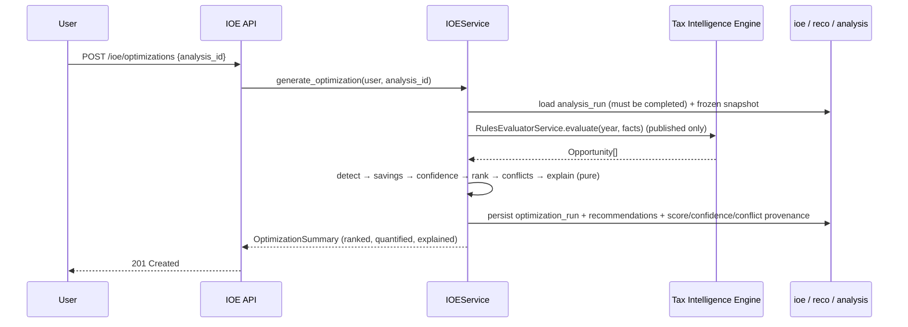
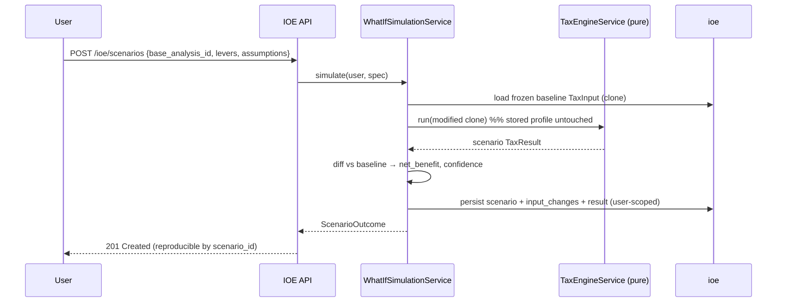

# Onyx Ledger — Income Optimization Engine (IOE) Architecture

> ⚠️ **SUPERSEDED by `ioe-architecture-v2.md`.** Retained for history only — do not implement from this document.
> Revision 2 corrects four defects here: over-broad purity/determinism claims, "guaranteed savings" terminology,
> IOE-derived eligibility/actions (legislation interpretation), and summed recommendation totals (double counting).

**Status:** Superseded (pre-implementation, Revision 1).
**Author role:** Principal fintech systems architect
**Builds on (stable, unchanged):** the validated 14-schema database + `tkms`, the FastAPI modular monolith, the **deterministic Tax Intelligence Engine** (`TaxEngineService` + `RulesEvaluatorService`), and the **Tax Knowledge Management System** (published rules only). See `database-architecture.md`, `backend-architecture.md`, `tkms-architecture.md`.

The Tax Intelligence Engine answers **"what is this user eligible for under Canadian law?"** The IOE answers **"what could this user legally *do* to improve their after-tax position?"** — and it does so **without ever interpreting legislation or computing tax itself**. It consumes only verified, published outputs and transforms them into prioritized, quantified, explainable, reproducible strategies.

---

## 0. Design stance — a deterministic transform layer, not a second brain

Three hard constraints shape every decision below:

1. **The IOE never calculates tax.** Every dollar figure it reports is produced by re-running the existing **pure** `TaxEngineService` (federal/provincial/CPP/EI/dividends/capital-gains/rental) and *diffing* two `TaxResult`s, or is read straight from a published rule's stored formula via `RulesEvaluatorService`. The IOE does arithmetic on engine outputs; it does not model the tax system.
2. **The IOE never interprets legislation.** It reasons only over `Opportunity` objects the rules engine already emitted from **published** `tax_rule_version`s. No rule text, no eligibility logic, lives in the IOE.
3. **The IOE never replaces the engine.** It is a downstream, side-effect-free transform: `(frozen inputs, published rules, versioned weights) → ranked strategies`. Same inputs ⇒ byte-identical outputs.

Because of this, the IOE is a **pure decision-support layer**. It **extends** the existing surfaces (reuses `TaxInput`/`TaxEngineService`/`RulesEvaluatorService`, `analysis.*`, `reco.recommendation`) and adds one new bounded context — the `ioe` schema — for optimization runs, scenarios, score/confidence provenance, conflicts, and projections. Nothing existing is redesigned; the thin prototype `app/services/optimization/service.py` and the inline recommendation loop in `AnalysisService` are **formalized and absorbed**, not rewritten from scratch.

---

## 1. Overall system architecture

The IOE is a bounded context inside the modular monolith, layered per Clean Architecture (`api → services → domain(pure) → infrastructure`). Its heart is a set of **pure functions** (scoring, confidence, savings decomposition, conflict detection) wrapped by thin services that persist provenance.

```
                    ┌─────────────────────────────────────────────────────────┐
   User Profile ───►│  Tax Intelligence Engine (deterministic, UNCHANGED)      │
   Financial Data   │   TaxEngineService.build_input → TaxInput (frozen)       │
                    │   TaxEngineService.run → TaxResult                       │
                    │   RulesEvaluatorService.evaluate → Opportunity[]         │  ← published rules only
                    └───────────────┬─────────────────────────────────────────┘
                                    │ verified outputs (never re-interpreted)
                                    ▼
     ┌───────────────────────────── Income Optimization Engine ─────────────────────────────┐
     │  Detection → Ranking → Confidence → Savings → Conflict → Explanation                  │
     │       │         │           │          │          │            │                      │
     │       ▼         ▼           ▼          ▼          ▼            ▼                       │
     │  What-If Simulation (clone TaxInput → re-run pure engine → diff TaxResult)            │
     └───────────────┬───────────────────────────────────────────────────────────┬─────────┘
                     ▼                                                             ▼
        reco.recommendation (canonical)                                  ioe.* (runs, scenarios,
        + ioe.recommendation_score / confidence_breakdown                 score/confidence provenance,
                     │                                                     conflicts, projections)
                     ▼
        API  →  (future) AI Explanation Layer  →  User
```

**Two planes:**
- **Optimization plane (read-mostly, sync ≤2s):** detect → rank → score confidence → estimate savings → detect conflicts → explain → persist an `optimization_run` + recommendations. Pure given its inputs.
- **Simulation plane (sync ≤5s, isolated):** apply hypothetical levers to a *clone* of the frozen input, re-run the engine, diff, persist a `scenario` snapshot. **Never touches production profile data.**

```mermaid
flowchart TB
    subgraph TIE["Tax Intelligence Engine (unchanged, deterministic)"]
      BI[build_input → TaxInput] --> RUN[run → TaxResult]
      RUN --> FACTS[facts]
      FACTS --> EVAL[RulesEvaluatorService → Opportunity[]]
    end
    subgraph IOE["Income Optimization Engine (pure transform)"]
      DET[OpportunityDetection] --> RANK[Ranking]
      RANK --> CONF[Confidence]
      CONF --> SAV[Savings]
      SAV --> CONF2[Conflict detection]
      CONF2 --> EXP[Explanation]
      SIM[What-If Simulation] -.clone+rerun.-> RUN
    end
    EVAL --> DET
    EXP --> RECO[(reco.recommendation)]
    EXP --> IOEDB[(ioe schema)]
    SIM --> IOEDB
    RECO --> API[/api/v1/ioe/]
    IOEDB --> API
    API --> AI[future AI Explanation Layer]
```

---

## 2. Domain model

### Pure domain objects (framework-free, no DB)
- **`Opportunity`** *(reused from the tax engine)* — `{rule_version_id, opportunity_code, category, mechanism, where/how/why, estimated_impact, priority, citation}`. The IOE's **input contract**; it is never constructed by the IOE, only consumed.
- **`DetectedOpportunity`** — enriches an `Opportunity` with detection metadata the spec mandates: `opportunity_id, opportunity_type, applicable_rule_version_id, eligibility_status, estimated_impact, guaranteed(bool), required_actions[], dependencies[], supporting_legislation, confidence, priority_score`.
- **`ScoreBreakdown`** — the ranking provenance: `overall_score`, plus per-factor `{factor_code, raw, normalized, weight, contribution}` for all 11 ranking factors.
- **`ConfidenceBreakdown`** — `overall (0..100)` + per-factor `{code, value, weight, contribution, reason}` + a rendered human-readable explanation.
- **`SavingsBreakdown`** — `{guaranteed, estimated, one_time, recurring_annual, multi_year_total, future_benefit, horizon_years, assumptions[]}`.
- **`Lever`** — a named scenario input change bound to a `TaxInput` field (or a composite of fields), with a direction and validation. The lever registry defines the allowed what-if space.
- **`ScenarioSpec`** — `{scenario_type, label, lever_changes[], assumptions[]}` — the deterministic input to a simulation.
- **`ScenarioOutcome`** — `{baseline_tax, scenario_tax, tax_delta, net_benefit, guaranteed_component, estimated_component, affected_rule_versions[], affected_recommendations[], confidence, execution_ms}`.
- **`Conflict`** — `{recommendation_a, recommendation_b, conflict_type, description, tradeoff, resolution_hint}`.
- **`OptimizationExplanation`** — the structured, deterministic `{detected, why_it_matters, legislation, estimated_impact, required_action, risks, limitations, dependencies, confidence, citations}` block later consumed (not generated) by the AI layer.

### Persistence model — new `ioe` schema (workflow + provenance)

| Table | Purpose | Key columns |
|---|---|---|
| `optimization_run` | one IOE analysis over an `analysis_run` | user_id, analysis_id, tax_year, ioe_version, engine_version, weight_config_version, status, total_guaranteed_savings, total_estimated_savings, input_snapshot_hash, started/completed_at |
| `detected_opportunity` | each opportunity found | optimization_run_id, recommendation_id, opportunity_type, tax_rule_version_id, eligibility_status, estimated_impact, is_guaranteed, required_actions `jsonb`, dependencies `jsonb`, confidence_score, priority_score, recommendation_score |
| `recommendation_score` | ranking provenance | detected_opportunity_id, factor_code, raw_value, normalized_value, weight, contribution |
| `confidence_breakdown` | confidence provenance | detected_opportunity_id, factor_code, value, weight, contribution, reason |
| `scenario` | a what-if simulation snapshot | user_id, base_analysis_id, scenario_type, label, assumptions `jsonb`, scenario_version, status, input_snapshot_hash, result_hash, execution_ms |
| `scenario_input_change` | one lever delta | scenario_id, field, old_value, new_value |
| `scenario_result` | the diffed outcome | scenario_id, baseline_tax, scenario_tax, tax_delta, net_benefit, guaranteed_component, estimated_component, affected_rule_versions `jsonb`, confidence |
| `savings_estimate` | decomposed savings | optimization_run_id, detected_opportunity_id (nullable), one_time, recurring_annual, multi_year_total, future_benefit, is_guaranteed, horizon_years |
| `multi_year_projection` | per-horizon forecast | optimization_run_id, horizon_year, projected_savings, is_assumption_based, assumptions `jsonb` |
| `optimization_conflict` | detected trade-off | optimization_run_id, recommendation_a_id, recommendation_b_id, conflict_type, description, tradeoff, resolution_hint |
| `weight_config` | versioned ranking weights (config-as-data) | version, weights `jsonb`, is_active, created_at |

**Reused, unchanged:** `analysis.analysis_run` / `analysis_input_snapshot` (the frozen baseline), `reco.recommendation` (canonical recommendation record + lifecycle events), `tax_kb.tax_rule_version` (citation + provenance), the audit triggers, RLS.

**Extensions to existing tables (additive, justified):** `reco.recommendation += optimization_run_id` (FK, nullable) so a recommendation ties to the IOE run that produced it (traceability mandate). No other existing table changes.

---

## 3. Service boundaries

Each is a package under `app/services/ioe/` with a public façade; no reach-in to another's internals (enforced by the existing import-linter contract).

| Service | Responsibility | Plane |
|---|---|---|
| **OpportunityDetectionService** | Turn engine `Opportunity[]` + user context into `DetectedOpportunity[]` (type, eligibility, actions, dependencies, guaranteed-vs-estimated) | optimization |
| **RankingService** | Compute the multi-factor `RecommendationScore` (pure `scoring`), persist per-factor breakdown, sort | optimization |
| **ConfidenceService** | Compute numeric confidence + human-readable reasons (pure `confidence`), persist breakdown | optimization |
| **SavingsEstimationService** | Decompose impact into guaranteed/estimated, one-time/recurring/multi-year (pure `savings`) | optimization |
| **ConflictDetectionService** | Detect mutually-incompatible recommendations (pure `conflicts`), record trade-offs | optimization |
| **MultiYearPlanningService** | Project recurring savings across horizons with explicit assumptions | optimization |
| **OptimizationExplanationService** | Assemble the deterministic structured explanation block | optimization |
| **WhatIfSimulationService** | Clone the frozen `TaxInput`, apply levers, re-run the pure engine, diff `TaxResult` | simulation |
| **ScenarioService** | Persist/list/compare/delete scenario snapshots; guarantee reproducibility | simulation |
| **IOEService** | Façade: `generate_optimization(analysis_id)` orchestrates detection→ranking→confidence→savings→conflict→explanation; persists `optimization_run` | both |
| **IOE workers** | Async optimization/scenario tasks for heavy requests | both |

**Reused services:** `TaxEngineService` (build_input/run/facts — the only tax authority), `RulesEvaluatorService` (published-rule opportunities), `AnalysisService` (produces the baseline `analysis_run`), `AdminService`/auth (RBAC), TKMS (guarantees "published" status).

---

## 4. Folder structure

```
backend/app/services/ioe/
├── __init__.py
├── domain/                       # PURE — no DB, no framework, fully unit-tested
│   ├── models.py                 # DetectedOpportunity, ScoreBreakdown, ConfidenceBreakdown,
│   │                             #   SavingsBreakdown, Lever, ScenarioSpec, ScenarioOutcome, Conflict
│   ├── scoring.py                # deterministic multi-factor ranking + factor extractors
│   ├── confidence.py             # deterministic confidence model
│   ├── savings.py                # savings decomposition + multi-year projection math
│   ├── conflicts.py              # pairwise conflict rules
│   └── levers.py                 # lever registry: name → TaxInput field(s), direction, validation
├── detection/service.py          # OpportunityDetectionService
├── ranking/service.py            # RankingService
├── confidence/service.py         # ConfidenceService
├── savings/service.py            # SavingsEstimationService
├── conflict/service.py           # ConflictDetectionService
├── planning/service.py           # MultiYearPlanningService
├── explanation/service.py        # OptimizationExplanationService
├── simulation/service.py         # WhatIfSimulationService
├── scenario/service.py           # ScenarioService
└── service.py                    # IOEService (façade / orchestrator)
backend/app/database/models/ioe.py            # SQLAlchemy models for the ioe schema
backend/app/api/v1/ioe/routes.py              # user-scoped optimization + scenario API
backend/workers/tasks/ioe.py                  # async optimization / scenario tasks
backend/db/sql/20_ioe.sql                     # ioe schema + reco.recommendation FK + triggers/grants
backend/db/sql/95_seed_ioe.sql                # default weight_config
backend/migrations/versions/0026_ioe.py       # + 0027_seed_ioe  (mirror the SQL)
backend/tests/{unit,integration,performance}/ # scoring/confidence/conflict/scenario/e2e/perf/regression
```

Levers and conflict rules live behind small registries: adding a what-if lever or a conflict pattern is a data/registry entry, never a pipeline change.

---

## 5. Data-flow diagrams (text)

**Optimization (sync, per request):**
```
[User requests optimization for tax_year]
  → require a COMPLETED analysis_run (else 409 "run analysis first")     # no optimization from incomplete data
  → load frozen TaxInput snapshot + TaxResult (baseline)                 # reproducibility anchor
  → RulesEvaluatorService.evaluate(year, facts) → Opportunity[]          # published rules ONLY
DETECT   : Opportunity[] → DetectedOpportunity[]                         # type, eligibility, actions, deps, guaranteed?
SAVINGS  : per opportunity → SavingsBreakdown                           # guaranteed vs estimated; 1-time/recurring/multi-year
CONFIDENCE: per opportunity → ConfidenceBreakdown (0..100 + reasons)
RANK     : scoring(factors, weight_config@version) → RecommendationScore # deterministic, weighted, clamped
CONFLICT : pairwise(DetectedOpportunity[]) → Conflict[]                 # timing / pool-allocation clashes
EXPLAIN  : → OptimizationExplanation per recommendation
PERSIST  : optimization_run + detected_opportunity + reco.recommendation
           + recommendation_score + confidence_breakdown + savings_estimate
           + optimization_conflict + multi_year_projection              # single transaction
```

**What-if simulation (sync, isolated):**
```
[User submits ScenarioSpec {levers, assumptions} on base_analysis_id]
  → load frozen baseline TaxInput (clone; NEVER mutate stored profile)
  → levers.apply(clone, changes) → modified TaxInput                    # validated deltas only
  → TaxEngineService.run(modified) → scenario TaxResult                 # SAME pure engine
  → diff(baseline TaxResult, scenario TaxResult) → tax_delta, net_benefit
  → (optional) re-evaluate opportunities under modified facts → affected recommendations
  → confidence(assumptions present ⇒ capped) 
  → persist scenario + scenario_input_change[] + scenario_result        # user-scoped, isolated
  → result_hash = H(assumptions, input deltas, engine_version, rule_version_set)   # reproducible
```

**Multi-year projection:**
```
recurring_annual savings × horizon, indexed by ref.tax_year.indexation_factor where known,
else flat with an explicit "assumption: constant" flag. Educational, not predictive.
```

---

## 6. Sequence diagrams (text)

**Generate optimization**


**Run a what-if scenario**


---

## 7. Optimization workflow

1. **Gate on completeness.** Require a `completed`, `data_verified` `analysis_run`; refuse on missing inputs or unpublished data (returns a clear, actionable error). *No optimization is ever generated from incomplete or unpublished data.*
2. **Consume verified opportunities** from `RulesEvaluatorService` (published `tax_rule_version`s only).
3. **Detect & classify** each into a typed `DetectedOpportunity` (unused deduction/credit, unused contribution room, income splitting, timing, carry-forward/back, benefit eligibility, household, student, retirement, future planning), marking **guaranteed vs estimated** and required actions/dependencies.
4. **Quantify** via `SavingsEstimationService` — impacts come from published formulas or engine diffs, never IOE arithmetic on the tax base.
5. **Score confidence** deterministically with human-readable reasons.
6. **Rank** with the versioned multi-factor model.
7. **Detect conflicts** and attach trade-offs.
8. **Explain** each recommendation in the structured block.
9. **Persist** one immutable `optimization_run` with full provenance; surface the ranked, quantified, explained set.

---

## 8. Ranking methodology

A **deterministic weighted-sum** over normalized factors — no ML, no randomness. Every factor is a pure function of `(DetectedOpportunity, user context, rule metadata, baseline result)` mapped to `[0,1]`; "difficulty" and "cash-flow" enter negatively.

```
RecommendationScore = clamp01( Σ_i  w_i · f_i(opportunity) )  × 100     # 0..100
```

| Factor (`f_i`) | Deterministic source | Direction |
|---|---|---|
| estimated_tax_savings | savings.guaranteed+estimated, normalized (log-scaled to a cap) | + |
| eligibility_confidence | ConfidenceBreakdown.overall | + |
| financial_impact | savings ÷ baseline tax payable | + |
| implementation_difficulty | lever/action difficulty rating (registry) | − |
| required_cash_flow | cash outlay to realize ÷ liquidity proxy | − |
| time_sensitivity | days-to-deadline for the action (rule/year metadata) | + |
| legislative_certainty | rule status(published)=1; discount if expiry near / recently amended | + |
| user_relevance | does the user hold the relevant account/income type? (profile match) | + |
| historical_user_behaviour | prior accept/reject signal from `reco.recommendation_status_event` | + |
| recommendation_freshness | newer opportunity vs previously-surfaced-and-ignored | + |
| recommendation_confidence | same as eligibility_confidence unless scenario-derived | + |

**Configurable weights** live in `ioe.weight_config` (versioned JSON, one active). Each `optimization_run` **pins `weight_config_version`** so historical ordering is reproducible even after weights change. Ties break by `(estimated_savings desc, opportunity_code asc)` for total determinism. Per-factor `contribution` rows are persisted (`recommendation_score`) so the ranking is fully transparent and auditable.

---

## 9. Scenario-modeling architecture

- **Isolation by construction.** A scenario operates on an **in-memory clone** of the frozen baseline `TaxInput`; the stored profile is never read-modify-written. Production data cannot be mutated by a simulation.
- **Levers, not free-text.** The `levers` registry maps each allowed hypothetical to concrete `TaxInput` field(s): e.g. `increase_rrsp → rrsp_deduction (+Δ)`, `realize_capital_gains → capital_gains (+Δ)`, `adjust_dividends → eligible/non_eligible_dividends`, `add/remove_employment_income`, `increase_fhsa`, `increase_childcare → child_care`. **Composite levers** (`move_provinces → province`, `retire → employment_income↓ + pension_income↑`, `purchase_property`, `sell_investments`) apply several field deltas atomically. Only registered, validated levers are accepted.
- **Same engine.** The scenario is scored by the **identical pure `TaxEngineService.run`**, then diffed against the baseline `TaxResult`. The IOE adds no tax logic.
- **Snapshotting for reproducibility.** Each simulation writes a `scenario` with: assumptions, `scenario_input_change[]`, `scenario_result`, `scenario_version`, `execution_ms`, and a `result_hash = H(assumptions, deltas, engine_version, published-rule-version set)`. Re-running an identical spec yields an identical hash. Historical scenarios remain reproducible because the inputs and the engine/rule versions are pinned.
- **Comparison.** `compare(scenario_a, scenario_b)` diffs two stored outcomes (or a scenario vs the baseline) deterministically.

---

## 10. Confidence-scoring methodology

Deterministic weighted model → `0..100` plus a rendered explanation.

```
Confidence = clamp01( Σ_j  c_j · v_j )  × 100
```

| Component (`v_j`) | Source | Notes |
|---|---|---|
| data_completeness | required-fields-present ÷ required-fields for this opportunity | drives most of the score |
| documentation_quality | linked `docs.document` verification status for the relevant slips | e.g. T4/T2202 present & verified |
| rule_certainty | rule is `published` (TKMS-approved) → high | never surfaces non-published |
| legislation_stability | rule age / amendment recency / expiry proximity | discounts volatile rules |
| calculation_determinism | 1.0 for engine-formula impacts; lower for assumption-based scenario impacts | separates fact from projection |
| scenario_assumptions | penalty proportional to # of assumptions in a what-if | assumption ⇒ never 100% |
| validation_results | TKMS `validation_report` status for the citing rule version | passed=full, warnings=discount |
| historical_accuracy | platform-level calibration constant (config) | conservative default |

Output example (rendered from the breakdown, not free-typed):
```
Confidence: 96%
  • Complete financial profile (data_completeness 1.00)
  • Published, four-eyes-approved CRA rule (rule_certainty 1.00)
  • Impact computed by the validated engine formula (determinism 1.00)
  • No what-if assumptions applied
```
Assumption-bearing scenarios are **capped** (see §15) so certainty is never implied where assumptions exist.

---

## 11. API specification (user-scoped, `/api/v1/ioe`)

All endpoints require a **user JWT**; every row is user-scoped by RLS (`app.user_id`). Mutations are audited. Errors are RFC-9457 problem+json with correlation ids (existing conventions).

| Method + path | Purpose |
|---|---|
| `POST /ioe/optimizations` `{analysis_id}` | Generate an optimization analysis (or `async=true` → job id) |
| `GET /ioe/optimizations/{id}` | Optimization summary (totals, guaranteed vs estimated) |
| `GET /ioe/optimizations/{id}/recommendations` | Ranked recommendations (score + confidence + explanation) |
| `GET /ioe/optimizations/{id}/opportunities` | Ranked detected opportunities (typed, with actions/deps) |
| `GET /ioe/optimizations/{id}/conflicts` | Detected trade-offs |
| `GET /ioe/optimizations/{id}/savings` | Savings estimate (one-time/recurring/multi-year, guaranteed vs estimated) |
| `GET /ioe/optimizations/{id}/projection` | Multi-year projection with explicit assumptions |
| `POST /ioe/scenarios` `{base_analysis_id, levers[], assumptions[]}` | Run a what-if simulation |
| `GET /ioe/scenarios` · `/scenarios/{id}` | Scenario history / detail (reproducible) |
| `POST /ioe/scenarios/compare` `{a, b}` | Compare two scenarios (or scenario vs baseline) |
| `DELETE /ioe/scenarios/{id}` | Delete a scenario (soft-delete; audit retained) |
| `GET /ioe/recommendations/{id}/trace` | Full audit chain for one recommendation |

Request/response bodies are Pydantic v2; OpenAPI 3.1 auto-generated.

---

## 12. Database interactions

- **Read baseline, never recompute it.** The IOE reads the frozen `analysis_input_snapshot` + persisted `analysis_run` results; it does not re-derive the user's tax — it re-runs the engine only for *hypotheticals*.
- **Published-only reads.** Opportunities come from `RulesEvaluatorService`, which filters `status='published'`; the IOE has no other rule read path. Unpublished legislation is unreachable.
- **Immutability.** `optimization_run`, `scenario`, and their result rows are **append-only** — a new optimization is a new run, never an in-place edit. Re-running produces a new immutable record; the audit trigger rejects UPDATE/DELETE on tracked IOE tables.
- **One transaction per run/scenario.** All child rows (recommendations, score/confidence/savings/conflict) are written atomically; partial states are impossible.
- **Provenance via FKs** — recommendation → `optimization_run` → `analysis_run` → `tax_rule_version` (→ TKMS import job) → `weight_config_version` → score/confidence breakdown. Traceability is a join.
- **RLS everywhere.** `ioe.*` user-owned tables carry `user_id` and enforce the `app.user_id` GUC, exactly like `analysis`/`reco`. A user can never read another user's optimizations or scenarios.
- **Migrations.** New DDL ships as **SQL files + mirrored Alembic revisions** (`0026/0027`), SQL authoritative — the established pattern; models stay autogenerate-clean.

---

## 13. Background-worker design

Sync by default (targets in §14 are met inline). Heavy requests offload to **Celery** on dedicated queues, reusing the established `asyncio.run`-inside-a-UoW bridge:

| Queue | Task | Trigger |
|---|---|---|
| `ioe_optimize` | full optimization generation | `async=true`, or many opportunities |
| `ioe_scenario` | batch / multi-lever scenario sweeps | scenario sets, sensitivity grids |
| `ioe_project` | multi-year projection fan-out | long horizons |

Cross-cutting: **idempotency** (an optimization keyed by `(analysis_id, weight_config_version, rule_version_set hash)` — re-request returns the existing run), **result caching** (see §14), Celery Beat optional for periodic "your situation changed" re-optimization. Workers never introduce nondeterminism.

---

## 14. Performance strategy

- **Targets:** optimization **< 2 s**, scenario **< 5 s** (typical). Enforced by:
  - **Reusing the frozen baseline** (no re-derivation of the user's return).
  - **Caching the published-rule set per (tax_year)** in Redis (invalidated by TKMS publish, exactly like the engine's rule cache) so detection doesn't re-query the KB each call.
  - **Caching the baseline `TaxResult`** on the `analysis_run` (already persisted) so scenarios diff against a stored number.
  - **Pure, in-memory scoring/confidence/conflict** — no per-recommendation DB round-trips; one batched write at the end.
- **Async escape hatch** for large opportunity sets / scenario sweeps (§13).
- **Determinism ≠ slow:** all hot-path math is `Decimal` arithmetic over a bounded opportunity list (tens, not thousands).

---

## 15. Open decisions requiring sign-off

Proceeding with the **recommended** option unless redirected:

1. **New `ioe` schema vs. extending `reco`/`analysis`** — _(Recommended)_ a dedicated `ioe` schema for runs/scenarios/score/confidence/conflict/projection provenance (clean bounded context, mirrors TKMS), while keeping `reco.recommendation` canonical (+ an `optimization_run_id` FK). Vs. cramming everything into `reco`.
2. **Recommendation generation ownership** — _(Recommended)_ move generation into `IOEService` and have `AnalysisService` delegate to it (single source of truth), preserving the existing `reco.recommendation` shape and API. Vs. leaving the inline loop in `AnalysisService` and running IOE as a parallel writer.
3. **Weights as versioned data** — _(Recommended)_ `ioe.weight_config` (versioned JSON, active flag), pinned per run for reproducibility. Vs. weights in code/config file.
4. **Scenario lever scope now** — _(Recommended)_ ship the core lever set that maps cleanly to existing `TaxInput` fields (RRSP/FHSA/donations/capital-gains/dividends/childcare/employment income/province/retire), with the registry extensible; defer levers needing new engine inputs (e.g. detailed property purchase) to a follow-up. Vs. building every lever now.
5. **Confidence cap for assumption-based results** — _(Recommended)_ hard-cap what-if / assumption-bearing confidence (e.g. ≤ 80%) so certainty is never implied where assumptions exist. Vs. letting the formula alone decide.
6. **Sync vs async default** — _(Recommended)_ synchronous by default (meets the <2 s / <5 s targets), with an `async=true` worker path for heavy requests. Vs. always-async.

---

## 16. Security considerations

- **Authenticated, user-scoped only.** Every endpoint requires a user JWT; the UoW sets `app.user_id`, and **RLS** on all `ioe.*` user tables guarantees a user sees only their own optimizations and scenarios. Cross-user exposure is structurally impossible.
- **No unpublished legislation, ever.** The only rule read path is `RulesEvaluatorService` (published-only); the IOE cannot surface draft or unapproved rules.
- **Scenario isolation.** Simulations run on in-memory clones; no scenario can read or write another user's data or the production profile.
- **Immutable audit.** `optimization_run` and `scenario` are audited by the append-only `audit.audit_log` (SECURITY DEFINER trigger); records cannot be altered or deleted. Scenario "delete" is a soft-delete that preserves the audit trail.
- **No side effects on tax data.** The IOE has no write path to `finance`/`profile`/`wealth` — it is read-only over user financial data.

---

## 17. Scalability strategy

- **Stateless, horizontally scalable services** — pure transforms hold no state; scale the API/workers independently.
- **Read-path caching** (published-rule set, baseline result) keeps DB load flat as users grow; write volume is one run + children per request.
- **Partition-ready** — `optimization_run`/`scenario` are time/user indexed and are candidates for RANGE partitioning on `created_at` at scale (same pattern as `analysis`/`audit`).
- **Jurisdiction & capability extensibility** — new provinces arrive through the engine + TKMS (the IOE consumes whatever the engine emits); new optimization types are a detection/lever/conflict registry entry, not an architecture change.
- **Service-extraction seam** — because the IOE talks only through the engine's public interface and owns its own schema, it can graduate to a standalone service without touching the engine or the KB contract.
- **Millions of users** — no per-user model; determinism means results are cacheable and reproducible, and the heavy path is bounded, small `Decimal` arithmetic.

---

## 18. Failure-recovery strategy

- **Fail closed on incomplete/unpublished data** — the completeness gate refuses to generate rather than emitting a low-quality or unsupported recommendation.
- **Atomic runs** — an optimization/scenario is one transaction; a mid-run failure leaves no partial `optimization_run` (status pinned `failed`, nothing half-written).
- **Idempotent regeneration** — re-requesting an optimization for an unchanged `(analysis, weights, rule set)` returns the existing immutable run; retries are safe.
- **Deterministic replay** — because every run/scenario pins its inputs, engine version, rule-version set, and weight-config version, any historical result can be recomputed and verified byte-for-byte (regression guard).
- **Async resilience** — worker tasks retry with backoff; a terminal failure records a dead-letter (reusing the TKMS DLQ pattern) and surfaces a clear status, never a wedged request.
- **Engine/TKMS isolation** — the IOE degrades gracefully if a downstream is unavailable (returns "analysis required" / "rules updating"), and can never corrupt the engine or the KB because it only reads them.

---

## 19. Testing strategy

- **Unit (pure):** `scoring` (factor extraction, weighting, tie-breaking, clamping), `confidence` (each component + reason rendering + assumption cap), `savings` (guaranteed vs estimated, one-time/recurring/multi-year, indexation), `conflicts` (each pattern), `levers` (field mapping + validation). Golden fixtures; identical inputs ⇒ identical outputs.
- **Integration (real Postgres):** generate an optimization from a seeded analysis → assert persisted run + ranked recommendations + score/confidence provenance; RLS isolation (user A cannot read B's runs/scenarios).
- **Scenario tests:** a lever change re-runs the engine and produces the expected `tax_delta`; the stored profile is provably unchanged; a scenario is reproducible by id (hash-stable).
- **Ranking tests:** ordering is stable and weight-config-driven; changing the active weights changes ordering deterministically; historical runs keep their pinned ordering.
- **Confidence tests:** assumption-bearing results are capped; missing data lowers confidence with the right reason.
- **Conflict-detection tests:** mutually incompatible strategies are flagged with a trade-off; compatible ones are not.
- **Performance tests:** optimization < 2 s, scenario < 5 s on representative profiles.
- **Regression / edge cases:** a golden portfolio must yield identical recommendations across releases; zero-income, missing province, no opportunities, and all-guaranteed cases behave sanely.

---

## 20. Next step — the implementation gate

On approval I will implement in tested, reviewable increments (SQL file + Alembic revision + pure domain + services + API + workers + tests, verified on live PostgreSQL — the established process):

1. **Schema:** `20_ioe.sql` (ioe schema + `reco.recommendation.optimization_run_id` + triggers/RLS/grants) + `95_seed_ioe.sql` (default `weight_config`) + Alembic `0026/0027`; SQLAlchemy models; autogenerate-clean.
2. **Pure domain:** `models`, `scoring`, `confidence`, `savings`, `conflicts`, `levers` with golden unit tests.
3. **Detection + ranking + confidence + savings + conflict + explanation** services; `IOEService.generate_optimization`; delegate `AnalysisService` recommendation generation to it.
4. **What-if simulation + scenario** services (clone/re-run/diff, snapshots, compare, delete) with isolation + reproducibility tests.
5. **Multi-year planning** + **API** (`/api/v1/ioe`) + **traceability** endpoint.
6. **Workers** (async optimize/scenario) + **caching** + **performance/regression** tests.

> **Reply "approved" (or adjust any §15 option) and I'll begin implementation.**
