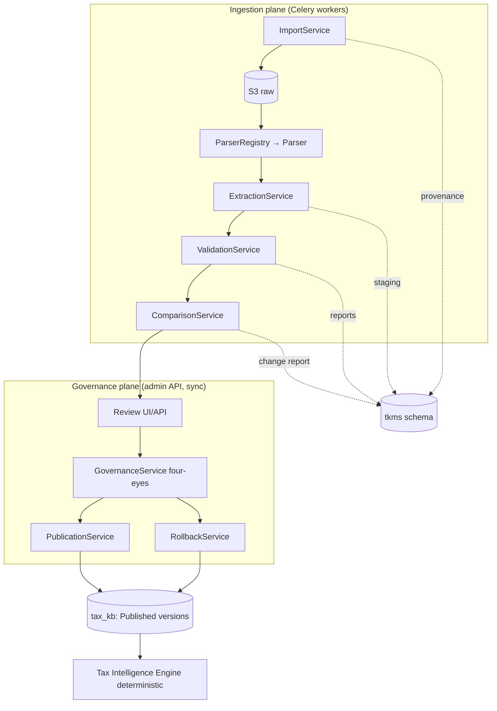

# Onyx Ledger — Tax Knowledge Management System (TKMS) Architecture

**Status:** Architecture design (pre-implementation). Code is generated only after this design is approved.
**Author role:** Principal fintech systems architect
**Builds on (stable, unchanged):** the validated 14-schema PostgreSQL database, the Alembic migration framework, and the FastAPI modular-monolith backend (`database-architecture.md`, `backend-architecture.md`).

TKMS is the authoritative workflow that **imports, parses, extracts, validates, compares, versions, governs, publishes, and rolls back** Canadian tax legislation. The deterministic Tax Intelligence Engine consumes **only Published rules** from the Tax Knowledge Base; TKMS is what earns that "Published" status through governance and traceability.

---

## 0. Design stance — extend, don't redesign

The existing system already provides ~60% of TKMS's substrate: `tax_kb.tax_rule[_version]`, the `rules.*` condition/formula/outcome tables, `admin.rule_change_request`/`rule_publication` (four-eyes), the Celery workers, the `audit.audit_log` triggers, and the pluggable-port pattern (`OcrProvider`, `LlmClient`, `Embedder`). The first-cut `data_ingestion` + `admin` services are a thin prototype of this workflow.

TKMS **keeps all of that** and adds the missing production layer:
- a **new `tkms` schema** for workflow + provenance entities (import jobs, parse results, staged extracted rules, validation/change reports, rollback records, dead-letter);
- a **pluggable parser framework** (a `Parser` port + versioned implementations + a registry), mirroring the existing port pattern;
- **validation**, **comparison**, and **rollback** engines that don't yet exist;
- **provenance columns** on `tax_kb.tax_rule_version` so every published rule ties back to its import job, parser, and validation report;
- **lifecycle alignment** of the version status vocabulary.

The engine's read path (`status = 'published'`) is untouched, so determinism is preserved.

---

## 1. Overall architecture

TKMS is a **bounded context inside the modular monolith**, layered per Clean Architecture. Legislation flows through discrete, independently testable and replaceable stages; each stage reads/writes explicit records so the pipeline is **resumable, idempotent, and fully auditable**.

```
Government Source → Import Job → Storage → Parser Selection → Text Extraction →
Structured Rule Extraction → Validation → Draft Rules → Rule Comparison →
Human Review → Approval → Publication → Tax Knowledge Base → Tax Intelligence Engine
```

Two planes:
- **Ingestion plane (async, worker-driven):** import → store → parse → extract → validate → compare. Produces *draft* rule versions + reports. No human in the loop yet; fully retriable.
- **Governance plane (sync, human-driven, admin API):** review → four-eyes approve → publish / reject / rollback. Every decision permanently audited.

The line between them is the **Draft Rule**: a `tax_kb.tax_rule_version` (status `draft`/`validated`) with its condition tree + formula staged as real rows, linked to its `tkms.import_job`. It is inert until Published.



---

## 2. Service boundaries

Each is a package under `app/services/tkms/` with a public façade and no reach-in to another's internals (enforced by the import-linter contract already in CI).

| Service | Responsibility | Plane |
|---|---|---|
| **ImportService** | Create/track `ImportJob`; store raw docs (checksum, dedupe); orchestrate the async pipeline; own job status + timings | ingestion |
| **ParserRegistry** | Resolve `(source, format) → Parser` by name+version; list available parsers | ingestion |
| **Parsers** (`Parser` port impls) | Text extraction + structured rule extraction; each returns the **same** `ExtractedRuleSet` | ingestion |
| **ExtractionService** | Normalize parser output into staged `extracted_rule` rows; promote to `Draft` rule versions (+ conditions/formulas) with provenance | ingestion |
| **ValidationService** | Run the validation ruleset; produce a `ValidationReport`; block promotion/publication on errors | ingestion |
| **ComparisonService** | Diff a draft version against the currently-published version → structured `ChangeReport` | ingestion |
| **GovernanceService** | Four-eyes lifecycle: submit → review → approve/reject; enforce reviewer≠submitter; audit every decision | governance |
| **PublicationService** | Publish an approved+validated version; supersede prior; write provenance + `rule_publication`; invalidate caches; trigger re-embedding | governance |
| **RollbackService** | Re-publish a prior version and supersede the current, under four-eyes + audit | governance |
| **TraceabilityService** | Resolve a published rule / recommendation back through version → import job → parser → validation → citation | read |
| **TkmsAdminApi** | Portal endpoints (upload, monitor, inspect, compare, approve, publish, rollback, audit, search) | governance |
| **TKMS workers** | Celery tasks per stage with retries + DLQ | ingestion |

Existing services **reused**: `AdminService` (auth/RBAC), `RulesEvaluatorService` (unchanged, read-only consumer), `KnowledgeIndex` (re-embed on publish), object storage / LLM ports.

---

## 3. Folder structure

```
backend/app/services/tkms/
├── __init__.py
├── domain/                      # PURE — entities, value objects, lifecycle
│   ├── models.py                # ExtractedRule, RuleDraft, ValidationFinding, ChangeItem
│   ├── lifecycle.py             # RuleLifecycle state machine + legal transitions
│   └── ports.py                 # Parser, Clock, IdGen (framework-free)
├── ingestion/
│   └── service.py               # ImportService (job orchestration)
├── parsers/
│   ├── base.py                  # Parser ABC + ExtractedRuleSet contract
│   ├── registry.py              # ParserRegistry (name+version resolution)
│   ├── csv_parser.py            # GovernmentCsvParser
│   ├── json_parser.py           # GovernmentJsonParser
│   ├── xml_parser.py            # GovernmentXmlParser
│   ├── manual_parser.py         # ManualRuleParser
│   ├── cra_html_parser.py       # CRAHtmlParser        (stub: port ready)
│   ├── cra_pdf_parser.py        # CRAPdfParser         (stub: OCR/LLM-assisted)
│   └── finance_parser.py        # DepartmentFinanceParser / ProvincialParser (stubs)
├── extraction/service.py        # ExtractionService (stage → draft promotion)
├── validation/
│   ├── service.py               # ValidationService (orchestrates checks)
│   └── checks.py                # pure validators (schema, dup, conflict, formula, dates…)
├── comparison/service.py        # ComparisonService (ChangeReport)
├── governance/service.py        # GovernanceService (four-eyes lifecycle)
├── publication/service.py       # PublicationService
├── rollback/service.py          # RollbackService
└── traceability/service.py      # TraceabilityService
backend/app/database/models/tkms.py         # SQLAlchemy models for the tkms schema
backend/app/api/v1/tkms/routes.py           # admin portal API (admin-scoped)
backend/workers/tasks/tkms.py               # Celery tasks (import/parse/validate/compare/publish/index)
backend/db/sql/19_tkms.sql                  # tkms schema + tax_rule_version provenance + status align
backend/db/sql/94_seed_tkms.sql             # TKMS permissions/roles seed
backend/migrations/versions/0024_tkms.py    # + 0025_seed_tkms  (mirror the SQL)
backend/tests/{unit,integration,security}/  # parser/validation/comparison/workflow/rollback/concurrency
```

Parsers live behind the same **port pattern** as `OcrProvider`/`LlmClient`: adding a jurisdiction or format is a new file + a registry entry, never a pipeline change.

---

## 4. Domain model

### New `tkms` schema (workflow + provenance)

| Table | Purpose | Key columns |
|---|---|---|
| `import_job` | One legislative import, cradle-to-grave | source_org, source_url, checksum, jurisdiction_code, province_code, tax_year, document_version, format, parser_name, parser_version, operator_admin_id, status, validation_status, approval_status, processing_started/completed_at, processing_duration_ms |
| `raw_document` | Stored source artifact (bytes in S3) | import_job_id, storage_bucket, object_key, content_hash, mime_type, byte_size |
| `parse_result` | Output of one parser run | import_job_id, parser_name, parser_version, status, confidence, text_object_key, rule_count, error |
| `extracted_rule` | **Canonical** staged parser output (immutable) | parse_result_id, import_job_id, ordinal, payload `jsonb`, confidence |
| `validation_report` | Result of validating a job/draft | import_job_id, target_version_id, status (passed/warnings/failed), created_at |
| `validation_finding` | One check outcome | report_id, rule_ref, severity (error/warning), code, message |
| `change_report` | Draft-vs-published diff for one draft version | import_job_id, draft_version_id, baseline_version_id, summary |
| `change_item` | One field-level change | change_report_id, field, change_type (added/removed/changed), old_value, new_value |
| `rollback_record` | An executed rollback | tax_rule_id, from_version_id, to_version_id, reason, performed_by, approved_by |
| `dead_letter` | Failed task after max retries | task_name, payload `jsonb`, error, attempts, resolved_at |

### Extensions to existing tables (justified additions)
- `tax_kb.tax_rule_version` += `import_job_id` (FK → tkms.import_job, nullable), `parser_version`, `parser_confidence`, `validation_report_id` → **provenance for traceability**.
- `tax_kb.tax_rule` += `subcategory` (spec requires it).
- **Status vocabulary alignment** (CHECK): the version lifecycle becomes `draft → validated → pending_review → approved → published → superseded → archived` (adds `validated`, `pending_review`, `archived`; maps the prototype's `pending_approval`→`pending_review`, `retired`→`archived`). `import_job.status` is a separate enum (`received → stored → parsing → parsed → extracted → validating → validated → in_review → published → failed`).

### Domain (pure, framework-free)
- **`ExtractedRule`** — the single output contract every parser must produce: `{rule_code, name, category, subcategory, jurisdiction, province, tax_year, effective_date, expiry_date, formula, eligibility_conditions[], income_thresholds, max_amount, contribution_limit, source_citation, legislation_reference, confidence}`.
- **`RuleLifecycle`** — a state machine encoding legal transitions; illegal transitions raise. It is the one place lifecycle rules live.
- **Ports** — `Parser` (`extract_text`, `extract_rules`), plus `Clock`/`IdGen` for deterministic tests.

---

## 5. Data-flow diagrams (text)

**Ingestion (async, per Import Job):**
```
[Admin uploads / scheduled fetch]
  → ImportService.create_job(source, jurisdiction, tax_year, format, operator)   # status=received
  → store raw bytes in S3, compute checksum                                       # status=stored, dedupe by checksum
  → enqueue parse task
PARSE  (worker): ParserRegistry.resolve(source, format) → Parser.extract_text     # parse_result(text)
EXTRACT(worker): Parser.extract_rules(text) → [ExtractedRule]                      # extracted_rule rows (staging), status=extracted
PROMOTE(worker): ExtractionService → tax_kb.tax_rule_version(status=draft)         # + rules.* condition/formula rows, provenance=import_job
VALIDATE(worker): ValidationService.run(draft) → validation_report                 # status=validated | failed(block)
COMPARE(worker): ComparisonService.diff(draft, published_baseline) → change_report # status=in_review
  → notify reviewers
```

**Governance (sync, human):**
```
Reviewer opens job → sees extracted rules + validation_report + change_report
  → GovernanceService.submit_for_review(draft, submitter)         # version: draft/validated → pending_review
  → GovernanceService.approve(reviewer)                           # reviewer ≠ submitter; version → approved
  → PublicationService.publish(publisher, version)                # requires approved + validation passed
        · supersede currently-published (same rule+year)          # old → superseded
        · version → published, published_at, rule_publication row
        · write provenance link, invalidate Redis rule cache
        · enqueue re-embed (KnowledgeIndex) for AI retrieval
  → (or) GovernanceService.reject(reviewer, reason)               # version → draft (rework) / archived
```

**Rollback (sync, human, four-eyes):**
```
RollbackService.request(admin, tax_rule, target_prior_version, reason)   # rollback_record(pending)
  → second admin approves                                                # four-eyes
  → re-publish target_prior_version, supersede current, audit            # deterministic, reversible
```

---

## 6. Sequence diagrams (text)

**Import → Publish**
```mermaid
sequenceDiagram
    participant A as Admin(importer)
    participant API as TKMS API
    participant IMP as ImportService
    participant W as Celery workers
    participant KB as tax_kb / tkms
    participant B as Admin(reviewer)
    A->>API: POST /tkms/imports (source, format, file)
    API->>IMP: create_job + store(raw)  [checksum dedupe]
    IMP->>W: enqueue parse
    W->>W: parse → extract → promote(draft) → validate → compare
    W->>KB: draft version + reports (provenance linked)
    W-->>B: notify "ready for review"
    B->>API: GET /tkms/imports/{id} (rules + validation + change report)
    B->>API: POST submit_for_review  (importer cannot approve own)
    B->>API: POST approve            (reviewer ≠ importer)
    B->>API: POST publish
    API->>KB: supersede prior; version=published; rule_publication; provenance
    KB-->>Engine: only published versions are now consumable
```

**Rollback**
```mermaid
sequenceDiagram
    participant A as Admin
    participant API as TKMS API
    participant RB as RollbackService
    participant B as Second Admin
    participant KB as tax_kb
    A->>API: POST /tkms/rules/{rule}/rollback {to_version, reason}
    API->>RB: request → rollback_record(pending)
    B->>API: POST rollback/{id}/approve   (four-eyes)
    RB->>KB: publish(to_version); supersede current; audit
    RB-->>A: rolled back; historical analyses unaffected (immutable versions)
```

---

## 7. Background-worker architecture

Celery (Redis broker) — one **queue per stage** so slow work never blocks and each scales independently:

| Queue | Tasks | Retry | On terminal failure |
|---|---|---|---|
| `tkms_import` | store, checksum, dedupe | 3× backoff | `dead_letter` + job.status=failed |
| `tkms_parse` | text extraction | 3× | dead_letter, keep raw for reparse |
| `tkms_extract` | structured extraction, draft promotion | 3× | dead_letter |
| `tkms_validate` | validation ruleset | 2× | job stays `validating`, findings recorded |
| `tkms_compare` | change report | 2× | non-blocking (review can proceed) |
| `tkms_publish` | supersede + publish + re-embed | 2× | rollback the tx; audit; alert |
| `tkms_index` | pgvector re-embed | 5× | retry-only (eventual) |
| `tkms_notify` | reviewer notifications | 5× | best-effort |

Cross-cutting: **idempotency keys** (import checksum; task de-dupe), **resumable jobs** (each stage reads prior stage's persisted output, so a re-run resumes, not restarts), **exponential backoff + jitter**, **dead-letter table** with an admin "retry/resolve" action, **Celery Beat** for scheduled government fetches.

---

## 8. Database interaction strategy

- **Staging vs. authoritative.** In-flight artifacts (jobs, parse results, extracted rules, reports) live in `tkms`. The **Tax Knowledge Base (`tax_kb` + `rules`) only ever holds real rule versions**; a draft is a `tax_rule_version` with a non-published status and staged conditions/formulas, inert to the engine.
- **Immutability.** Published versions are never mutated — new law = new version; corrections = new version + supersede. `extracted_rule` rows are immutable snapshots of parser output.
- **Transactions.** Promotion (draft + conditions + formula) and publication (supersede + publish + provenance + publication record) are each **single transactions**; partial states are impossible.
- **Provenance FKs** make traceability a join, not a reconstruction.
- **Repositories** per aggregate (Clean Architecture); the async UoW sets `app.actor_type='admin'` + `app.user_id=admin_id` so the append-only audit triggers capture every privileged write.
- **Concurrency.** Optimistic concurrency (`row_version`) on the draft version; the partial-unique "one published per (rule, tax_year)" index makes double-publish impossible at the DB level.
- **Migrations.** New `tkms` DDL ships as **SQL files + mirrored Alembic revisions** (0024/0025), exactly as the established framework requires — the SQL remains authoritative.

---

## 9. API specification (admin-scoped, `/api/v1/tkms`)

All endpoints require an **admin JWT** + a specific TKMS permission; all mutations are audited.

| Method + path | Permission | Purpose |
|---|---|---|
| `POST /tkms/imports` | `tkms.import` | Create import job + upload raw (or reference URL) |
| `GET /tkms/imports` · `/imports/{id}` | `tkms.read` | Monitor jobs; full detail (parse/validation/change reports) |
| `POST /tkms/imports/{id}/reparse` | `tkms.import` | Re-run parse with a chosen parser/version |
| `GET /tkms/imports/{id}/extracted` | `tkms.read` | Inspect staged parser output |
| `GET /tkms/imports/{id}/validation` | `tkms.read` | Validation report + findings |
| `GET /tkms/versions/{id}/compare` | `tkms.read` | Change report vs currently-published |
| `POST /tkms/versions/{id}/submit` | `tkms.import` | Submit draft for review |
| `POST /tkms/versions/{id}/approve` | `tkms.approve` | Four-eyes approve (≠ submitter) |
| `POST /tkms/versions/{id}/reject` | `tkms.approve` | Reject with reason → rework/archive |
| `POST /tkms/versions/{id}/publish` | `tkms.publish` | Publish approved+validated version |
| `POST /tkms/rules/{rule}/rollback` | `tkms.rollback` | Request rollback to a prior version |
| `POST /tkms/rollbacks/{id}/approve` | `tkms.rollback` | Four-eyes approve rollback |
| `GET /tkms/rules/search` | `tkms.read` | Search historical legislation (jurisdiction/year/status/text) |
| `GET /tkms/versions/{id}/trace` | `tkms.read` | Full provenance chain for a published rule |
| `GET /tkms/dead-letters` · `POST /{id}/retry` | `tkms.import` | Inspect + retry failed tasks |
| `GET /tkms/stats` | `tkms.read` | Import/processing/validation/publishing statistics |

OpenAPI 3.1 auto-generated; RFC-9457 problem+json errors with correlation ids (existing conventions).

---

## 10. Security model

- **Least privilege, granular permissions:** `tkms.import`, `tkms.read`, `tkms.approve`, `tkms.publish`, `tkms.rollback` — assigned via roles (`kb_importer`, `kb_reviewer`, `kb_publisher`, `kb_admin`). Reuses the `admin.role/permission/role_permission` model; new permissions seeded in `94_seed_tkms.sql`.
- **Four-eyes, structurally enforced:** approve/publish/rollback require a **different** admin than the submitter — checked in `GovernanceService` **and** by the DB `CHECK (reviewed_by <> submitted_by)`. Publication also requires an **approved change request + a passed validation report**.
- **No silent mutation of published law:** published versions are immutable; the append-only `audit.audit_log` (SECURITY DEFINER trigger) records every privileged action with actor + before/after; the audit log rejects UPDATE/DELETE.
- **No direct DB editing path** — every change flows through the audited API.
- **Uploads:** size/MIME/checksum-verified, scanned, and `quarantined` before parsing; parser sandboxes (no code execution from documents; XML external-entity disabled).
- **Admin plane** connects with admin scope; TKMS tables are not user-RLS (no `user_id`) and are reachable only via admin-permissioned endpoints.

---

## 11. Failure-recovery strategy

- **Resumable, staged pipeline:** each worker persists its output; a failed stage retries with backoff and, on terminal failure, writes to `dead_letter` while the job's status pins the last good stage. Re-running resumes from there.
- **Idempotency:** import dedupe by `checksum`; tasks keyed so re-delivery is a no-op; publication guarded by the partial-unique index.
- **Atomic publish/rollback:** wrapped in one transaction — a mid-publish crash leaves the prior published version intact.
- **Dead-letter queue** with an admin **retry/resolve** action; alerts on DLQ growth.
- **Poison documents** never wedge the pipeline (quarantine + failed status, not crash).
- **Determinism guard:** the engine only ever reads `published`; a botched import can never reach production calculations.

---

## 12. Testing strategy

- **Unit (pure):** each `Parser` against golden documents → exact `ExtractedRuleSet`; every validation check (schema, duplicate, conflict, formula integrity, jurisdiction/date/threshold consistency, reference integrity); the `RuleLifecycle` state machine (legal + illegal transitions); the comparison differ (golden change reports).
- **Integration (real Postgres + MinIO):** the full pipeline import→parse→extract→validate→compare→draft, asserting the persisted job/reports/draft; publish materializes a `published` version consumable by the engine.
- **Workflow/security:** four-eyes (importer can't approve/publish own), permission matrix, publish-requires-validation-passed, audit entries written.
- **Rollback tests:** rollback re-publishes a prior version, supersedes current, and **historical analyses still resolve their original version** (immutability).
- **Concurrency:** two simultaneous publishes of the same rule+year → exactly one wins (unique index); optimistic-concurrency conflicts on draft edits.
- **Performance/regression:** large dataset import throughput; a golden-legislation corpus that must produce identical published rules across releases (deterministic regression).

---

## 13. Rollback strategy

Two distinct meanings, both supported:
- **Legislative rollback (data):** re-publish a prior rule version and supersede the current — the primary feature. Fully audited, four-eyes, reversible; because versions are immutable, **historical user analyses are unaffected** (they reference the exact version used at calculation time).
- **Deployment rollback (schema/code):** the Alembic chain + the "SQL is source of truth" rule already provide this; TKMS DDL is additive (`0024/0025`), so a code rollback leaves the schema forward-compatible. New `tkms` tables are never destructively altered in place — changes are new SQL files + revisions.

A publish that later proves wrong is corrected by **rollback (preferred)** or by publishing a **new corrected version**, never by mutating the bad one.

---

## 14. Scalability strategy

- **Stage-parallel workers:** independent queues autoscale on depth; parsing/extraction (CPU/IO-bound) scale separately from publish/index.
- **Bulk import fan-out:** a multi-rule dataset extracts to N `extracted_rule` rows processed in parallel.
- **KB read path unchanged & cached:** the engine reads current-year `published` rules from Redis (invalidated on publish); TKMS write volume never affects calculation latency.
- **Storage offload:** raw documents + extracted text live in S3, not Postgres.
- **Provenance via joins**, not recomputation; `tkms` event/report tables are candidates for time-range partitioning at scale (same pattern as `audit_log`).
- **Service-extraction seam:** because TKMS talks through ports and owns its own schema, it can graduate to a standalone service later without touching the engine or the KB contract.

---

## 15. Open decisions requiring sign-off

Proceeding with the **recommended** option unless redirected:

1. **Draft storage:** _(Recommended)_ drafts live as `tax_kb.tax_rule_version` (non-published) with staged conditions/formulas + provenance — reuses versioning/four-eyes, engine unaffected — vs. a separate `tkms.draft_rule` materialized only at publish (cleaner separation, more moving parts).
2. **Status vocabulary:** _(Recommended)_ **align** the version CHECK to `draft/validated/pending_review/approved/published/superseded/archived` (adds 3 values via a new SQL file + revision) — vs. keeping the prototype's names.
3. **PDF/HTML parsers:** _(Recommended)_ ship the framework + CSV/JSON/XML/Manual parsers now; **stub** CRAHtml/CRAPdf/Finance/Provincial behind the port (real ones, incl. optional AI-assisted extraction, wired later) — vs. building them all now.
4. **AI-assisted parsing:** _(Recommended)_ AI may **assist extraction/summarization only**; its output is always staged, validated, reviewed, and stored as structured data before publish — the engine and eligibility remain 100% deterministic (a hard constraint, not an option).
5. **Provenance columns:** _(Recommended)_ add `import_job_id/parser_version/parser_confidence/validation_report_id` to `tax_rule_version` + `subcategory` to `tax_rule` (small additive migration) — required for the traceability mandate.

---

## 16. Next step — the implementation gate

On approval I will implement in tested, reviewable increments (mirroring the established process — SQL file + Alembic revision + services + API + workers + tests, verified on live PostgreSQL):

1. **Schema:** `19_tkms.sql` (tkms schema, provenance columns, status alignment) + `94_seed_tkms.sql` (permissions/roles) + Alembic `0024/0025`; SQLAlchemy models; autogenerate-clean.
2. **Domain + parser framework:** `ExtractedRule`, `RuleLifecycle`, `Parser` port + registry + CSV/JSON/XML/Manual parsers (golden-file unit tests).
3. **Ingestion + extraction:** `ImportService`, `ExtractionService`, storage + checksum/dedupe, draft promotion with provenance.
4. **Validation + comparison engines** with their check/diff unit tests.
5. **Governance + publication + rollback** (four-eyes, supersede, provenance, re-embed) with workflow/security/rollback tests.
6. **Workers** (per-stage queues, retries, DLQ) + **TKMS admin API** + **traceability** endpoint.
7. **End-to-end pipeline test** (import → published rule consumed by the engine) + concurrency + regression corpus.

> **Reply "approved" (or adjust any §15 option) and I'll begin implementation.**
