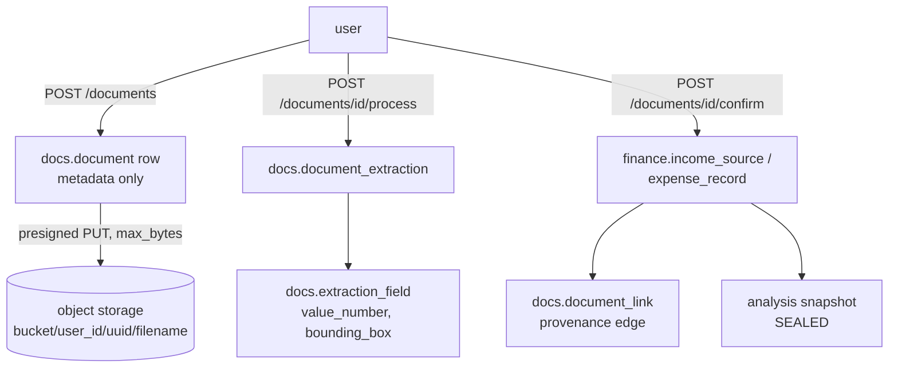
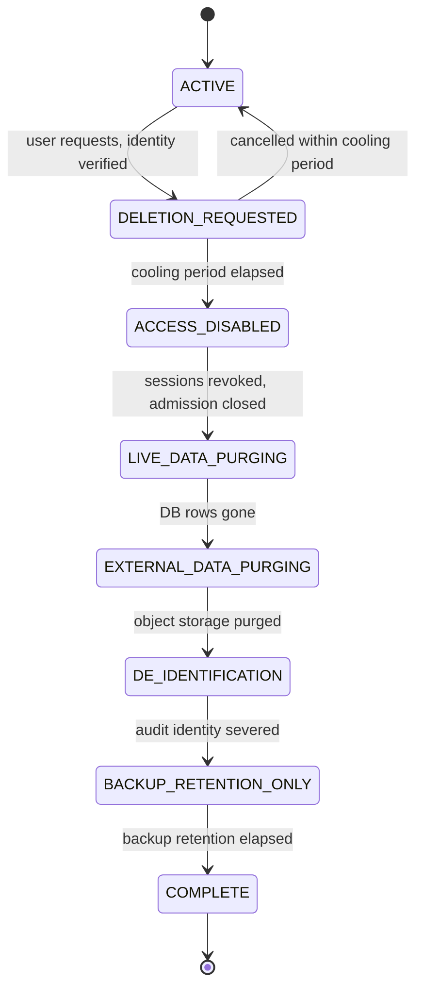
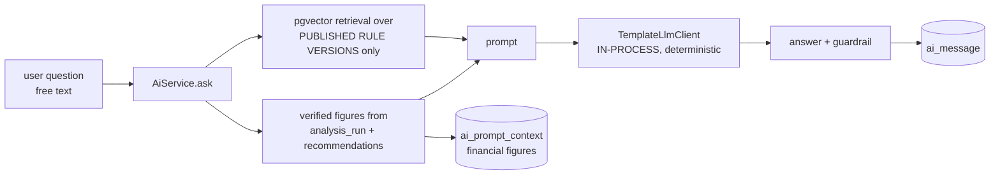

# Privacy and Data Lifecycle Specification

**Entry 11A. Specification-first: this document deletes nothing.** It establishes
the contract that Entry 11B implements. Every statement here is either an
engineering fact drawn from the repository, a recommended architecture, or a
policy decision explicitly parked for review — the three are labelled and never
blended.

Machine-readable companion: [`data-inventory.csv`](./data-inventory.csv),
regenerated from `app/privacy/classification.py` by
`scripts/export_privacy_inventory.py`. The registry — not this document — is the
authority, and `tests/security/test_privacy_inventory.py` keeps it honest
against the live schema.

> **Entry 11A defines an engineering privacy/data-lifecycle architecture.
> It does not certify legal compliance.**
>
> No claim is made about PIPEDA, the CPPA, provincial privacy legislation, or
> CRA retention requirements. External privacy-counsel review remains required,
> and every decision that depends on it is listed in §24 rather than resolved
> here. This document is not legal advice.

---

## 1. How the inventory was produced

Not from categories. The set of user-derived tables is *derived*: seed with
every table carrying a `user_id` column plus `identity.user_account`, then follow
foreign keys outward. That yields **75 tables across 13 schemas**, and it is
recomputed from `pg_catalog` on every test run, so it cannot silently go stale.

| | |
|---|---|
| Total tables in the schema | 148 |
| **User-derived** (FK-reachable from a person) | **75** |
| Not user-derived (legislation, reference, rules, TKMS, admission) | 73 |
| User-derived tables **without** RLS enabled+forced | **27** (16 of them a real gap — §18) |

The derivation has one blind spot, and it is important: **`audit.audit_log` has
no foreign key to `identity.user_account`**, so FK reachability does not find it
— while it demonstrably contains copies of user rows. It is treated explicitly
in §9 and §21. Any future store that holds user data without an FK to the user
must be added by hand; the automated set is a floor, not a ceiling.

---

## 2. Privacy classes (§4)

Closed set, declared in `app/privacy/classification.py` as `PrivacyClass`.
Distribution across the 75 classified tables (a table may carry several):

| Class | Tables | Where the weight is |
|---|---|---|
| `DERIVED_TAX_RESULT` | 26 | IOE sealed evidence, analysis output |
| `USER_FREE_TEXT` | 21 | `notes`, `description`, `source_name`, `label`, AI messages |
| `SEALED_EVIDENCE` | 21 | optimization/scenario/portfolio children |
| `FINANCIAL_SOURCE_DATA` | 18 | finance, wealth, extraction fields, snapshots |
| `PSEUDONYMOUS_IDENTIFIER` | 11 | internal UUIDs, HMAC digests, provider ids |
| `AUDIT_SECURITY_RECORD` | 8 | audit schema, integrity checks, login events |
| `ACCOUNT_IDENTITY` | 5 | account, preferences, billing |
| `AUTHENTICATION_SECURITY` | 5 | credential, sessions, tokens, MFA |
| `TAX_PROFILE_DATA` | 5 | profile, spouse, dependants, registered accounts |
| `DIRECT_IDENTIFIER` | 3 | `user_account.email`, `user_profile.display_name`, `login_event.email_tried` |
| `OPERATIONAL_TELEMETRY` | 3 | freshness outbox, run events |
| `RECOMMENDATION_DATA` | 3 | recommendations and feedback |
| `DOCUMENT_EXTRACTED_DATA` | 2 | extraction, extraction fields |
| `DERIVED_TAX_INPUT` | 2 | frozen snapshot, analysis assumptions |
| `DOCUMENT_BINARY` | 1 | `docs.document` (metadata; bytes live in object storage) |

**Only three tables carry a direct identifier.** That is a genuinely good
property and it is what makes de-identification tractable (§11).

What account deletion does, across the 75 classified tables:

| `DeletionAction` | Tables |
|---|---|
| `CASCADE_DELETE` — removed by the parent's cascade | 59 |
| `CUSTOM_WORKFLOW` — sealed evidence or object storage | 6 |
| `DE_IDENTIFY` — row survives, identity severed | 6 |
| `RETAIN` — survives deliberately, reason stated | 4 |

24 tables are marked as replay dependencies and 20 as immutable.

---

## 3. Source, derived, sealed (§7)

| Kind | Meaning | Deletion consequence |
|---|---|---|
| `SOURCE` | the user provided it, may change it | deletable in place |
| `DERIVED` | computed, reproducible from source | deletable and regenerable |
| `SEALED_DERIVED` | computed then **frozen as evidence** | deleting destroys the ability to prove a past decision |
| `OPERATIONAL` | machinery — queues, counters, leases | bounded retention, no user meaning |
| `AUDIT` | "what happened", usually security | severing identity is usually possible; deleting often is not wanted |

Worked examples from the actual models:

```
finance.income_source              → SOURCE
analysis.analysis_input_snapshot   → SEALED_DERIVED   (the frozen 27 inputs)
ioe.scenario_result                → SEALED_DERIVED
ioe.freshness_outbox               → OPERATIONAL
ioe.integrity_check                → AUDIT
audit.audit_log                    → AUDIT (append-only, no user FK)
```

---

## 4. The central tension, resolved (§1)

> the user wants their data deleted
> — but a historical result was sealed against frozen evidence

Neither escape is acceptable: "keep everything" is not deletion, and "delete
everything" silently converts sealed results into unverifiable claims while
still displaying them as verified.

**The resolution: erasure is permitted to destroy evidence, and the system must
say so.** A sealed result whose snapshot has been erased does not become
"verified" and does not become "corrupt" — it becomes *unverifiable for a stated
reason*. The reason code is a privacy outcome, not a failure:

```
SOURCE_ERASED_BY_PRIVACY_LIFECYCLE
```

Design intent for Entry 11B (**not implemented, no enum changed in 11A**):
`ioe.integrity_check.reason_code` gains this value; replay reports it instead of
attempting a verification it cannot perform. The alternative — reporting
`verified` from a retained hash after the content is gone — would be a false
statement about evidence that no longer exists, which is worse than admitting
the erasure. See §12.

---

## 5. The six deletion concepts (§6)

They are not one operation and must never share an implementation.

| # | Operation | Trigger | Effect on sealed evidence |
|---|---|---|---|
| **A** | **Correction** — income 90,000 → 95,000 | user edit | none; prior results stay reproducible, current results go stale (Entry 9) |
| **B** | **Object deletion** — remove one receipt | user action | none; see §8 for what the extraction does |
| **C** | **Tax-year deletion** — remove 2024 | user action | scoped to that year's partitions and runs |
| **D** | **Account deletion** — close the account | user action | orchestrated, phased (§10) |
| **E** | **Privacy erasure request** | rights request | may reach further than D, including sealed evidence and backups |
| **F** | **Operational expiry** | scheduled | admission counters, leases, transient rows; no user involvement |

**A is not deletion.** Correction creates a successor; the historical snapshot is
untouched. This already works — Entry 9's freshness model makes dependent results
stale rather than rewriting them — and the privacy specification must not break
it.

**E is broader than D.** Account deletion is a product operation and may
legitimately retain audit and billing records; an erasure request is a rights
exercise whose exceptions are a legal determination (§14). Building D as if it
were E, or vice versa, is the most likely way to get this wrong.

---

## 6. Lifecycle states (§5)

`LifecycleState` in the registry is a **conceptual model, not a column**:
`ACTIVE → SUPERSEDED → ARCHIVED → DELETION_REQUESTED → DELETION_IN_PROGRESS →
DELETED / DE_IDENTIFIED / RETAINED_FOR_AUDIT / RETAINED_IN_BACKUP`.

Mechanism per class, chosen against what the tables already support:

| Data class | Mechanism | Already present? |
|---|---|---|
| Documents | `docs.document.deleted_at` soft delete, then object purge | **column exists, and every read already filters on it** |
| Financial source | soft delete, or hard delete within the tax-year partition | `deleted_at` on `income_source`/`expense_record`, already filtered |
| Sealed evidence | supersession pointer / custom erasure workflow | self-FKs exist on `ioe.scenario`, `ioe.optimization_run` |
| Account | deletion ledger row | **`audit.data_deletion_request` exists, unused** |
| Audit/security | de-identification in place | FKs already `SET NULL` |
| Operational | purge by age | `AdmissionService.purge` exists (Entry 10) |

**Soft delete is half-built, and it is the useful half.** `deleted_at` exists on
`identity.user_account`, `docs.document`, `finance.income_source` and
`finance.expense_record`, and **every read path already filters on it** —
authentication, the financial service, the tax-engine input loader, the document
list. Nothing anywhere writes it.

That is a much better starting position than an unused column: the hard part
(making every query respect the flag, including the one that feeds the tax
engine) is already done and already under test. Entry 11B's soft-delete phase is
mostly a matter of setting the timestamp and purging behind it — and the
`uq_user_account_email_active` unique index is already partial on
`deleted_at IS NULL`, so a soft-deleted account frees its address for
re-registration without any further change (§10).

Entry 11B should use these affordances rather than invent parallel mechanisms.

---

## 7. The frozen snapshot (§9, §10) — findings

**What it contains.** `canonical_snapshot()` seals exactly
`dataclasses.fields(TaxInput)` — **27 fields**:

```
province, year, age, marital_status, spouse_net_income,
employment_income, self_employment_income, self_employment_expenses,
rental_income, rental_expenses, interest_income, eligible_dividends,
non_eligible_dividends, capital_gains, pension_income, other_income,
rrsp_deduction, fhsa_deduction, union_dues, child_care, other_deductions,
tuition, medical_expenses, donations, cpp_contrib, ei_contrib, tax_withheld
```

plus `schema_version`, `tax_year`, `jurisdiction`, and the content hash.

**Minimization report — the snapshot is already minimal.** Checked against every
category §10 asks about:

| Candidate for removal | Present? |
|---|---|
| names, display names | **no** |
| email addresses | **no** |
| employer names (`profile.tax_profile.employer_name`) | **no** |
| document filenames | **no** |
| free-form descriptions (`income_source.source_name`, `notes`) | **no** |
| external storage paths | **no** |
| UI labels | **no** |

Every sealed field is an input the deterministic engine consumes; removing any
one makes the result irreproducible. **No change to the snapshot format is
proposed**, and `tests/security/test_privacy_inventory.py` now asserts both
halves — that the sealed set equals the engine's inputs, and that no identifying
or free-text field name appears in it — so a future field cannot drift in
unnoticed.

**But it is still personal data.** Twenty-seven financial figures for one person
in one year is a detailed financial portrait. "No direct identifier" means
de-identification is *possible*, not that the row is anonymous: it is linked to
`analysis_run.user_id` and is trivially re-identifiable while that link exists
(§11).

**After ordinary source deletion:** the snapshot is untouched. That is the
correct behaviour and the reason sealed evidence exists. Deleting a 2024 income
row does not rewrite what was calculated in 2024.

**After account deletion (D):** `analysis.analysis_run` cascades from the user,
so the snapshot goes with it. Nothing special is required — but see the
`ai.ai_message_citation` FK in §10 which will *block* that cascade.

**After an erasure request (E):** the snapshot must be destroyed and the sealed
result's replay status must become `SOURCE_ERASED_BY_PRIVACY_LIFECYCLE` (§4).

**Crypto-erasure (§38): evaluated, not recommended for now.**

| | |
|---|---|
| Benefit | destroy a per-user key and every retained encrypted snapshot — including in backups — becomes computationally inaccessible, which is the only mechanism that reaches immutable backups without destroying them |
| Replay cost | replay of that user's history becomes permanently impossible; identical outcome to erasure, so no *additional* loss |
| Backup benefit | **this is the real argument** — it is the one approach that answers §16 without rewriting backups |
| Cost | envelope encryption, KMS, key rotation, key-loss recovery, and a hard dependency on infrastructure the repository does not contain |
| Verdict | **FUTURE_CAPABILITY.** Do not build custom cryptography. Revisit when the backup entry lands, using managed KMS envelope encryption only. |

---

## 8. Document lifecycle (§11, §12)

Traced through `DocumentService` and the `docs` schema.



**Where a copy of the document can exist**, and what deleting the original must
do to each:

| Artifact | Exists today | On document delete (B) |
|---|---|---|
| Original binary | object storage | **must be purged** — no DB cascade reaches it |
| Object-store versions | **unknown** — adapter is in-memory | `DEPLOYMENT_CONFIGURATION_REQUIRED`: versioning must be off, or delete must remove all versions |
| Extracted text | not persisted | n/a |
| Structured fields | `docs.extraction_field` | delete with the document |
| Thumbnails/previews | none | n/a |
| Local temp files | **none** — no `tempfile`/`/tmp` use anywhere | n/a |
| Content hash | `docs.document.content_hash` | retain in tombstone (proves *which* document was deleted) |
| Provider request/response | **none** — no external provider (§9) | n/a |
| Confirmed tax facts | `finance.*` | **survive**: the user asserted them, and they are the tax input |
| Provenance edge | `docs.document_link` | **retain as a broken link with a reason** — deleting it silently would make a confirmed figure look unsourced |
| Sealed historical analysis | `analysis_input_snapshot` | **survives, unchanged** |

**Unambiguous answers to §11's questions.** Delete a document →
extracted fields go; confirmed tax facts **stay**; the provenance edge stays and
is marked as pointing at deleted evidence; the sealed historical analysis is
untouched; the object binary must be purged and any storage version with it.

**Replacement and supersession (§12).** Recommendation: **never mutate in place.**
Uploading a replacement creates a new `docs.document` row; the prior row is
marked superseded via `deleted_at` plus a supersession pointer, and its binary is
retained while any sealed result depends on it. The current schema has
`deleted_at` but **no supersession column** — an `IMPLEMENTATION_GAP` for 11B.

---

## 9. Highest-sensitivity data — where it actually is

| Category | Location | RLS |
|---|---|---|
| Financial source data | `finance.income_source*`, `finance.expense_record*` (partitioned by year), `wealth.asset/liability` | **yes** on parents |
| | `wealth.asset_valuation`, `wealth.liability_balance`, `wealth.registered_account_detail` | **no** (PD-1) |
| Tax profile | `profile.tax_profile` (incl. `employer_name`), `spouse_profile`, `dependent` | yes |
| Document binaries | object storage only | n/a |
| Extracted document content | `docs.extraction_field` (`value_number`, `bounding_box`) | **no** (PD-1) |
| Sealed calculation inputs | `analysis.analysis_input_snapshot` (27 figures) | **no** (PD-1) |
| AI conversations | `ai.ai_message` (question + answer verbatim) | **no** (PD-1) |
| AI prompt context | `ai.ai_prompt_context` (verified financial figures, JSONB) | **no** (PD-1) |
| **Whole-row copies of all of the above** | **`audit.audit_log`** | **no, and no user FK** (PD-4) |

---

## 10. Account deletion (§22, §23, §24)

### Dependency graph — real foreign keys

`identity.user_account` has **39 direct children**: 33 `CASCADE`, 4 `SET NULL`
(`audit.consent_log`, `audit.security_event`, `identity.login_event`,
`reco.recommendation_status_event`), 2 unused request tables.

```
identity.user_account
├── CASCADE  identity.{user_credential, auth_session, mfa_method,
│            password_reset_token, email_verification_token}
├── SET NULL identity.login_event                    → DE_IDENTIFY (incomplete: §11)
├── CASCADE  profile.{user_profile, tax_profile, spouse_profile,
│            dependent, user_preference, user_privacy_setting}
├── CASCADE  finance.{income_source, expense_record} + year partitions
├── CASCADE  wealth.{asset, liability} → valuation/balance/registered detail
├── CASCADE  docs.document → extraction → extraction_field, document_link
│            ⚠ object-storage binaries are NOT reached by any cascade
├── CASCADE  analysis.analysis_run → input_snapshot, line_item, assumption
│            ⚠ BLOCKED by ai.ai_message_citation (NO ACTION)
├── CASCADE  ioe.{optimization_run, scenario} → 18 sealed children
├── CASCADE  ioe.{freshness_outbox, integrity_check}
├── CASCADE  reco.recommendation, recommendation_feedback
├── SET NULL reco.recommendation_status_event         → DE_IDENTIFY
├── CASCADE  ai.ai_conversation → ai_message → prompt_context, citation
├── CASCADE  billing.{subscription, entitlement, payment_method_ref}
│            ⚠ billing.invoice → RETAIN (LEGAL_REVIEW_REQUIRED)
├── SET NULL audit.{consent_log, security_event}      → DE_IDENTIFY
└── (no FK)  audit.audit_log                          → UNREACHABLE (PD-4)
```

**Three edges make a single `DELETE FROM user_account` wrong:**

1. `ai.ai_message_citation → analysis.analysis_run` is `NO ACTION`. A user who
   asked the AI about an analysis cannot have that analysis deleted; the cascade
   raises. **Deletion must delete AI data before analyses.**
2. `docs.document` cascades the row and leaves the **bytes** in object storage.
3. `audit.audit_log` has no FK at all and is append-only. The cascade *writes to
   it* — every deleted row's full contents land in `previous_value`. **Deleting
   an account currently increases the amount of retained personal data.**

**Do not change these FKs to make deletion convenient.** `NO ACTION` on the
citation edge is correct — it is preventing a dangling evidence reference. The
ordering belongs in the orchestrator.

### Deletion state machine (§45)



| Phase | Allowed operations | On failure | Audit record |
|---|---|---|---|
| `DELETION_REQUESTED` | read, cancel | retry request | ledger row created |
| `ACCESS_DISABLED` | none by the user | retry; idempotent | tokens revoked count |
| `LIVE_DATA_PURGING` | none | **resume**, per-table checkpoint | tables completed |
| `EXTERNAL_DATA_PURGING` | none | resume; object purge is idempotent | objects purged count |
| `DE_IDENTIFICATION` | none | resume | rows de-identified |
| `BACKUP_RETENTION_ONLY` | none | time-based | tombstone retained |
| `COMPLETE` | none | — | completion timestamp |

**Idempotency (§44):** every phase must be re-runnable. `ACCESS_DISABLED` twice
is a no-op; purging an already-purged table is a no-op; a worker killed mid-phase
resumes at its checkpoint. A crash must never leave a half-active account —
`ACCESS_DISABLED` is entered *first* and is the state that makes that safe.

### Privileged path, not user privilege (§24)

The user must never gain broad `DELETE`. The shape, consistent with the existing
outbox "keyhole":

```
user → POST /account/deletion  (ordinary auth; proves ownership of ONE account)
     → audit.data_deletion_request row  (the ONLY thing the request writes)
     → privileged lifecycle worker claims the row (FOR UPDATE SKIP LOCKED)
     → receives ONE user_id; cannot select a set
     → executes bounded, ordered deletion under its own role
     → writes progress back to the ledger
```

No new `SECURITY DEFINER` deletion function. The worker role is separate from
`onyx_app_rw`, the request table is the queue, and the ledger is the audit
record. **`audit.data_deletion_request` already exists** — but its FK to the user
is `CASCADE`, which is exactly backwards for a record that must outlive the
account. Changing that FK is an Entry 11B migration.

### Races (§47) and queued work (§46)

| Race | Required behaviour |
|---|---|
| upload finishing during deletion | worker re-checks lifecycle state before writing; late object is purged by a sweep |
| analysis sealing during deletion | admission refuses new runs once `ACCESS_DISABLED`; in-flight run completes and is then deleted |
| freshness relay during deletion | relay skips rows for deleted users |
| AI call in flight | n/a today (no external call); future adapter must check state before sending |

**Deletion must dominate.** No new long-lived user-derived record may survive
because it raced. The mechanism already exists: **admission control (Entry 10) is
the natural enforcement point** — a lifecycle state of `ACCESS_DISABLED` should
refuse admission for every user-triggered class, which stops new expensive work
at exactly one seam rather than at every call site.

### Re-registration (§48)

A deleted user registering with the same address must receive a **new
`user_account.id`**. Nothing may reattach: not de-identified audit rows (their
`user_id` is NULL), not admission digests (keyed on the address, so they *would*
collide — see §13), not historical tax data (deleted). The email uniqueness index
is partial on `deleted_at IS NULL`, so re-registration is possible; that is the
correct default, and any other behaviour is `LEGAL_REVIEW_REQUIRED`.

---

## 11. De-identification (§25)

Four terms, not interchangeable:

| Term | Meaning here | Re-identifiable? |
|---|---|---|
| `PSEUDONYMIZED` | direct identifiers replaced by a stable token | yes, with the mapping |
| `DE_IDENTIFIED` | identifiers removed *and* the linking columns cleared | not without outside data |
| `AGGREGATED` | only counts/sums survive, k-anonymity enforced | no |
| `ANONYMOUS` | no path back, even with outside data | no |

**Removing `user_id` is not de-identification.** The checklist a record must pass:

- [ ] `user_id` NULL or removed
- [ ] no email address, in any column, including `login_event.email_tried`
- [ ] no display name, employer name, or dependant name
- [ ] no document filename (**note: today the filename lives in `object_key`**)
- [ ] no object-storage key
- [ ] no IP address
- [ ] no auth-subject or source-address HMAC digest
- [ ] no external provider identifier
- [ ] no free-text field that could name a person
- [ ] no rare financial value that is identifying on its own

**The four `SET NULL` tables do not currently pass it.** `identity.login_event`
retains `email_tried` and `ip_address`; `reco.recommendation_status_event` retains
a free-text `note`. Severing the FK is necessary and nowhere near sufficient —
recorded as **PD-3**.

---

## 12. Hashes and replay after erasure (§39, §40, §41)

**A retained hash is not deletion, and it is not replay.** After erasure:

| Artifact | State | Reported as |
|---|---|---|
| snapshot content | erased | — |
| `snapshot_hash` | retained | proof that *something specific* existed |
| replay attempt | impossible | `SOURCE_ERASED_BY_PRIVACY_LIFECYCLE` |

A retained hash is a `PSEUDONYMOUS_IDENTIFIER`: it does not reveal the content,
but it confirms a guess. Anyone holding a candidate snapshot can test it. That is
usually acceptable for integrity evidence and must be a conscious decision, not
an assumption that "hashes are not personal data".

**Immutable ≠ undeletable (§41).** The sealed tables are immutable under *ordinary
application operations* — triggers reject mutation, services expose no update
path. That protects against accident and tampering. It does not, and must not,
mean a privacy erasure workflow cannot remove them under a separate privileged
path. **Do not weaken the ordinary immutability triggers to make erasure easier**;
give erasure its own role and its own audited entry point.

**Deletion mechanism per table class (§39):**

| Class | Mechanism |
|---|---|
| Source financial/profile | `HARD_DELETE` |
| Documents | `TOMBSTONE` (row + hash retained, binary purged) |
| Sealed evidence | `CUSTOM_WORKFLOW` (erase content, mark replay unavailable) |
| Audit/security | `DE_IDENTIFY` |
| Billing | `RETAIN` — `LEGAL_REVIEW_REQUIRED` |
| Operational | `HARD_DELETE` by age |

---

## 13. Operational stores

### Admission (§18) — Entry 10

| Column group | Class | Retention |
|---|---|---|
| `scope_id` for USER/ADMIN | `PSEUDONYMOUS_IDENTIFIER` (internal UUID) | 2 h |
| `scope_id` for `AUTH_SUBJECT`/`IP` | `PSEUDONYMOUS_IDENTIFIER` (HMAC-SHA256, dedicated secret) | 2 h |
| counters, leases, timestamps | `OPERATIONAL_TELEMETRY` | 2 h / 24 h |

Growth is **not** naturally bounded — the `AUTH_SUBJECT` scope is keyed on what an
unauthenticated caller types, so cardinality is attacker-controlled. Entry 10
already added `AdmissionService.purge` on an hourly beat; no further cleanup is
required for 11B beyond confirming the beat runs.

**Re-registration interaction:** the digest is deterministic over the address, so
a deleted user re-registering with the same email lands on the **same counter
row**. Consequence is limited (a shared minute-long throttle window) but it is a
real, if weak, link between two accounts. Rotating `admission_identity_secret`
breaks it. Recorded as a minor finding; no change proposed.

### Freshness (§19)

`ioe.freshness_outbox` carries `user_id` and closed reason codes — never values.
Cascades on account deletion. `ioe.freshness_outbox_audit` carries no user column
and only transition/worker/error codes, so it needs no de-identification.
**Recommendation: bounded retention, not permanent.** Operational integrity needs
days, not years.

### Replay integrity (§20)

`ioe.integrity_check` carries `user_id`, hashes, closed reason codes, timings.
After account deletion it should be **de-identified, not deleted** — the platform
retains a countable record that verification ran, with no link to a person. Once
the evidence it verified is erased, its status must become
`SOURCE_ERASED_BY_PRIVACY_LIFECYCLE` rather than remaining `verified` (§4).

### Audit trail vs privacy (§21)

**"Audit" is not a blanket retention excuse.** Four distinct purposes, four
distinct answers:

| Purpose | Tables | Needs a user link? | Retention |
|---|---|---|---|
| Security audit | `audit.security_event`, `identity.login_event` | during the window only | `BOUNDED_AUDIT`, then de-identify |
| Financial/tax evidence | `billing.invoice`, sealed results | yes | `LEGAL_REVIEW_REQUIRED` |
| Operational debugging | `ioe.*_event`, `freshness_outbox_audit` | no | short |
| Product analytics | **none exists** | — | — |

`audit.audit_log` sits across all four and is examined next.

---

## 14. Logs, errors, queues, metrics (§15, §16, §17, §35)

**Logging** — 40 call sites total, structured, overwhelmingly closed codes.
Classification:

| Policy | Applies to | Present? |
|---|---|---|
| `NEVER_LOG` | financial values, document content, email, tokens, exception strings from user paths | **upheld** |
| `RESTRICTED_IDENTIFIER` | `user_id` (`replay/events.py` logs `tenant`), request path with entity UUIDs, correlation id | present; access and retention are `DEPLOYMENT_REVIEW_REQUIRED` |
| `SAFE_OPERATIONAL_CODE` | operation codes, reason codes, durations, status | present |

Request logging records method, path, status, elapsed, correlation id — **no
body, no query string, no headers**. `user_id` in logs is a legitimate
operational need but is *not* harmless; log retention and access control are a
deployment question this repository cannot answer.

**Error persistence (§16).** IOE and freshness use closed `*_reason_code` columns
throughout, and `test_persisted_error_codes_contain_no_sensitive_values` already
enforces the shape. The exceptions are TKMS: `import_job.error`,
`parse_result.error` and `dead_letter.error` store raw `str(e)`. That path handles
**government legislation documents, not user data**, and is operator-triggered —
low privacy risk, but it is raw exception text and is recorded as **PD-5**.

**Queue payloads (§17)** — every task, from the actual signatures:

| Task | Queue | Payload | User id? | Financial? | Free text? |
|---|---|---|---|---|---|
| `analysis.run_analysis` | `analysis` | `user_id, tax_year` | yes | no | no |
| `ioe.run_optimization` | `ioe` | identifiers | yes | no | no |
| `ioe.invalidate_scenarios_for_analysis` | `ioe_freshness` | `analysis_id, reason_code` | no | no | no |
| `ioe.invalidate_scenarios_for_tax_year` | `ioe_freshness` | `tax_year, reason_code` | no | no | no |
| `ioe.relay_freshness_outbox` | `ioe_freshness` | `batch_size` | no | no | no |
| `ioe.sweep_scenario_freshness` | `ioe_freshness` | `limit` | no | no | no |
| `ioe.verify_sealed_integrity` | `ioe_integrity` | `batch_size` | no | no | no |
| `tkms.parse/extract/promote/validate/compare` | `tkms_*` | `job_id` | no | no | no |
| `tkms.reindex` | `tkms_index` | `tax_year` | no | no | no |
| `maintenance.*` | `maintenance` | none | no | no | no |

**No queue carries a financial value, a document, document text, or a snapshot.**
The design is identifier-oriented throughout. `user_id` on two tasks is the
minimum needed to do the work.

**Task RESULTS are a second Redis store, and the first draft of this matrix
missed it.** `celery_app` sets `backend=settings.redis_url`, so every task's
return value is persisted:

| Task | Result stored in Redis |
|---|---|
| `analysis.run_analysis` | `str(run.id)` — an analysis UUID |
| `ioe.run_optimization` | `str(outcome.run_id)` — a run UUID |
| `ioe.verify_sealed_integrity` | counts only |
| `ioe.invalidate_*`, `sweep_*`, `relay_*` | integer counts |
| `tkms.*` | `job_id` |
| `maintenance.purge_admission_history` | counts |

Identifiers and counts, no financial values and no free text — the discipline
holds on the result side too, and `workers/tasks/ioe.py` says so explicitly
("it is a Celery result stored in Redis, so nothing identifying may travel in
it"). Classification: `PSEUDONYMOUS_IDENTIFIER` and `OPERATIONAL_TELEMETRY`.

`result_expires` is **not configured**, so Celery's default of 86 400 s applies —
a bounded one-day retention that happens to be reasonable, but it is a default
rather than a decision. Broker and result-backend persistence, eviction and
retention are `DEPLOYMENT_CONFIGURATION_REQUIRED`, and Entry 11B should set
`result_expires` explicitly so the value is a choice.

**Metrics (§35).** Admission metric keys are `OPERATION:REASON` codes; integrity
metrics are counters and per-reason counts. **No user id, document id, hash,
email or financial value appears in any label.** No analytics system exists.

---

## 15. AI data flow (§13, §14)

### Repository-proven behaviour



| Question | Repository answer |
|---|---|
| What user data is sent to a provider? | **None. There is no provider.** `get_llm_client()` unconditionally returns `TemplateLlmClient`, which runs in-process. No `httpx`/`requests`/`aiohttp` client exists anywhere in production code. |
| Are financial values included in the prompt? | Yes — verified figures are placed in the prompt string, which today never leaves the process. |
| Are tax documents included? | No. |
| Is conversation text persisted? | Yes: `ai.ai_message.content`, both sides. |
| Are request/response bodies logged? | No. |
| Are they persisted? | The *inputs* are: `ai.ai_prompt_context.context` stores the verified figures. |
| Can users delete conversations? | **No — there is no delete endpoint.** |
| Retention configuration? | None. |
| Embeddings derived from user data? | **No.** `KnowledgeEmbedding` is written only with `source_type="rule_version"` — published legislation. No user-derived vectors exist (§34). |

`llm_provider="anthropic"` and `llm_model` exist in settings and are **inert** —
read by nothing that makes a call.

### External unknowns

Everything about a future provider is `EXTERNAL_PROVIDER_REVIEW_REQUIRED`:
retention, training/reuse settings, region, deletion API, subprocessors. **No
guarantee is stated here**, because no code can prove one.

### The minimization contract 11B's AI layer must obey (§14)

```
sealed deterministic result
   → privacy-minimized explanation facts (bounded, named, no free text)
   → AI renderer
```

Not the tax profile, not documents, not the whole conversation history. Binding
requirements for any future adapter: an explicit allow-list of fields; no
document content; no direct identifier; user-controllable conversation deletion
that also issues a provider-side deletion where the provider supports one; and a
recorded decision on whether prompts may be retained at all.

---

## 16. Backups and restore (§30, §31)

**No backup implementation exists in this repository.** No claim is made that one
does. The contract the future backup entry must satisfy:

```
live data deleted / de-identified
  → backups age out under bounded retention
  → a restored backup MUST NOT resurrect deleted data
```

**Deletion ledger / tombstone model.** `audit.data_deletion_request` becomes the
ledger: one durable row per deletion, retained **longer than the longest backup
retention**, and — critically — **not cascade-deleted with the account** (its FK
is currently `CASCADE`; that must change).

Restore procedure the backup entry must implement:

```
restore snapshot from T1
  → service stays UNAVAILABLE
  → replay every deletion ledger entry with completed_at > T1
  → verify no restored account is in a deleted state
  → only then resume traffic
```

**Restore-safety invariant (§31):** *user deleted at T2, backup from T1 restored →
the user must not reappear as active data.* This is a required test for the
backup entry, not an aspiration.

---

## 17. Object storage, encryption, temporary files (§32, §33, §37)

| Property | Repository evidence |
|---|---|
| Buckets | `onyx-documents`, `onyx-legislation` (settings defaults) |
| Document key | `{user_id}/{uuid4}/{filename}` ⚠ |
| Legislation key | `{job_id}/raw/{uuid4}`, `{job_id}/text/{parse_id}` — opaque, fine |
| Adapter in use | `LocalObjectStorage` — **in-memory dict**, not durable |
| Versioning | not configured — `DEPLOYMENT_CONFIGURATION_REQUIRED` |
| Deletion | **no delete method exists on the port at all** |
| Presigned TTL | 900 s, only in the commented-out S3 sketch |
| Encryption at rest | **absent from the repository** — `DEPLOYMENT_REVIEW_REQUIRED` |
| TLS / `sslmode` | **absent from the repository** — `DEPLOYMENT_REVIEW_REQUIRED` |
| Temporary files | **none** — no `tempfile`, no `/tmp`, no local disk writes |

⚠ **The document object key embeds the user-supplied filename** (PD-2). Filenames
are user free text and routinely contain a person's name. Object keys surface in
bucket listings, CDN and access logs, and support tooling — places with different
access control from the RLS-protected row. There is **no `filename` column** on
`docs.document`, so the filename exists *only* inside the key; fixing this needs
a column plus an opaque key, which is an Entry 11B migration.

The `{user_id}/` prefix is deliberately **kept** in the recommendation: it is an
internal UUID, and it makes account deletion of object storage a single prefix
delete — an operational asset for 11B.

---

## 18. RLS and non-RLS review (§53)

The existing invariant
(`test_every_user_derived_table_in_every_schema_has_forced_rls`) covers tables
that carry a `user_id` **column**, and it passes. The gap is the tables that do
not: **27 user-derived tables have no RLS**, reached only through a parent.

The `ioe` schema already solved this — Entry 3B put RLS on child evidence tables
with no `user_id` of their own. The other schemas did not follow, so the boundary
is inconsistent:

| Schema | Child tables with RLS | Without |
|---|---|---|
| `ioe` | 18 | 1 (`run_rule_snapshot`) |
| `analysis` | 0 | 4 — **including the frozen snapshot** |
| `docs` | 0 | 3 — including `extraction_field` |
| `wealth` | 0 | 3 |
| `ai` | 0 | 3 — including messages and financial prompt context |
| `billing` | 0 | 1 |

**Eleven of the 27 legitimately cannot have RLS, and saying "27" would overstate
the gap.** The precise scope:

| Group | Tables | Should have RLS? |
|---|---|---|
| `identity.*` (7) | `user_account`, `user_credential`, `auth_session`, `login_event`, `mfa_method`, `password_reset_token`, `email_verification_token` | **No.** Authentication happens *before* `app.user_id` is set — `unit_of_work` deliberately leaves the GUC unset for anonymous sessions — so a policy keyed on it would deny the login lookup. Protected by grants and the service layer. |
| `audit.*` (4) | `consent_log`, `security_event`, `data_deletion_request`, `data_export_request` | **No**, by the same argument the admission schema makes for itself: they are read by privileged paths that must see across tenants. Protected by grants. |
| **Everything else (16)** | `analysis` (4), `docs` (3), `ai` (3), `wealth` (3), `billing` (1), `ioe.run_rule_snapshot`, `reco.recommendation_status_event` | **Yes.** Tenant-owned child rows reached through a parent — exactly the shape Entry 3B gave RLS in `ioe`. |

So **PD-1's real scope is 16 tables**, and it still includes the frozen
snapshot, extraction fields, AI messages and AI prompt context.

**This is not a demonstrated leak.** Every service scopes through the parent, and
no API path reaches these tables unscoped. It *is* the absence of the boundary the
repository elsewhere treats as load-bearing — "RLS is the tenant-correctness
boundary, not the query access path" — and it means one careless future query
crosses tenants silently. Recorded as **PD-1**, `IMPLEMENTATION_GAP (HIGH)`.

**Non-RLS by design, re-justified from a privacy standpoint:**

| Schema | Contains tenant data? | Why no RLS |
|---|---|---|
| `ref`, `rules`, `tax_kb` | no | published/reference data, identical for all users |
| `tkms` | no | legislation ingestion; operator-scoped |
| `admission` | **pseudonymous only** | global capacity counting must see *all* rows; an RLS policy keyed on `app.user_id` would make the global count return only the caller's rows — a limiter that stops limiting exactly when the platform is busiest. Protection is **grants** (`onyx_app_rw` CRUD, `onyx_app_ro` SELECT, `PUBLIC` revoked) plus shape: no financial column exists, and no endpoint returns a row. |
| `audit.audit_log` | **yes — whole user rows** | append-only by trigger; **no privacy justification exists**. PD-4. |

---

## 19. Data correction (§27)

```
user corrects a source fact
  → source row updated (or superseded)
  → prior sealed results remain reproducible, untouched
  → dependent current results become STALE with a reason code
```

This already works via Entry 9's freshness model and must not be disturbed.
Correction is not deletion; a correction that rewrote sealed history would
destroy the property that makes historical results defensible.

---

## 20. Tax-year retention (§28)

Policy classes, deliberately without durations:

| Class | Meaning | Decision |
|---|---|---|
| `ACTIVE_TAX_YEAR` | current filing year | live |
| `RECENT_HISTORICAL_TAX_YEAR` | reassessment still plausible | retain fully — `TAX_RETENTION_REVIEW_REQUIRED` |
| `ARCHIVED_TAX_YEAR` | beyond reassessment | retain sealed evidence, consider purging source — `TAX_RETENTION_REVIEW_REQUIRED` |
| `EXPIRED_TAX_YEAR` | beyond every retention need | purge — `TAX_RETENTION_REVIEW_REQUIRED` |

**No duration is asserted anywhere in this document.** The partitioning by tax
year (`finance.*_y2024`, `_y2025`) makes year-scoped deletion cheap once the
durations are decided — dropping a partition is the natural mechanism.

---

## 21. Legal hold (§43) and the retention registry (§42)

**Legal hold** — extension point only, not built. A hold must be explicit,
bounded to named users, auditable, privileged, and never a global default. It
suspends deletion phases while leaving `ACCESS_DISABLED` in force.

**Retention registry** — recommendation: keep policy in **code/config**
(`RetentionClass` already exists) until the durations survive legal review, then
move to a governed table if they need to change without a deploy. Durations must
never be scattered as literals; Entry 10's `_COUNTER_RETENTION` /
`_LEASE_RETENTION` constants are the pattern to follow.

---

## 22. Threat model (§50)

| Scenario | Control today | Required |
|---|---|---|
| Insider / overprivileged worker read | least-privilege roles, no `rolbypassrls`, four-eyes on rules | audit-log access controls (`DEPLOYMENT_REVIEW_REQUIRED`) |
| Cross-tenant access | RLS on parents, ownership checks in services | **RLS on the 27 child tables (PD-1)** |
| Deleted account in derived tables | cascades exist | orchestrated deletion (11B) |
| Deleted document survives extraction | cascade removes fields | **object purge (no delete method exists)** |
| Deleted user restored from backup | none | **deletion ledger replay (§16)** |
| Logs retain financial values | closed codes; 40 audited call sites | log retention policy |
| Queue retains payload after deletion | identifier-only payloads | broker retention config |
| AI provider retains conversation | **no provider exists** | minimization contract before one is added |
| Object-store version survives delete | unknown | versioning policy |
| Orphaned embeddings | **none — legislation only** | keep it that way; classify if user embeddings appear |
| Admission pseudonyms retained forever | hourly bounded purge (Entry 10) | none |
| Analytics re-identification | **no analytics exists** | classify before adding |
| **Audit log accumulates user rows** | **none** | **PD-4** |

---

## 23. Gap register (§56)

| ID | Finding | Class | Severity |
|---|---|---|---|
| **PD-4a** | `audit.log_change` wrote the Argon2 password hash into the append-only `audit.audit_log` on every registration | `PRIVACY_DEFECT_NOW` | **HIGH — FIXED in 11A** |
| **PD-4** | `audit.audit_log` holds whole copies of financial/profile rows, has no user FK, is append-only, and account deletion *adds* to it | `PRIVACY_DEFECT_NOW` | **HIGH — 11B** |
| **PD-1** | 16 tenant-owned child tables have no RLS, including the frozen snapshot, extraction fields, AI messages and AI prompt context. (27 user-derived tables lack RLS in total; 11 of those — `identity` and `audit` — correctly cannot have it.) | `IMPLEMENTATION_GAP` | HIGH |
| **PD-2** | Document object keys embed the user-supplied filename; no `filename` column exists | `IMPLEMENTATION_GAP` | MEDIUM |
| **PD-3** | The four `SET NULL` tables do not de-identify: `login_event` keeps `email_tried` and `ip_address`; `recommendation_status_event` keeps a free-text note | `IMPLEMENTATION_GAP` | MEDIUM |
| **PD-5** | TKMS persists raw `str(e)` in `import_job.error`, `parse_result.error`, `dead_letter.error` (legislation path, not user data) | `IMPLEMENTATION_GAP` | LOW |
| **PD-6** | Failed logins record nothing: `AuthService` adds a `login_event` then raises, so the row rolls back | `PRIVACY_DEFECT_NOW` (security-audit) | MEDIUM |
| **PD-7** | No deletion capability exists at all — no account, document, financial-record or conversation delete endpoint | `IMPLEMENTATION_GAP` | HIGH |
| **PD-8** | `ObjectStorage` port has no `delete` method; binaries are unreachable by any cascade | `IMPLEMENTATION_GAP` | HIGH |
| **PD-9** | `audit.data_deletion_request` FK is `CASCADE`, so the deletion record dies with the account it must outlive | `IMPLEMENTATION_GAP` | MEDIUM |
| **PD-10** | Object-store encryption, versioning, TLS and backup config absent from the repository | `DEPLOYMENT_CONFIGURATION_REQUIRED` | — |
| **PD-12** | Celery serialized failed-task exceptions — statement and bound parameters included — into the Redis result backend | `PRIVACY_DEFECT_NOW` | **HIGH — FIXED in closeout (§29.2)** |
| **PD-13** | The same exception text reaches the Celery worker's own log; sanitizing it is a logging concern, not a persistence one | `DEPLOYMENT_CONFIGURATION_REQUIRED` + 11B | MEDIUM |
| **PD-14** | `server/` (Node/Netlify Blobs) is a second application storing emails, bcrypt hashes, profiles and documents, and was absent from the first inventory pass | `IMPLEMENTATION_GAP` | MEDIUM — see §29.1 |
| **PD-11** | Future AI provider retention, training reuse, region, deletion API all unknown | `EXTERNAL_PROVIDER_REVIEW_REQUIRED` | — |

### PD-6 recommendation

The failed-login rollback is **not** a privacy-lifecycle problem — it is a
security-audit problem, and putting it in 11B would bury it under deletion work.
**Recommendation: a dedicated authentication/security hardening item**, alongside
the `login_event` de-identification (PD-3), which touches the same table and the
same service. Doing them together avoids two migrations on one table.

---

## 24. Decision register — nothing here is decided by engineering

| Decision | Marker |
|---|---|
| Retention duration for each tax-year class | `TAX_RETENTION_REVIEW_REQUIRED` |
| Right-to-erasure exceptions (which audit/billing records may survive) | `LEGAL_REVIEW_REQUIRED` |
| Security-audit retention window | `LEGAL_REVIEW_REQUIRED` |
| Whether consent records may be erased | `LEGAL_REVIEW_REQUIRED` |
| Financial/invoice retention | `LEGAL_REVIEW_REQUIRED` |
| Backup retention and deletion timing | `LEGAL_REVIEW_REQUIRED` + `DEPLOYMENT_REVIEW_REQUIRED` |
| Cross-border AI processing | `PRIVACY_COUNSEL_REVIEW_REQUIRED` |
| Cross-border object storage | `PRIVACY_COUNSEL_REVIEW_REQUIRED` |
| Consent requirements and privacy-notice language | `PRIVACY_COUNSEL_REVIEW_REQUIRED` |
| Processor/subprocessor obligations | `PRIVACY_COUNSEL_REVIEW_REQUIRED` |
| Whether re-registration may reattach anything | `LEGAL_REVIEW_REQUIRED` |
| Cooling-off period before deletion executes | `PRIVACY_COUNSEL_REVIEW_REQUIRED` |
| Encryption at rest, TLS enforcement, KMS | `DEPLOYMENT_REVIEW_REQUIRED` |
| Whether any PostgreSQL environment ever held real registrations | `OPERATIONAL_REVIEW_REQUIRED` (§29.1) |
| Whether the Netlify `server/` app is live, and with what data | `OPERATIONAL_REVIEW_REQUIRED` (§29.1) |
| Redis persistence, eviction and snapshot behaviour | `DEPLOYMENT_REVIEW_REQUIRED` |
| Celery worker log retention and sanitization | `DEPLOYMENT_REVIEW_REQUIRED` |
| Account-deletion grace/cooling period | `PRIVACY_COUNSEL_REVIEW_REQUIRED` |
| Legal hold policy | `LEGAL_REVIEW_REQUIRED` |
| Crypto-erasure policy | `PRIVACY_COUNSEL_REVIEW_REQUIRED` |
| User export scope | `PRIVACY_COUNSEL_REVIEW_REQUIRED` |

**No Canadian statutory period, CRA requirement or PIPEDA obligation is asserted
anywhere in this document.**

---

## 25. Export (§26)

Format: **JSON**, one object per category, machine-readable, with a manifest
listing categories and row counts.

Included: profile; financial source data; document *metadata* and confirmed
extracted facts; analyses and their line items; recommendations; scenarios;
optimization results; AI conversations; account metadata (created, status).

Excluded, deliberately: password hashes, tokens, session records; any other
tenant's data; worker audit internals (`freshness_outbox_audit`, claim tokens);
weights, rule snapshots and other proprietary system configuration; raw
`audit_log` rows.

The `exportable` flag in the registry marks the 32 tables in scope.
`audit.data_export_request` already exists to carry the request. **No exporter is
implemented; none is built in 11A.**

---

## 26. Entry 11B implementation plan

Refined from the closeout findings. Ordered so that the two things which make
everything else unsafe come first.

| Phase | Scope | Tables / services | Migration | Worker privilege | Idempotency | Failure recovery | Tests | External dependency |
|---|---|---|---|---|---|---|---|---|
| **11B0** | **PD-4** — stop `audit.audit_log` accumulating whole user rows; decide what an audit record must contain | `audit.log_change`, `audit.audit_log` | yes (function, possibly columns) | `SECURITY DEFINER`, narrowed payload | n/a | n/a | audit still proves who/what/when; no financial value persisted; Entry 3A four-eyes tests unaffected | — |
| **11B1** | **PD-1** — RLS on the 16 tenant-owned child tables | `analysis` (4), `docs` (3), `ai` (3), `wealth` (3), `billing` (1), `ioe.run_rule_snapshot`, `reco.recommendation_status_event` | yes (policies) | n/a | n/a | n/a | cross-tenant read denied per table; **login still works** (RLS must not reach `identity`); `NON_RLS` defect count drops to 0 | — |
| **11B2** | Account lifecycle + deletion-request state machine | `audit.data_deletion_request` (**PD-9**: FK `CASCADE` → must outlive the account), new lifecycle state | yes | privileged worker, `FOR UPDATE SKIP LOCKED` keyhole; **no broad `SECURITY DEFINER`** | phase checkpoints | resume at checkpoint | state transitions; crash mid-phase resumes; `ACCESS_DISABLED` entered first | grace period `PRIVACY_COUNSEL_REVIEW_REQUIRED` |
| **11B3** | Source deletion + correction | `finance.*`, `profile.*`, `wealth.*` | possibly | user-authorized, ownership-checked | delete-if-exists | idempotent retry | source gone, sealed result byte-identical, dependents stale | — |
| **11B4** | Document / object / extraction deletion | `docs.*`, `ObjectStorage.delete` (**PD-8**), `filename` column + opaque keys (**PD-2**) | yes | ownership-checked | purge-if-exists | orphan sweep | binary gone, fields gone, confirmed facts survive, provenance link marked, no orphaned object | object versioning `DEPLOYMENT_REVIEW_REQUIRED` |
| **11B5** | Sealed-snapshot erasure semantics | `analysis.*`, `ioe.*`, new `SOURCE_ERASED_BY_PRIVACY_LIFECYCLE` reason | yes (enum/check) | privileged erasure path; **ordinary immutability triggers untouched** | idempotent | resumable | replay reports erasure, never `verified` | erasure exceptions `LEGAL_REVIEW_REQUIRED` |
| **11B6** | AI conversation + external provider lifecycle | `ai.*`, conversation delete endpoint, provider deletion hook | no | user-scoped | idempotent | retry | conversation deleted; `ai_prompt_context` gets the shortest retention in the system | `EXTERNAL_PROVIDER_REVIEW_REQUIRED` |
| **11B7** | Operational / audit retention | `freshness_outbox*`, `integrity_check`, admission (already done) | possibly | scheduled worker | age-based | next run | de-identification checklist passes in full | windows `LEGAL_REVIEW_REQUIRED` |
| **11B8** | Data export (**PD-7**) | `audit.data_export_request`, new API | no | ordinary auth + ownership | resumable | resume | export completeness; no other tenant, no secrets | scope `PRIVACY_COUNSEL_REVIEW_REQUIRED` |
| **11B9** | Deletion worker hardening + `server/` reconciliation (**PD-14**) | lifecycle worker; Netlify Blobs store | no | privileged | idempotent | resumable | races in §10 covered; both applications' stores reconciled | `OPERATIONAL_REVIEW_REQUIRED` |
| **11B10** | Backup tombstone contract | deletion ledger retention, restore drill | no | operational | replayable | — | **deleted at T2, backup from T1 → user does not reappear** | backup entry must exist |
| **11B11** | End-to-end privacy verification | all of the above | no | — | — | — | the six invariants in §28 | — |

**Ordering rationale.** 11B0 and 11B1 lead because everything after them writes
into a store that accumulates user data with no deletion path (PD-4), across a
tenant boundary that is incomplete (PD-1). Deleting data while both are true is
the wrong order to do two risky things in.

**PD-6 and PD-3 are deliberately absent.** They belong to a separate
authentication/security hardening entry (§29.7).

---

## 27. The twenty-two questions (§60)

| # | Question | Answer |
|---|---|---|
| 1 | What user-derived data is stored? | 75 tables, 13 schemas; classes in §2 |
| 2 | Where? | PostgreSQL (75 tables), object storage (document + legislation binaries), Redis as broker **and result backend** (identifiers and counts only, ~1 day default), logs (codes + `user_id`). No cache, no analytics, no temp files. |
| 3 | What source data is mutable? | profile, financial, wealth, documents, preferences, AI conversations |
| 4 | What derived data is immutable? | 21 tables carry `SEALED_EVIDENCE`, 20 are marked immutable; immutable under *ordinary* operations (§12) |
| 5 | What sealed data is needed for replay? | the 27-field snapshot, rule-version manifests, spec/result hashes |
| 6 | What sealed data is unnecessary? | **none** — the snapshot is already minimal (§7) |
| 7 | Document deleted? | binary purged, extracted fields deleted, confirmed facts **survive**, provenance link retained as broken, sealed analysis untouched (§8) |
| 8 | Tax year deleted? | year partitions dropped, runs for that year removed; other years untouched (§20) |
| 9 | Account deleted? | phased orchestration, §10 |
| 10 | What remains? | de-identified audit/security records, billing records, the deletion ledger, backups until expiry |
| 11 | Why? | security audit, statutory financial retention (unreviewed), restore safety |
| 12 | Can it be de-identified? | yes, against the §11 checklist — which the four `SET NULL` tables do **not** currently pass (PD-3) |
| 13 | Hashes after erasure? | retained; a pseudonymous identifier, not content, not replay (§12) |
| 14 | Replay status after erasure? | `SOURCE_ERASED_BY_PRIVACY_LIFECYCLE`, never `verified` (§4) |
| 15 | AI conversations? | deleted with the account today by cascade; **no user-facing delete exists** (PD-7) |
| 16 | What goes externally? | **nothing** — no external provider is reachable from production code (§15) |
| 17 | Queued work during deletion? | admission refuses new user work at `ACCESS_DISABLED`; workers re-check state (§10) |
| 18 | Backups? | age out; live deletion cannot reach them (§16) |
| 19 | Restore? | replay the deletion ledger before resuming traffic (§16) |
| 20 | Re-registration? | new internal id; nothing reattaches except the admission digest, which is bounded and noted (§13) |
| 21 | What needs legal review? | §24 |
| 22 | What must 11B implement? | §26 |

---

## 28. Invariant tests Entry 11B must pass (§51)

Specified here, implemented there:

```
delete source financial record
  → source row gone
  → sealed historical result byte-identical
  → dependent current results STALE with a reason code

delete document
  → object binary gone from storage
  → extraction fields gone
  → confirmed facts survive
  → provenance link retained and marked
  → no orphaned object, no orphaned extraction

request account deletion
  → login denied immediately
  → admission refuses every user-triggered operation class
  → in-flight work completes or is cancelled, never orphaned

deletion completes
  → no directly identifying live row outside explicitly RETAINED classes
  → the §11 de-identification checklist passes for every DE_IDENTIFY table

restore a backup older than a deletion
  → ledger replayed before traffic resumes
  → the deleted user does not reappear as active data

deleted user re-registers with the same address
  → new internal id
  → no de-identified record, sealed artifact or historical row reattaches
```

---

## 29. Closeout findings (conformance pass)

### 29.1 Deployment state, and a second application (§1)

The audit so far covered `backend/` — the FastAPI + PostgreSQL system. **That is
not what this repository deploys.**

| Application | Storage | Deployment artifact |
|---|---|---|
| `backend/` (Python, PostgreSQL) | 148 tables, object storage, Redis | `backend/deploy/docker-compose.yml`, self-labelled **"Local dev stack"**, `POSTGRES_HOST_AUTH_METHOD: trust`, `ONYX_JWT_SECRET: dev-secret-change-me`, MinIO with a dev password |
| `server/` (Node/Express) | **Netlify Blobs** | root `netlify.toml` + `NETLIFY.md` — the actual deploy target |

`NETLIFY.md` states the deployed system persists "accounts/audits in Netlify
Blobs (auto-provisioned — **no database to set up**)". So the deployed
application does not use PostgreSQL at all, and `audit.audit_log` — the table
carrying the credential defect — **does not exist in any deployed environment**.

**`server/` is a storage surface this specification previously omitted, and that
was a gap.** What it stores, from `server/store.js`:

| Field | Class |
|---|---|
| `email` | `DIRECT_IDENTIFIER` |
| `name` | `DIRECT_IDENTIFIER` |
| `passwordHash` (bcrypt) | `AUTHENTICATION_SECURITY` |
| `profile` (province, year, marital status) | `TAX_PROFILE_DATA` |
| `documents[]` | `DOCUMENT_EXTRACTED_DATA` |
| `audit` | `DERIVED_TAX_RESULT` |

It has a `FileStore` (local `server/data/db.json`) and a `BlobStore` (Netlify
Blobs). The local file is **gitignored and not tracked** — verified with
`git check-ignore` and `git ls-files`. Safe aggregates of the local copy: **7
users, 1 email domain, all created inside an 8-minute window**, bcrypt hashes —
a demo session, not a user base.

Notably, `server/store.js` already exposes `deleteDocument`, which is more
deletion capability than the Python backend has (§23, PD-7).

**Classification for the PostgreSQL credential defect:**

```
NO_REAL_PRODUCTION_DATA_EXISTS   (for backend/ PostgreSQL)
```

Evidence: the only PostgreSQL deployment artifact is self-described as a local
dev stack with trust authentication and committed dev secrets; the deployed
application uses a different datastore entirely and says so; there is no
infra-as-code, no managed-database configuration, and no secret management
anywhere in the repository.

**Residual, stated honestly:** a repository cannot prove the absence of a
deployment someone made by hand. One operator confirmation closes this —
`OPERATIONAL_REVIEW_REQUIRED`, and `scripts/audit_credential_scan.py` answers it
against any environment in seconds without an operator having to trust this
document.

**`server/` deployment state:** `UNKNOWN_DEPLOYMENT_STATE`. `NETLIFY.md` reads
as instructions for connecting the repository rather than a record that it was
connected. If it *is* live, its store holds real emails and bcrypt hashes and
falls under the same lifecycle contract — an `OPERATIONAL_REVIEW_REQUIRED` item
carried into 11B.

### 29.2 Celery failure metadata (§11) — PD-12, fixed

Payloads were audited; the failure path was not. Redis is the result backend, and
Celery serializes a failed task's exception into it — `exc_message` is
`str(exception)` verbatim. SQLAlchemy renders a `DBAPIError` as the statement
*plus its bound parameters*, so a database error during a financial write would
write the amount, the source name and the SQL into Redis. Every task re-raises
via `self.retry(exc=exc)` or lets the original escape at retry exhaustion, so
the path was live.

Verified by serializing a synthetic SQLAlchemy-shaped error through Celery's own
`prepare_exception`: all four synthetic markers appeared in the payload.

**Fixed by removing the surface**, because nothing in the repository reads a task
result — there is no `AsyncResult`, no `.get()`, no `.ready()`:

| Setting | Value | Why |
|---|---|---|
| `task_ignore_result` | `True` | no result written, so no exception payload |
| `task_store_errors_even_if_ignored` | `False` | the one setting that would put it back |
| `result_expires` | 24 h, explicit | was the framework default — a bound arrived at by accident |
| `result_extended` | unset (False) | would persist args/kwargs, including two tasks' `user_id` |

**Still open:** the same exception reaches the **Celery worker's own log**. That
is a log-sanitization question, not a persistence one, and it is
`DEPLOYMENT_REVIEW_REQUIRED` plus an 11B item — recorded as PD-13.

### 29.3 Final Celery result matrix (§9, §12)

| Task | Queue | Args | Result | Sensitive? | Retention |
|---|---|---|---|---|---|
| `analysis.run_analysis` | `analysis` | `user_id, tax_year` | analysis UUID | no | not stored |
| `ioe.run_optimization` | `ioe` | identifiers | run UUID | no | not stored |
| `ioe.invalidate_scenarios_for_analysis` | `ioe_freshness` | `analysis_id, reason_code` | count | no | not stored |
| `ioe.invalidate_scenarios_for_tax_year` | `ioe_freshness` | `tax_year, reason_code` | count | no | not stored |
| `ioe.relay_freshness_outbox` | `ioe_freshness` | `batch_size` | count | no | not stored |
| `ioe.sweep_scenario_freshness` | `ioe_freshness` | `limit` | count | no | not stored |
| `ioe.verify_sealed_integrity` | `ioe_integrity` | `batch_size` | counts | no | not stored |
| `tkms.parse/extract/promote/validate/compare` | `tkms_*` | `job_id` | `job_id` | no | not stored |
| `tkms.reindex` | `tkms_index` | `tax_year` | count | no | not stored |
| `maintenance.*` | `maintenance` | none | counts | no | not stored |

Failure metadata: **not stored** (§29.2). Redis persistence, eviction and
snapshotting remain `DEPLOYMENT_REVIEW_REQUIRED` — nothing in this repository
configures them.

### 29.4 Non-RLS classification — final (§7)

All **100** non-RLS tables carry a closed reason and an access model in
`app/privacy/classification.py:NON_RLS`, enforced against the live catalogue by
`tests/security/test_privacy_inventory.py`.

| Reason | Tables |
|---|---|
| `GLOBAL_REFERENCE_OR_REGISTRY` | 50 — `ref`, `rules`, `tax_kb`, `tkms` |
| `PRIVACY_DEFECT_REQUIRES_REMEDIATION` | **16** — PD-1 |
| `WORKER_AUDIT_STATE` | 9 — `audit.*`, `freshness_outbox_audit` |
| `OPERATOR_ADMIN_STATE` | 7 — `admin.*` (staff, not customers) |
| `GLOBAL_SYSTEM_STATE` | 7 — versions, weights, assumptions, plan, embeddings |
| `CROSS_TENANT_OPERATIONAL_STATE` | 7 — `identity.*` |
| `PINNED_SYSTEM_EVIDENCE` | 2 — rule snapshots |
| `PSEUDONYMOUS_OPERATIONAL_STATE` | 2 — `admission.*` |

```
unexplained privacy-relevant non-RLS tables = 0
```

Every exception is justified or named as a defect. **No table is asserted to be
"safe" without a table-level reason.**

The `identity` exception is the load-bearing one: authentication reads
`user_account` *before* `app.user_id` exists — `unit_of_work` deliberately
leaves the GUC unset for anonymous sessions — so an RLS policy keyed on it would
deny the login lookup outright.

### 29.5 Admission re-check (§8)

`PSEUDONYMOUS_OPERATIONAL_STATE`, confirmed against the columns *and* the data:
no email, username, financial value or document content; `AUTH_SUBJECT` and `IP`
scopes are HMAC-SHA256 digests under a dedicated secret; `PUBLIC` revoked;
`onyx_app_rw` CRUD and `onyx_app_ro` SELECT only; purged hourly (2 h counters,
24 h leases). A test now asserts no `scope_id` matches an email or a dotted-quad
shape, so the digest discipline is checked against stored rows rather than
assumed.

### 29.6 `deleted_at` — an affordance, not a capability (§13)

```
IMPLEMENTATION_AFFORDANCE
```

Every read path already filters on it; **nothing anywhere writes it**. Present
on `identity.user_account`, `docs.document`, `finance.income_source`,
`finance.expense_record` (and their partitions), and `admin.admin_user`. Read
sites: `AuthService` (twice), `AdminService`, `FinancialService` (twice),
`TaxEngineService` (twice), the document list.

This is **not** an existing deletion capability, and 11B must not reach for it
reflexively — each table gets its own decision between soft delete, hard delete,
supersession, de-identification and retention.

### 29.7 Failed login-event rollback (§14)

```
SECURITY_AUDIT_DEFECT  (PD-6)
```

`AuthService` adds the `login_event` row and then raises, so the row rolls back
with the request's transaction: **failed authentication attempts are not durably
audited.** No privacy risk — it retains *less* data, not more — so under §14's
rule it is not corrected opportunistically here.

**Owner: a dedicated authentication/security hardening entry**, not 11B. It sits
next to PD-3 (`login_event` retains `email_tried` and `ip_address` after the FK
is nulled), which touches the same table and the same service — doing them
together avoids two migrations on one table, and neither is a data-lifecycle
concern.

### 29.8 Full storage-surface inventory (§16)

| Surface | Live user data | Derived | Direct id | Financial | Document | Retention in repo | Deletion exists |
|---|---|---|---|---|---|---|---|
| PostgreSQL (`backend/`) | yes | yes | yes (3 tables) | yes | metadata | partial | no (PD-7) |
| Object storage | yes | — | in the key (PD-2) | — | **yes** | no | **no method** (PD-8) |
| Netlify Blobs (`server/`) | **yes** | yes | **yes** | — | yes | no | `deleteDocument` only |
| Local `server/data/db.json` | dev only | — | yes | — | yes | n/a | n/a — gitignored |
| Celery broker (Redis) | identifiers | — | no | no | no | broker-controlled | n/a |
| Celery result backend | **disabled** | — | no | no | no | 24 h explicit | n/a |
| AI provider path | **none exists** | — | — | — | — | n/a | n/a |
| Application logs | `user_id`, paths | — | no | no | no | no | no |
| Metrics | codes only | — | no | no | no | in-process | n/a |
| `audit.audit_log` | **yes, whole rows** | yes | yes | yes | — | none | **no** (PD-4) |
| pgvector | **no** — legislation only | — | no | no | no | n/a | n/a |
| Admission | pseudonymous | — | no | no | no | **yes, 2 h/24 h** | automatic |
| Backups | not implemented | — | — | — | — | — | — |
| Exports | not implemented | — | — | — | — | — | — |
| Temporary files | **none exist** | — | — | — | — | — | — |

No known current storage surface is absent from this table.

### 29.9 Password-hash classification (§6)

```
Argon2 hash ≠ plaintext password
Argon2 hash  = authentication-sensitive credential material
```

A hash is not a password, and treating it as harmless is the error that produced
PD-4a. It is offline-attackable, it is a credential equivalent for anyone who
obtains it, and it must appear **only** in `identity.user_credential`.

Prohibited in: audit payloads (fixed, 0046 + scrub), logs, queue payloads,
**Celery result metadata** (fixed, §29.2), metrics, error text, analytics. The
same rule covers `refresh_token_hash`, `token_hash` and `mfa_secret`, which is
why the redaction list names all of them rather than only the one that leaked.

---

## 30. What Entry 11A changed in the running system

Almost nothing, deliberately.

| Change | Why it was not deferred |
|---|---|
| `audit.log_change` redacts named credential columns (migration `0046`) | the audit log is append-only and unreachable by deletion, so a secret written into it can *never* be removed — deferring meant permanently accumulating Argon2 hashes |
| `app/privacy/classification.py` + inventory guard | the specification is only true if something keeps it true |
| Snapshot minimization assertion | prevents an identifying field drifting into sealed evidence between now and 11B |
| Celery result storage disabled (`task_ignore_result`) | a failing task was writing SQL statements and bound parameters into Redis; deferring meant continuing to leak financial values on every database error |
| Non-RLS justification registry + enforcement | "every exception is reviewed" is only worth saying if something checks it |
| `scripts/audit_credential_scan.py` | converts "we believe there is no historical exposure" into "we checked, and here is the count" — for any environment, in seconds |

Everything else in this document is a specification.

**Backup restore invariant (§19), restated as the acceptance criterion the
future backup/PITR entry inherits:**

```
user deleted at T2
restore backup from T1  (T1 < T2)
  → every deletion-ledger entry with completed_at > T1 is replayed
  → the deleted user's data is not reactivated
  → the service does not accept traffic until reconciliation completes
```

This is mandatory, not advisory: a restore that silently resurrects a deleted
account undoes every guarantee in this document in one operation.
